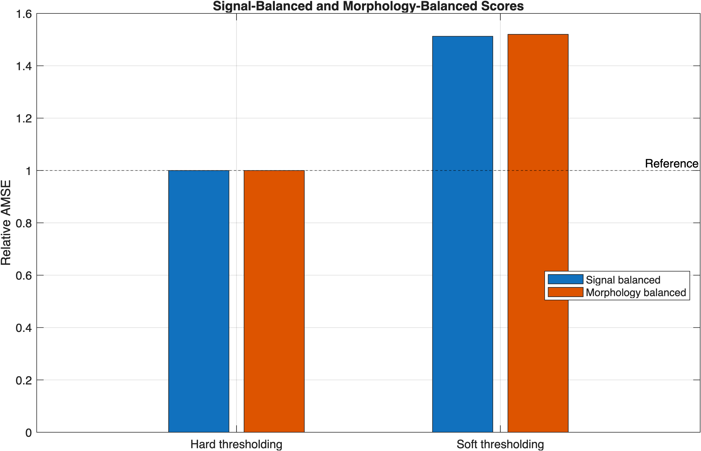
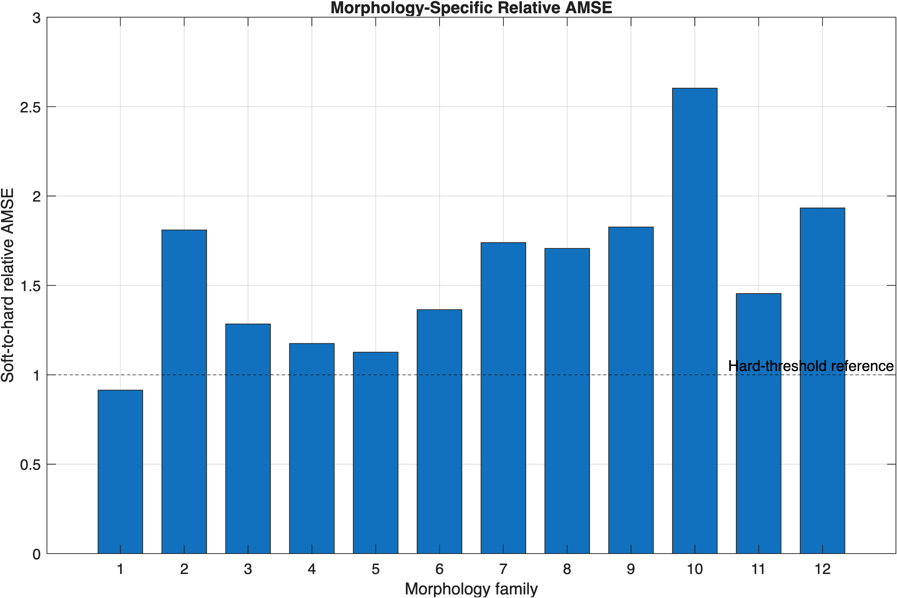

# Applying the BEND-1D Golden Rules in MATLAB

This example demonstrates how the BEND-1D Golden Rules can be applied in a multi-signal denoising comparison. The workflow normalizes every clean signal to the same centered-power SNR, uses paired Monte Carlo noise realizations, computes signal-wise AMSE values, converts them to relative AMSE, and forms both signal-balanced and morphology-balanced summaries.

Hard and soft wavelet thresholding are used only as illustrative competing methods. They are not part of the BEND-1D library or its public methodology.

## Requirements

- MATLAB R2026a or later;
- an installed or locally accessible copy of BEND-1D; and
- Wavelet Toolbox for `wavedec`, `detcoef`, `wthresh`, `waverec`, and `wmaxlev`.

## Define an Illustrative Benchmark

The example uses 20 BEND-1D signals distributed unevenly across the twelve morphology families. The unequal family sizes are deliberate: they allow the example to show why ordinary signal averaging and morphology-balanced aggregation can give different results.

The family assignments below are illustrative assignments for this tutorial. They should not be interpreted as the official membership of Core12, Core24, Core48, or Core96.

```matlab
clear; clc; close all

benchmark = table( ...
    ["TF002";"TF066"; ...
     "TF003"; ...
     "TF016"; ...
     "TF001";"TF228"; ...
     "TF006";"TF151"; ...
     "TF063";"TF143"; ...
     "TF213"; ...
     "TF083";"TF227"; ...
     "TF004";"TF196"; ...
     "TF014";"TF040"; ...
     "TF149"; ...
     "TF141";"TF155"], ...
    [1;1;2;3;4;4;5;5;6;6;7;8;8;9;9;10;10;11;12;12], ...
    ["Smooth global structure";"Smooth global structure"; ...
     "Piecewise-smooth and plateau structure"; ...
     "Jumps and steps"; ...
     "Cusps, corners, and derivative singularities"; ...
     "Cusps, corners, and derivative singularities"; ...
     "Isolated peaks and spikes";"Isolated peaks and spikes"; ...
     "Peak clusters and resolution challenges"; ...
     "Peak clusters and resolution challenges"; ...
     "Periodic and quasi-periodic oscillation"; ...
     "Chirps and evolving frequency";"Chirps and evolving frequency"; ...
     "Transients and ring-downs";"Transients and ring-downs"; ...
     "Repeated motifs and event trains"; ...
     "Repeated motifs and event trains"; ...
     "Multiscale, intermittent, and rough structure"; ...
     "Composite and adversarial mixtures"; ...
     "Composite and adversarial mixtures"], ...
    'VariableNames',{'ID','Family','FamilyName'});

disp(benchmark);
```
```text
      ID       Family                      FamilyName                   
    _______    ______    _______________________________________________

    "TF002"       1      "Smooth global structure"                      
    "TF066"       1      "Smooth global structure"                      
    "TF003"       2      "Piecewise-smooth and plateau structure"       
    "TF016"       3      "Jumps and steps"                              
    "TF001"       4      "Cusps, corners, and derivative singularities" 
    "TF228"       4      "Cusps, corners, and derivative singularities" 
    "TF006"       5      "Isolated peaks and spikes"                    
    "TF151"       5      "Isolated peaks and spikes"                    
    "TF063"       6      "Peak clusters and resolution challenges"      
    "TF143"       6      "Peak clusters and resolution challenges"      
    "TF213"       7      "Periodic and quasi-periodic oscillation"      
    "TF083"       8      "Chirps and evolving frequency"                
    "TF227"       8      "Chirps and evolving frequency"                
    "TF004"       9      "Transients and ring-downs"                    
    "TF196"       9      "Transients and ring-downs"                    
    "TF014"      10      "Repeated motifs and event trains"             
    "TF040"      10      "Repeated motifs and event trains"             
    "TF149"      11      "Multiscale, intermittent, and rough structure"
    "TF141"      12      "Composite and adversarial mixtures"           
    "TF155"      12      "Composite and adversarial mixtures"
```

The table contains all twelve morphology families, but some families contain two signals while others contain one. Consequently, an unweighted average over the 20 signals does not give every family the same influence.

## Configure the Experiment

All signals are sampled at the same length and evaluated under the same SNR, noise level, wavelet, thresholding rule, number of replications, and random-number seed.

```matlab
N = 1024;
noiseSigma = 0.20;
targetSNR = 5;

waveletName = "db4";
requestedLevel = 5;
decompositionLevel = min( ...
    requestedLevel,wmaxlev(N,waveletName));

numberOfReplications = 100;
randomSeed = 2026;

methodNames = ["Hard thresholding","Soft thresholding"];
numberOfMethods = numel(methodNames);
numberOfSignals = height(benchmark);
numberOfFamilies = 12;

fprintf("Signals: %d\n",numberOfSignals);
fprintf("Morphology families: %d\n",numberOfFamilies);
fprintf("Sample size: %d\n",N);
fprintf("Target linear SNR: %.3f\n",targetSNR);
fprintf("Noise standard deviation: %.3f\n",noiseSigma);
fprintf("Monte Carlo replications: %d\n",numberOfReplications);
```

The experiment configuration is:

```text
Signals: 20
Morphology families: 12
Sample size: 1024
Target linear SNR: 5.000
Noise standard deviation: 0.200
Monte Carlo replications: 100
```

## GR1: Equalize Signal Power

For a clean signal $f=(f_1,\ldots,f_N)$, the centered power is

```math
P_f=\frac{1}{N}\sum_{i=1}^{N}(f_i-\bar f)^2.
```

Every signal is normalized so that $P_f/\sigma^2=\mathrm{SNR}$. Therefore, each normalized signal has the same centered power, even when the native BEND-1D signals have different offsets and amplitudes.

```matlab
cleanSignals = zeros(N,numberOfSignals);
centeredPower = zeros(numberOfSignals,1);
achievedSNR = zeros(numberOfSignals,1);
signalNames = strings(numberOfSignals,1);

for signalIndex = 1:numberOfSignals
    signalID = benchmark.ID(signalIndex);

    [~,fNative,meta] = generate(signalID,N);

    fClean = normalizeSNR( ...
        fNative,noiseSigma,targetSNR);

    cleanSignals(:,signalIndex) = fClean(:);
    signalNames(signalIndex) = string(meta.Name);

    centeredPower(signalIndex) = mean( ...
        (fClean-mean(fClean)).^2);

    achievedSNR(signalIndex) = ...
        centeredPower(signalIndex)/(noiseSigma^2);
end

normalizationCheck = table( ...
    benchmark.ID,signalNames,benchmark.Family, ...
    centeredPower,achievedSNR, ...
    'VariableNames',{'ID','Name','Family', ...
                     'CenteredPower','AchievedSNR'});

disp(normalizationCheck);
```
```text
    ID                 Name              Family    CenteredPower    AchievedSNR
    _______    ________________________    ______    _____________    ___________

    "TF002"    "Planck"                       1           0.2              5     
    "TF066"    "BatteryDischarge"             1           0.2              5     
    "TF003"    "StickSlip"                    2           0.2              5     
    "TF016"    "MarketCrash"                  3           0.2              5     
    "TF001"    "Percolation"                  4           0.2              5     
    "TF228"    "LogPeriodicCusp"              4           0.2              5     
    "TF006"    "Fano"                         5           0.2              5     
    "TF151"    "PeakOnPeak"                   5           0.2              5     
    "TF063"    "NMRMultiplet"                 6           0.2              5     
    "TF143"    "DoubletOnCliff"               6           0.2              5     
    "TF213"    "BellBeating"                  7           0.2              5     
    "TF083"    "GravitationalWaveChirp"       8           0.2              5     
    "TF227"    "ChirpCuspCollision"           8           0.2              5     
    "TF004"    "RingDown"                     9           0.2              5     
    "TF196"    "CavitationCollapse"           9           0.2              5     
    "TF014"    "ECGBeat"                     10           0.2              5     
    "TF040"    "WhaleClicks"                 10           0.2              5     
    "TF149"    "LacunaryCascade"             11           0.2              5     
    "TF141"    "MishMashAlpha"               12           0.2              5     
    "TF155"    "GrandMishMash"               12           0.2              5
```

Because $\mathrm{SNR}=5$ and $\sigma=0.20$, the target centered power is $5(0.20)^2=0.20$. Apart from numerical rounding, every row should therefore report `CenteredPower = 0.2000` and `AchievedSNR = 5.0000`.

## Use Paired Monte Carlo Comparisons (GR9)

Within a signal and replication, both denoising methods must receive exactly the same noisy realization. The random seed is reset once before the experiment, not separately for each method.

```matlab
mseResults = zeros( ...
    numberOfSignals,numberOfReplications,numberOfMethods);

pairedDifference = zeros( ...
    numberOfSignals,numberOfReplications);

rng(randomSeed,"twister");

for signalIndex = 1:numberOfSignals
    fClean = cleanSignals(:,signalIndex);

    for replication = 1:numberOfReplications
        noise = noiseSigma*randn(N,1);
        noisySignal = fClean + noise;

        hardEstimate = exampleWaveletThreshold( ...
            noisySignal,waveletName,decompositionLevel,"hard");

        softEstimate = exampleWaveletThreshold( ...
            noisySignal,waveletName,decompositionLevel,"soft");

        mseResults(signalIndex,replication,1) = ...
            mean((hardEstimate-fClean).^2);

        mseResults(signalIndex,replication,2) = ...
            mean((softEstimate-fClean).^2);

        pairedDifference(signalIndex,replication) = ...
            mseResults(signalIndex,replication,2) ...
            -mseResults(signalIndex,replication,1);
    end
end
```

The two MSE values stored at a fixed signal and replication are paired because they were computed from the same `noisySignal`.

## Compute Signal-Wise AMSE

For method $m$ and signal $s$, the AMSE is

```math
AMSE_{m,s}=\frac{1}{R}\sum_{r=1}^{R}MSE_{m,s,r}.
```

```matlab
amse = squeeze(mean(mseResults,2));

pairedMeanDifference = mean(pairedDifference,2);
pairedSEDifference = std(pairedDifference,0,2) ...
    /sqrt(numberOfReplications);

signalResults = table( ...
    benchmark.ID,signalNames,benchmark.Family, ...
    benchmark.FamilyName,amse(:,1),amse(:,2), ...
    pairedMeanDifference,pairedSEDifference, ...
    'VariableNames',{'ID','Name','Family','FamilyName', ...
                     'HardAMSE','SoftAMSE', ...
                     'SoftMinusHard','PairedSE'});

disp(signalResults);
```

The table provides the complete signal-by-signal results that should remain available in supplementary material or the benchmark repository.
```text
  ID                 Name              Family                      FamilyName                       HardAMSE     SoftAMSE     SoftMinusHard     PairedSE 
    _______    ________________________    ______    _______________________________________________    _________    _________    _____________    __________

    "TF002"    "Planck"                       1      "Smooth global structure"                          0.0013587    0.0012749     -8.3793e-05     1.9584e-05
    "TF066"    "BatteryDischarge"             1      "Smooth global structure"                          0.0015335    0.0013658     -0.00016769      3.105e-05
    "TF003"    "StickSlip"                    2      "Piecewise-smooth and plateau structure"           0.0079965     0.014473       0.0064769     0.00011592
    "TF016"    "MarketCrash"                  3      "Jumps and steps"                                  0.0033002    0.0042383      0.00093804     6.4001e-05
    "TF001"    "Percolation"                  4      "Cusps, corners, and derivative singularities"     0.0016103    0.0014258     -0.00018452     3.3898e-05
    "TF228"    "LogPeriodicCusp"              4      "Cusps, corners, and derivative singularities"     0.0056704    0.0088436       0.0031731     7.6067e-05
    "TF006"    "Fano"                         5      "Isolated peaks and spikes"                        0.0019857    0.0028438      0.00085802     5.2484e-05
    "TF151"    "PeakOnPeak"                   5      "Isolated peaks and spikes"                        0.0015997    0.0014171     -0.00018253     3.7454e-05
    "TF063"    "NMRMultiplet"                 6      "Peak clusters and resolution challenges"          0.0070889     0.013027       0.0059381     0.00012107
    "TF143"    "DoubletOnCliff"               6      "Peak clusters and resolution challenges"          0.0022069    0.0022354      2.8499e-05     4.2767e-05
    "TF213"    "BellBeating"                  7      "Periodic and quasi-periodic oscillation"          0.0051497     0.008956       0.0038062     9.0226e-05
    "TF083"    "GravitationalWaveChirp"       8      "Chirps and evolving frequency"                      0.01588     0.040539        0.024659     0.00026573
    "TF227"    "ChirpCuspCollision"           8      "Chirps and evolving frequency"                     0.003547     0.004047      0.00049999     5.1146e-05
    "TF004"    "RingDown"                     9      "Transients and ring-downs"                         0.003876    0.0056902       0.0018142     7.5644e-05
    "TF196"    "CavitationCollapse"           9      "Transients and ring-downs"                         0.011803     0.026825        0.015022     0.00016695
    "TF014"    "ECGBeat"                     10      "Repeated motifs and event trains"                 0.0033689    0.0079393       0.0045704     0.00010942
    "TF040"    "WhaleClicks"                 10      "Repeated motifs and event trains"                  0.016772     0.048211        0.031438     0.00031582
    "TF149"    "LacunaryCascade"             11      "Multiscale, intermittent, and rough structure"    0.0084818     0.012333       0.0038516     8.6944e-05
    "TF141"    "MishMashAlpha"               12      "Composite and adversarial mixtures"                0.012229     0.022814        0.010586     0.00017139
    "TF155"    "GrandMishMash"               12      "Composite and adversarial mixtures"                0.011383     0.022792        0.011409      0.0001724
```

## GR2: Do Not Pool Raw AMSEs

The ordinary mean of the signal-wise AMSE values can be calculated as a diagnostic, but it should not be used as the primary global score. Signals with intrinsically large errors contribute more to this quantity than signals with small errors.

```matlab
pooledRawAMSE = mean(amse,1);

rawAMSETable = table( ...
    methodNames.',pooledRawAMSE.', ...
    'VariableNames',{'Method','MeanRawAMSE'});

disp(rawAMSETable);
```

These raw averages are retained only to illustrate the statistic that GR2 advises against using as the principal benchmark conclusion.
```text
         Method           MeanRawAMSE
    ___________________    ___________

    "Hard thresholding"     0.0063421 
    "Soft thresholding"      0.012565
```

## GR3: Give Every Signal One Vote

Hard thresholding is declared in advance as the fixed reference method. For method $A$ and signal $s$, the relative AMSE is

```math
r_{A,s}
=\frac{AMSE_{A,s}}
       {AMSE_{R,s}}.
```

Each signal contributes one relative value regardless of the absolute scale of its AMSE.

```matlab
referenceMethod = "Hard thresholding";
referenceIndex = find(methodNames == referenceMethod,1);

relativeAMSE = amse./amse(:,referenceIndex);
percentageImprovement = 100*(1-relativeAMSE);

relativeResults = table( ...
    benchmark.ID,signalNames,benchmark.Family, ...
    relativeAMSE(:,1),relativeAMSE(:,2), ...
    percentageImprovement(:,1), ...
    percentageImprovement(:,2), ...
    'VariableNames',{'ID','Name','Family', ...
                     'HardRelativeAMSE','SoftRelativeAMSE', ...
                     'HardImprovement','SoftImprovement'});

disp(relativeResults);
```

A value below one favors the method over the fixed reference. A value above one indicates a larger AMSE than the reference.
```text
    ID                 Name              Family    HardRelativeAMSE    SoftRelativeAMSE    HardImprovement    SoftImprovement
    _______    ________________________    ______    ________________    ________________    _______________    _______________

    "TF002"    "Planck"                       1             1                0.93833                0                6.1671    
    "TF066"    "BatteryDischarge"             1             1                0.89065                0                10.935    
    "TF003"    "StickSlip"                    2             1                   1.81                0               -80.996    
    "TF016"    "MarketCrash"                  3             1                 1.2842                0               -28.424    
    "TF001"    "Percolation"                  4             1                0.88541                0                11.459    
    "TF228"    "LogPeriodicCusp"              4             1                 1.5596                0               -55.959    
    "TF006"    "Fano"                         5             1                 1.4321                0               -43.209    
    "TF151"    "PeakOnPeak"                   5             1                0.88589                0                11.411    
    "TF063"    "NMRMultiplet"                 6             1                 1.8377                0               -83.766    
    "TF143"    "DoubletOnCliff"               6             1                 1.0129                0               -1.2914    
    "TF213"    "BellBeating"                  7             1                 1.7391                0               -73.912    
    "TF083"    "GravitationalWaveChirp"       8             1                 2.5528                0               -155.28    
    "TF227"    "ChirpCuspCollision"           8             1                  1.141                0               -14.096    
    "TF004"    "RingDown"                     9             1                 1.4681                0               -46.805    
    "TF196"    "CavitationCollapse"           9             1                 2.2727                0               -127.27    
    "TF014"    "ECGBeat"                     10             1                 2.3566                0               -135.66    
    "TF040"    "WhaleClicks"                 10             1                 2.8744                0               -187.44    
    "TF149"    "LacunaryCascade"             11             1                 1.4541                0               -45.411    
    "TF141"    "MishMashAlpha"               12             1                 1.8657                0               -86.566    
    "TF155"    "GrandMishMash"               12             1                 2.0023                0               -100.23    
```

## GR4: Aggregate Relative Risks Geometrically

The signal-balanced global relative-AMSE score is

```math
G_A=\exp\left\{\frac{1}{S}\sum_{s=1}^{S}\log r_{A,s}\right\}.
```

```matlab
signalBalancedScore = exp(mean(log(relativeAMSE),1));
signalBalancedImprovement = 100*(1-signalBalancedScore);

signalBalancedTable = table( ...
    methodNames.',signalBalancedScore.', ...
    signalBalancedImprovement.', ...
    'VariableNames',{'Method','RelativeAMSE', ...
                     'ImprovementPercent'});

disp(signalBalancedTable);
```
```text
       Method           RelativeAMSE    ImprovementPercent
    ___________________    ____________    __________________

    "Hard thresholding"            1                  0      
    "Soft thresholding"       1.5128            -51.276      
```

The geometric mean gives every signal one multiplicative vote. For example, relative AMSE values of $1/2$ and $2$ balance to a geometric mean of one.

## GR5: Give Every Morphology Family Equal Weight

First compute a geometric relative-AMSE score within each family. Then take the geometric mean of the twelve family scores so that every family receives exactly $1/12$ of the global weight.

```matlab
familyRelativeAMSE = zeros(numberOfFamilies,numberOfMethods);
familySizes = zeros(numberOfFamilies,1);

for familyIndex = 1:numberOfFamilies
    rows = benchmark.Family == familyIndex;
    familySizes(familyIndex) = sum(rows);

    familyRelativeAMSE(familyIndex,:) = exp( ...
        mean(log(relativeAMSE(rows,:)),1));
end

morphologyBalancedScore = exp( ...
    mean(log(familyRelativeAMSE),1));

morphologyBalancedImprovement = ...
    100*(1-morphologyBalancedScore);

familyNames = strings(numberOfFamilies,1);
for familyIndex = 1:numberOfFamilies
    firstRow = find(benchmark.Family == familyIndex,1);
    familyNames(familyIndex) = ...
        benchmark.FamilyName(firstRow);
end

familyResults = table( ...
    (1:numberOfFamilies).',familyNames,familySizes, ...
    familyRelativeAMSE(:,1),familyRelativeAMSE(:,2), ...
    'VariableNames',{'Family','FamilyName','NumberOfSignals', ...
                     'HardRelativeAMSE','SoftRelativeAMSE'});

morphologyBalancedTable = table( ...
    methodNames.',morphologyBalancedScore.', ...
    morphologyBalancedImprovement.', ...
    'VariableNames',{'Method','BENDRelativeAMSE', ...
                     'BENDImprovementPercent'});

disp(familyResults);
disp(morphologyBalancedTable);
```
```text
   Family                      FamilyName                       NumberOfSignals    HardRelativeAMSE    SoftRelativeAMSE
    ______    _______________________________________________    _______________    ________________    ________________

       1      "Smooth global structure"                                 2                  1                0.91418     
       2      "Piecewise-smooth and plateau structure"                  1                  1                   1.81     
       3      "Jumps and steps"                                         1                  1                 1.2842     
       4      "Cusps, corners, and derivative singularities"            2                  1                 1.1751     
       5      "Isolated peaks and spikes"                               2                  1                 1.1264     
       6      "Peak clusters and resolution challenges"                 2                  1                 1.3643     
       7      "Periodic and quasi-periodic oscillation"                 1                  1                 1.7391     
       8      "Chirps and evolving frequency"                           2                  1                 1.7066     
       9      "Transients and ring-downs"                               2                  1                 1.8266     
      10      "Repeated motifs and event trains"                        2                  1                 2.6027     
      11      "Multiscale, intermittent, and rough structure"           1                  1                 1.4541     
      12      "Composite and adversarial mixtures"                      2                  1                 1.9328     

          Method           BENDRelativeAMSE    BENDImprovementPercent
    ___________________    ________________    ______________________

    "Hard thresholding"              1                      0        
    "Soft thresholding"         1.5201                -52.006
```

The signal-balanced and morphology-balanced scores can differ because the tutorial benchmark contains unequal numbers of signals per family.

## G6: Verify the Balanced-Core Property

An illustrative Core12 is formed by selecting the first signal from each family. Since this subset contains exactly one signal per family, equal signal weighting automatically gives equal family weighting.

```matlab
core12Rows = zeros(numberOfFamilies,1);

for familyIndex = 1:numberOfFamilies
    core12Rows(familyIndex) = find( ...
        benchmark.Family == familyIndex,1);
end

core12RelativeAMSE = relativeAMSE(core12Rows,:);

core12SignalScore = exp( ...
    mean(log(core12RelativeAMSE),1));

core12FamilyScore = exp( ...
    mean(log(core12RelativeAMSE),1));

core12Check = table( ...
    methodNames.',core12SignalScore.',core12FamilyScore.', ...
    abs(core12SignalScore-core12FamilyScore).', ...
    'VariableNames',{'Method','SignalWeightedScore', ...
                     'FamilyWeightedScore','AbsoluteDifference'});

disp(core12Check);
```
```text
         Method           SignalWeightedScore    FamilyWeightedScore    AbsoluteDifference
    ___________________    ___________________    ___________________    __________________

    "Hard thresholding"               1                      1                   0         
    "Soft thresholding"          1.5625                 1.5625                   0
```

The two scores are identical up to numerical precision because the illustrative Core12 has one representative from every family.

## GR7: Compute Relative-to-Best Performance

When the denominator is the best observed AMSE for each signal, the result is a relative-to-best score rather than an improvement over a fixed reference:

```math
q_{A,s}=\frac{AMSE_{A,s}}{\min_B AMSE_{B,s}}.
```

```matlab
bestAMSE = min(amse,[],2);
relativeToBest = amse./bestAMSE;

relativeToBestTable = table( ...
    benchmark.ID,signalNames, ...
    relativeToBest(:,1),relativeToBest(:,2), ...
    'VariableNames',{'ID','Name', ...
                     'HardRelativeToBest', ...
                     'SoftRelativeToBest'});

disp(relativeToBestTable);
```
```text
     ID                 Name              HardRelativeToBest    SoftRelativeToBest
    _______    ________________________    __________________    __________________

    "TF002"    "Planck"                          1.0657                     1      
    "TF066"    "BatteryDischarge"                1.1228                     1      
    "TF003"    "StickSlip"                            1                  1.81      
    "TF016"    "MarketCrash"                          1                1.2842      
    "TF001"    "Percolation"                     1.1294                     1      
    "TF228"    "LogPeriodicCusp"                      1                1.5596      
    "TF006"    "Fano"                                 1                1.4321      
    "TF151"    "PeakOnPeak"                      1.1288                     1      
    "TF063"    "NMRMultiplet"                         1                1.8377      
    "TF143"    "DoubletOnCliff"                       1                1.0129      
    "TF213"    "BellBeating"                          1                1.7391      
    "TF083"    "GravitationalWaveChirp"               1                2.5528      
    "TF227"    "ChirpCuspCollision"                   1                 1.141      
    "TF004"    "RingDown"                             1                1.4681      
    "TF196"    "CavitationCollapse"                   1                2.2727      
    "TF014"    "ECGBeat"                              1                2.3566      
    "TF040"    "WhaleClicks"                          1                2.8744      
    "TF149"    "LacunaryCascade"                      1                1.4541      
    "TF141"    "MishMashAlpha"                        1                1.8657      
    "TF155"    "GrandMishMash"                        1                2.0023
```

Each row has at least one value equal to one. These values must not be described as percentage improvement because the denominator changes when the collection of competing methods changes.

## GR8: Report Global and Morphology-Specific Performance

A compact report should include global and family-specific relative AMSE, signal-wise wins, the fraction of signals within 5% of the best, and a measure of poor-case performance.

```matlab
[~,winnerIndex] = min(amse,[],2);

numberOfWins = zeros(1,numberOfMethods);
for methodIndex = 1:numberOfMethods
    numberOfWins(methodIndex) = ...
        sum(winnerIndex == methodIndex);
end

fractionWithinFivePercent = mean( ...
    relativeToBest <= 1.05,1);

worstFamilyRelativeAMSE = max( ...
    familyRelativeAMSE,[],1);

sortedRelativeToBest = sort(relativeToBest,1);
quantileIndex = ceil(0.90*numberOfSignals);
upper90RelativeToBest = ...
    sortedRelativeToBest(quantileIndex,:);

summaryTable = table( ...
    methodNames.',morphologyBalancedScore.', ...
    morphologyBalancedImprovement.',numberOfWins.', ...
    fractionWithinFivePercent.', ...
    worstFamilyRelativeAMSE.',upper90RelativeToBest.', ...
    'VariableNames',{'Method','BENDRelativeAMSE', ...
                     'ImprovementPercent','SignalWins', ...
                     'FractionWithin5Percent', ...
                     'WorstFamilyRelativeAMSE', ...
                     'Upper90RelativeToBest'});

disp(summaryTable);
```
```text
         Method           BENDRelativeAMSE    ImprovementPercent    SignalWins    FractionWithin5Percent    WorstFamilyRelativeAMSE    Upper90RelativeToBest
    ___________________    ________________    __________________    __________    ______________________    _______________________    _____________________

    "Hard thresholding"              1                    0              16                  0.8                          1                    1.1228        
    "Soft thresholding"         1.5201              -52.006               4                 0.25                     2.6027                    2.3566        
```
The `summaryTable` is suitable for a compact main-article summary, while `signalResults` retains the complete signal-level information.

## GR10: Check That No Single Signal Determines the Conclusion

A leave-one-signal-out diagnostic recomputes the signal-balanced global score after removing each signal in turn. A stable conclusion should not change substantially when any one signal is omitted.

```matlab
leaveOneOutScore = zeros(numberOfSignals,numberOfMethods);

for omittedSignal = 1:numberOfSignals
    retainedRows = true(numberOfSignals,1);
    retainedRows(omittedSignal) = false;

    leaveOneOutScore(omittedSignal,:) = exp( ...
        mean(log(relativeAMSE(retainedRows,:)),1));
end

maximumSingleSignalInfluence = max( ...
    abs(leaveOneOutScore-signalBalancedScore),[],1);

influenceTable = table( ...
    methodNames.',signalBalancedScore.', ...
    maximumSingleSignalInfluence.', ...
    'VariableNames',{'Method','FullScore', ...
                     'MaximumLeaveOneOutChange'});

disp(influenceTable);
```
```text
        Method           FullScore    MaximumLeaveOneOutChange
    ___________________    _________    ________________________

    "Hard thresholding"          1                     0        
    "Soft thresholding"     1.5128              0.050255
```

This diagnostic does not replace morphology balancing, but it helps identify whether the reported global score is unusually sensitive to a single signal.

## Visualize the Golden-Rules Summary

The first figure compares the signal-balanced and morphology-balanced global scores. The second figure shows the twelve morphology-specific relative-AMSE scores.

```matlab
if ~isfolder("figures")
    mkdir("figures");
end

figure("Color","white");

globalScores = [ ...
    signalBalancedScore; ...
    morphologyBalancedScore].';

bar(categorical(methodNames),globalScores,"grouped");
yline(1,"k--","Reference");
ylabel("Relative AMSE");
title("Signal-Balanced and Morphology-Balanced Scores");
legend("Signal balanced","Morphology balanced", ...
    "Location","best");
grid on;
box on;

exportgraphics(gcf, ...
    fullfile("figures","golden_rules_global_scores.png"), ...
    "Resolution",300);

figure("Color","white");

bar(1:numberOfFamilies,familyRelativeAMSE(:,2),0.70);
yline(1,"k--","Hard-threshold reference");
xlabel("Morphology family");
ylabel("Soft-to-hard relative AMSE");
title("Morphology-Specific Relative AMSE");
xticks(1:numberOfFamilies);
grid on;
box on;

exportgraphics(gcf, ...
    fullfile("figures","golden_rules_family_scores.png"), ...
    "Resolution",300);
```






## Local Wavelet-Thresholding Function

Place the following local function at the end of the MATLAB script. It is used only to provide two external denoising methods for the Golden Rules demonstration.

```matlab
function fHat = exampleWaveletThreshold( ...
    y,waveletName,decompositionLevel,thresholdType)

    y = y(:);
    N = numel(y);

    [coefficients,bookkeeping] = wavedec( ...
        y,decompositionLevel,waveletName);

    finestDetails = detcoef( ...
        coefficients,bookkeeping,1);

    sigmaHat = median( ...
        abs(finestDetails-median(finestDetails))) ...
        /0.6744897501960817;

    threshold = sigmaHat*sqrt(2*log(N));

    approximationLength = bookkeeping(1);
    detailIndices = ...
        (approximationLength+1):numel(coefficients);

    thresholdedCoefficients = coefficients;

    switch lower(string(thresholdType))
        case "hard"
            thresholdedCoefficients(detailIndices) = ...
                wthresh(coefficients(detailIndices), ...
                "h",threshold);

        case "soft"
            thresholdedCoefficients(detailIndices) = ...
                wthresh(coefficients(detailIndices), ...
                "s",threshold);

        otherwise
            error("BEND1D:InvalidExampleThreshold", ...
                "thresholdType must be 'hard' or 'soft'.");
    end

    fHat = waverec( ...
        thresholdedCoefficients,bookkeeping,waveletName);

    fHat = fHat(1:N);
    fHat = fHat(:);
end
```

## Interpretation and Limitations

This example keeps the three Golden Rules stages separate: normalization of each clean signal, paired evaluation of each method on each signal, and aggregation across heterogeneous signals and morphology families.

The raw pooled AMSE is shown only as a diagnostic. The principal summaries are the signal-wise relative AMSE, its geometric aggregation, and the morphology-balanced BEND-1D score. The paired design ensures that method differences are evaluated using identical noisy realizations, while the leave-one-signal-out diagnostic checks that one signal does not determine the conclusion.

The signal-to-family assignments in this tutorial are illustrative and are used only to demonstrate the calculations. A formal BEND-1D study should use the official versioned family assignments and official nested-core membership once those metadata are released.
