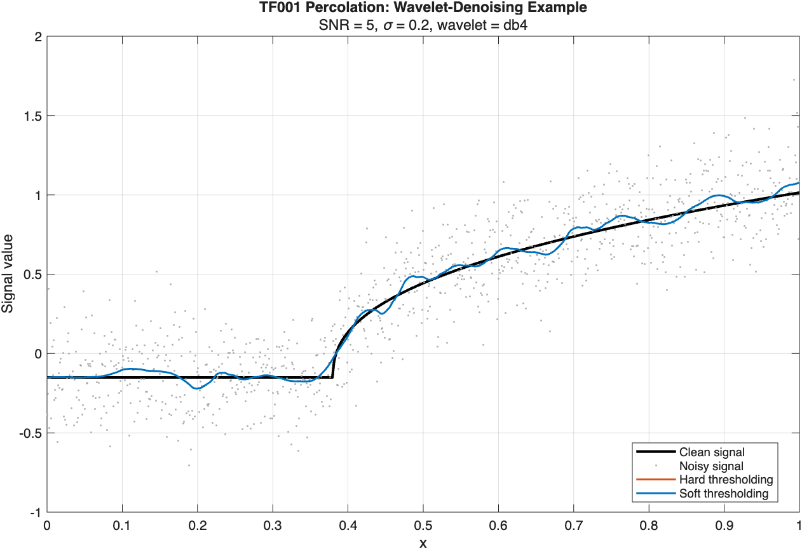
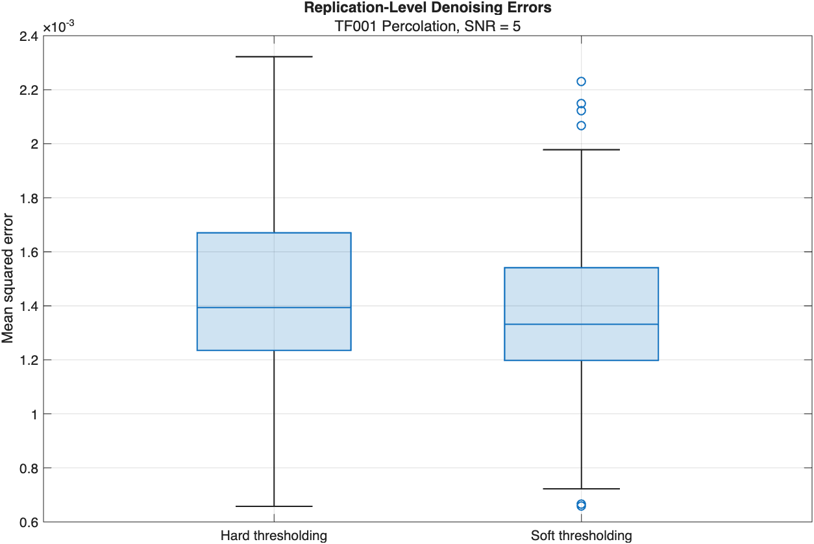
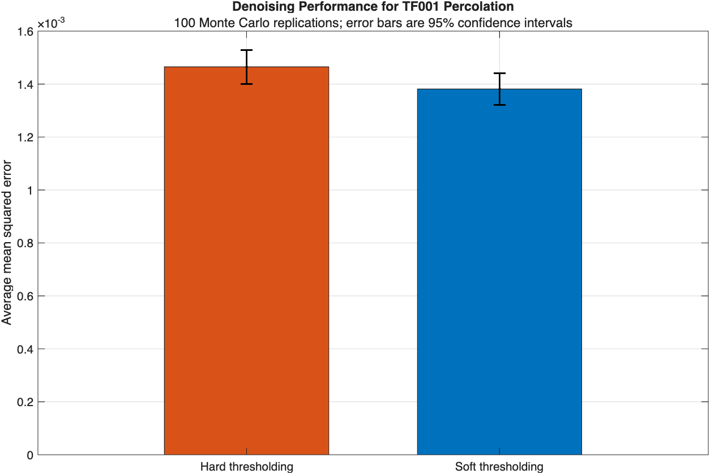

# Using BEND-1D to Evaluate Wavelet Denoising

This example demonstrates how BEND-1D can be used as a reproducible source of clean one-dimensional signals for a denoising experiment. The workflow selects a BEND-1D signal, normalizes it to a target signal-to-noise ratio (SNR), generates Gaussian-noise realizations, applies hard and soft wavelet thresholding, visualizes representative estimates, and compares the methods using average mean squared error (AMSE).

Hard and soft thresholding are used only as external illustrative methods. They are not part of the BEND-1D signal library or its public methodology.

## Requirements

- MATLAB R2026a or later;
- an installed or locally accessible copy of BEND-1D; and
- Wavelet Toolbox for `wavedec`, `detcoef`, `wthresh`, `waverec`, and `wmaxlev`.

## Generate a Clean Signal 

```matlab
%% Experiment configuration
% select a signal
signalID = "TF001";

% select signal length
N = 1024;

% Generate and normalize the BEND-1D signal
[x,fNative,meta] = generate(signalID,N);
```
## Create a Noisy Signal
The clean signal is rescaled by `normalizeSNR` so that its centered power satisfies the requested SNR.

```matlab
% specify noise level
noiseSigma = 0.20;

% Linear power ratio
targetSNR = 5;             

[fClean,normalization] = normalizeSNR( fNative,noiseSigma,targetSNR);

noise = noiseSigma*randn(size(fClean));

NoisySignal = fClean + noise;

fprintf("Signal: %s %s\n",meta.ID,meta.Name);
fprintf("Sample size: %d\n",N);
fprintf("Target linear SNR: %.3f\n",targetSNR);
fprintf("Noise standard deviation: %.3f\n",noiseSigma);

% plot clean and noisy signals
figure("Color","white");
plot(x,fClean,"k","LineWidth",2.0, "DisplayName","Clean signal");
hold on;
plot(x,NoisySignal,".", ...
    "Color",[0.65 0.65 0.65], "MarkerSize",4, "DisplayName","Noisy signal");
xlabel("x");
ylabel("Signal value");
title(meta.ID + " " + meta.Name + ": Clean and Noisy Signals");
legend("Location","best");
xlim([0 1]);
grid on;
box on;
```

```text
Signal: TF001 Percolation
Sample size: 1024
Target linear SNR: 5.000
Noise standard deviation: 0.200
```


## Wavelet Denoising

The noisy signal is first decomposed using the discrete wavelet transform. The noise standard deviation is estimated from the finest-scale detail coefficients \(d_1\) using

```math
\widehat\sigma =\frac{median\{|d_{1,k}-median(d_1)|\}}{0.67448975}.
```
The universal threshold is $\lambda=\widehat\sigma\sqrt{2\log N}.$ Hard thresholding uses $\delta_H(w;\lambda)=w\,\mathbf{1}\{|w|>\lambda\},$ whereas soft thresholding uses $\delta_S(w;\lambda)=sign(w)(|w|-\lambda)_+.$

The approximation coefficients are retained without thresholding, and all detail coefficients are thresholded using the common universal threshold.

```matlab
% select a wavelet filter
waveletName = "db4";

% number of wavelet decomposition levels
requestedLevel = 5;

maximumLevel = wmaxlev(N,waveletName);
decompositionLevel = min(requestedLevel,maximumLevel);

if decompositionLevel < requestedLevel
    warning("BEND1D:ReducedWaveletLevel", ...
        ["The requested level %d is not available. " + ...
         "Using level %d instead."], requestedLevel,decompositionLevel);
end

%% Allocate simulation results
methodNames = [ "Hard thresholding", "Soft thresholding"];


HardEstimate = exampleWaveletThreshold( NoisySignal,waveletName,decompositionLevel,"hard");

SoftEstimate = exampleWaveletThreshold( NoisySignal,waveletName,decompositionLevel,"soft");

figure("Color","white");

plot(x,fClean,"k","LineWidth",2.0, "DisplayName","Clean signal");
hold on;

plot(x,NoisySignal,".", "Color",[0.65 0.65 0.65], "MarkerSize",4, ...
    "DisplayName","Noisy signal");

plot(x, HardEstimate, "Color",[0.8500 0.3250 0.0980], "LineWidth",1.4, ...
    "DisplayName","Hard thresholding");

plot(x, SoftEstimate, "Color",[0 0.4470 0.7410], "LineWidth",1.4, ...
    "DisplayName","Soft thresholding");

xlabel("x");
ylabel("Signal value");
title(meta.ID + " " + meta.Name + ": Wavelet-Denoising Example");
subtitle("SNR = " + targetSNR + ", \sigma = " + noiseSigma + ...
    ", wavelet = " + waveletName);
legend("Location","best");
xlim([0 1]);
grid on;
box on;

% Local function to perform Hard and Soft thresholding
function fHat = exampleWaveletThreshold( ...
    y,waveletName,decompositionLevel,thresholdType)

    y = y(:);
    N = numel(y);

    [coefficients,bookkeeping] = wavedec( ...
        y,decompositionLevel,waveletName);

    finestDetails = detcoef( ...
        coefficients,bookkeeping,1);

    sigmaHat = median( ...
        abs(finestDetails-median(finestDetails))) ...
        /0.6744897501960817;

    threshold = sigmaHat*sqrt(2*log(N));

    approximationLength = bookkeeping(1);
    detailIndices = ...
        (approximationLength+1):numel(coefficients);

    thresholdedCoefficients = coefficients;

    switch lower(string(thresholdType))
        case "hard"
            thresholdedCoefficients(detailIndices) = ...
                wthresh(coefficients(detailIndices), ...
                "h",threshold);

        case "soft"
            thresholdedCoefficients(detailIndices) = ...
                wthresh(coefficients(detailIndices), ...
                "s",threshold);

        otherwise
            error("BEND1D:InvalidExampleThreshold", ...
                "thresholdType must be 'hard' or 'soft'.");
    end

    fHat = waverec( ...
        thresholdedCoefficients,bookkeeping,waveletName);

    fHat = fHat(1:N);
    fHat = fHat(:);
end
```


## Assess Denoising Performance

For each method, the replication-specific mean squared error is

```math
MSE =\frac{1}{N}\sum_{i=1}^{N} \left(\widehat f_i-f_i\right)^2.
```
```matlab
mseHard = mean((HardEstimate-fClean).^2);

mseSoft = mean((SoftEstimate-fClean).^2);

fprintf("MSE Hard Thresholding: %.3f", mseHard);
fprintf("MSE Soft Thresholding: %.3f ",mseSoft);
```
```text
MSE Hard Thresholding:
MSE Soft Thresholding
```

## Repeat Thresholding Across $100$ Replications and Assess Performance

Compute the average mean squared error (AMSE) to assess thresholding performance
```math
AMSE_m =\frac{1}{R}\sum_{r=1}^{R} MSE_{m,r},\quad where R is the number of replications.
```

The reported 95% Monte Carlo confidence interval is $AMSE_m \pm 1.96\frac{s_m}{\sqrt{R}},$ where $s_m$ is the sample standard deviation of the 100 replication-level MSE values.

```matlab

numberOfReplications = 100;
randomSeed = 2026;

%% Run the Monte Carlo experiment

rng(randomSeed,"twister");

for replication = 1:numberOfReplications

    noise = noiseSigma*randn(size(fClean));
    y = fClean + noise;

    fHard = exampleWaveletThreshold( y,waveletName,decompositionLevel,"hard");

    fSoft = exampleWaveletThreshold( y,waveletName,decompositionLevel,"soft");

    mseResults(replication,1) = mean((fHard-fClean).^2);

    mseResults(replication,2) = mean((fSoft-fClean).^2);

    if replication == 1
        firstNoisySignal = y;
        firstHardEstimate = fHard;
        firstSoftEstimate = fSoft;
    end
end

%% Summarize performance

averageMSE = mean(mseResults,1);
standardDeviationMSE = std(mseResults,0,1);
standardErrorMSE = standardDeviationMSE/sqrt(numberOfReplications);

confidenceHalfWidth = 1.96*standardErrorMSE;

lowerConfidenceLimit = max( averageMSE-confidenceHalfWidth,0);

upperConfidenceLimit = averageMSE+confidenceHalfWidth;

resultsTable = table( ...
    methodNames, averageMSE.', standardDeviationMSE.', standardErrorMSE.', lowerConfidenceLimit.', upperConfidenceLimit.', ...
    'VariableNames',{ 'Method','AMSE', 'SD_MSE','SE_AMSE', 'CI95_Lower', 'CI95_Upper'});

fprintf("\nDenoising Results\n");
fprintf("=================\n");
disp(resultsTable);

%% Plot the first realization

figure("Color","white");

plot(x,fClean,"k","LineWidth",2.0, "DisplayName","Clean signal");
hold on;

plot(x,firstNoisySignal,".", "Color",[0.65 0.65 0.65], "MarkerSize",4, "DisplayName","Noisy signal");

plot(x,firstHardEstimate, "Color",[0.8500 0.3250 0.0980], "LineWidth",1.4, "DisplayName","Hard thresholding");

plot(x,firstSoftEstimate, "Color",[0 0.4470 0.7410], "LineWidth",1.4, "DisplayName","Soft thresholding");

xlabel("x");
ylabel("Signal value");
title(meta.ID + " " + meta.Name + ": Wavelet-Denoising Example");
subtitle("SNR = " + targetSNR + ...
    ", \sigma = " + noiseSigma + ...
    ", wavelet = " + waveletName);
legend("Location","best");
xlim([0 1]);
grid on;
box on;

%% Plot AMSE and confidence intervals

figure("Color","white");

barHandle = bar( categorical(methodNames),averageMSE,0.65);

barHandle.FaceColor = "flat";
barHandle.CData = [
    0.8500 0.3250 0.0980
    0.0000 0.4470 0.7410
];

hold on;

errorbar( ...
    1:numberOfMethods,averageMSE, ...
    averageMSE-lowerConfidenceLimit, ...
    upperConfidenceLimit-averageMSE, ...
    "k.","LineWidth",1.4,"CapSize",10);

ylabel("Average mean squared error");
title("Denoising Performance for " + ...
    meta.ID + " " + meta.Name);
subtitle(numberOfReplications + ...
    " Monte Carlo replications; error bars are 95% confidence intervals");
grid on;
box on;

%% Plot replication-level MSE distributions

figure("Color","white");

boxchart( ...
    categorical(repelem(methodNames,numberOfReplications)), ...
    mseResults(:));

ylabel("Mean squared error");
title("Replication-Level Denoising Errors");
subtitle(meta.ID + " " + meta.Name + ...
    ", SNR = " + targetSNR);
grid on;
box on;
```

### Console output

The experiment produced:

The denoising summary was:

| Method | AMSE | SD of MSE | SE of AMSE | 95% CI lower | 95% CI upper |
|---|---:|---:|---:|---:|---:|
| Hard thresholding | 0.0014652 | 0.00032809 | 0.000032809 | 0.0014008 | 0.0015295 |
| Soft thresholding | 0.0013814 | 0.00030374 | 0.000030374 | 0.0013218 | 0.0014409 |

## Replication-level MSE distributions

The boxplots summarize the 100 MSE values obtained for each method.



Soft thresholding has a slightly lower median MSE and a somewhat smaller dispersion. Its distribution includes several upper outliers and two low observations, showing that performance still varies across noise realizations. Because the methods use identical noisy signals within each replication, their errors are paired even though the displayed boxplots show the two marginal distributions.

## AMSE comparison

The bars show AMSE, and the error bars show the marginal 95% Monte Carlo confidence intervals.



Soft thresholding attained the smaller AMSE:

\[
0.0013814 < 0.0014652.
\]

The relative AMSE reduction compared with hard thresholding was approximately

\[
\frac{0.0014652-0.0013814}{0.0014652}\times100\%
\approx 5.72\%.
\]

Thus, under this particular signal, SNR, wavelet, threshold, and replication design, soft thresholding provided modestly better average reconstruction accuracy. The marginal confidence intervals overlap, so the plot alone should not be treated as a formal test of the paired method difference. If formal inference is desired, compute the 100 paired differences

\[
D_r= MSE_{H,r}-MSE_{S,r}
\]

and construct a confidence interval for their mean.

## Interpretation and limitations

This example illustrates a reproducible denoising benchmark, not a general ranking of hard and soft thresholding. The result is conditional on TF001, \(N=1024\), linear SNR 5, Gaussian noise with \(\sigma=0.2\), `db4`, decomposition level 5, the universal threshold, and the selected random-number seed. Results can change across BEND-1D signals because the library contains different discontinuities, smoothness patterns, oscillations, transient features, and multiscale structures.

For a broader comparison, repeat the same paired experiment across several TF identifiers, sample sizes, SNR values, wavelets, and noise types. Always report the BEND-1D version, signal identifiers, tuning parameters, random-number seed, and number of Monte Carlo replications.

## Adapting the example

Change the selected signal:

```matlab
signalID = "TF027";
```

Change the wavelet:

```matlab
waveletName = "sym8";
```

Increase the number of replications:

```matlab
numberOfReplications = 500;
```

Change the linear SNR:

```matlab
targetSNR = 7;
```

The same framework can evaluate any external denoising method. Replace the calls to `exampleWaveletThreshold` with the method under study, while keeping the clean signal and noisy realization identical across competing methods within every replication.
