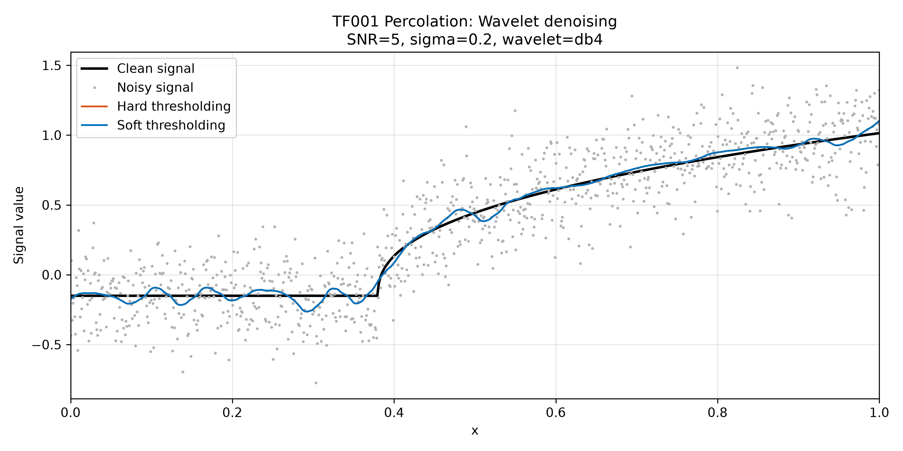
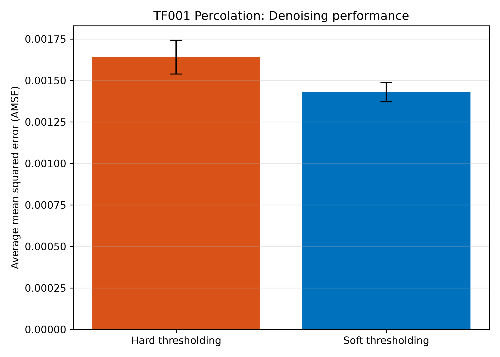

# Using BEND-1D to Evaluate Wavelet Denoising in Python

This example demonstrates how the Python version of BEND-1D can be used as a reproducible source of clean one-dimensional signals for a denoising experiment. A BEND-1D signal is generated and normalized to a target signal-to-noise ratio (SNR). Gaussian noise is then added, hard and soft wavelet thresholding are applied, and the two methods are compared using average mean squared error (AMSE).

Hard and soft thresholding are external illustrative methods. They are not part of the BEND-1D signal library or its public methodology.

## Requirements

The example requires:

- Python 3.10 or later;
- an installed copy of the Python BEND-1D package;
- NumPy and pandas;
- Matplotlib; and
- PyWavelets.

The additional packages can be installed from the PyCharm terminal using:

```bash
python -m pip install numpy pandas matplotlib PyWavelets
```

The following five steps should be run sequentially in the same Python file or PyCharm Python console.

## Step 1: Generate a Clean BEND-1D Signal

First, import the required packages and use `bend1d.generate` to generate signal `TF001` with $N=1024$ observations. The function returns the sampling grid `x`, the native signal `f_native`, and its catalog metadata.

```python
from pathlib import Path

import matplotlib.pyplot as plt
import numpy as np
import pandas as pd
import pywt

import bend1d

signal_id = "TF001"
sample_size = 1024

x, f_native, metadata = bend1d.generate(
    signal_id,
    sample_size,
)

print(f"Signal: {metadata['ID']} {metadata['Name']}")
print(f"Sample size: {sample_size}")
```

This produces:

```text
Signal: TF001 Percolation
Sample size: 1024
```

The signal can be changed by replacing `"TF001"` with another catalog identifier, such as `"TF027"` or `"TF156"`.

## Step 2: Normalize the Signal and Add Noise

The native signal is normalized using `bend1d.normalize_snr`. For noise standard deviation $sigma=0.20$ and target linear SNR equal to $5$, the centered clean-signal power satisfies

$$
\frac{N^{-1}\sum_{i=1}^{N}(f_i-\bar f)^2}{\sigma^2}=5.
$$

A noisy observation is then generated according to

$$
y_i=f_i+\varepsilon_i,
\qquad
\varepsilon_i\sim N(0,\sigma^2).
$$

```python
noise_sigma = 0.20
target_snr = 5.0
random_seed = 12345

f_clean, normalization = bend1d.normalize_snr(
    f_native,
    sigma=noise_sigma,
    target_snr=target_snr,
    units="linear",
)

rng = np.random.default_rng(random_seed)
noise = noise_sigma * rng.standard_normal(sample_size)
noisy_signal = f_clean + noise

print(f"Target linear SNR: {target_snr:.3f}")
print(f"Noise standard deviation: {noise_sigma:.3f}")

fig, axis = plt.subplots(figsize=(10, 5))
axis.plot(x, f_clean, "k", linewidth=2.0, label="Clean signal")
axis.plot(
    x,
    noisy_signal,
    ".",
    color="0.70",
    markersize=2.5,
    label="Noisy signal",
)
axis.set_xlabel("x")
axis.set_ylabel("Signal value")
axis.set_title(
    f"{metadata['ID']} {metadata['Name']}: Clean and noisy signals"
)
axis.set_xlim(0, 1)
axis.grid(True, alpha=0.3)
axis.legend(loc="best")
fig.tight_layout()
plt.show()
```

The corresponding output is:

```text
Target linear SNR: 5.000
Noise standard deviation: 0.200
```

## Step 3: Apply Hard and Soft Wavelet Thresholding

The noisy signal is decomposed using the discrete wavelet transform with the `db4` wavelet. The noise standard deviation is estimated from the finest-scale detail coefficients $d_{1,k}$ using the median absolute deviation:

$$
\widehat{\sigma}
=
\frac{\operatorname{median}_k
\left|d_{1,k}-\operatorname{median}(d_1)\right|}
{0.67448975}.
$$

The universal threshold is

$$
\lambda=\widehat{\sigma}\sqrt{2\log N}.
$$

Hard thresholding retains a coefficient only when its magnitude exceeds the threshold:

$$
\delta_H(w;\lambda)=w\,\mathbf{1}\{|w|>\lambda\}.
$$

Soft thresholding additionally shrinks retained coefficients toward zero:

$$
\delta_S(w;\lambda)
=
\operatorname{sign}(w)(|w|-\lambda)_+.
$$

The following function keeps the approximation coefficients unchanged and applies the selected threshold to all detail coefficients.

```python
def wavelet_threshold(y, wavelet="db4", level=5, mode="hard"):
    y = np.asarray(y, dtype=float).reshape(-1)

    maximum_level = pywt.dwt_max_level(
        y.size,
        pywt.Wavelet(wavelet).dec_len,
    )
    level = min(int(level), maximum_level)

    coefficients = pywt.wavedec(
        y,
        wavelet,
        level=level,
        mode="symmetric",
    )

    finest_details = coefficients[-1]
    sigma_hat = (
        np.median(
            np.abs(
                finest_details - np.median(finest_details)
            )
        )
        / 0.6744897501960817
    )

    threshold = sigma_hat * np.sqrt(2.0 * np.log(y.size))

    thresholded_coefficients = [coefficients[0]]
    thresholded_coefficients.extend(
        pywt.threshold(details, threshold, mode=mode)
        for details in coefficients[1:]
    )

    estimate = pywt.waverec(
        thresholded_coefficients,
        wavelet,
        mode="symmetric",
    )

    return estimate[: y.size], sigma_hat, threshold


wavelet_name = "db4"
decomposition_level = 5

hard_estimate, sigma_hat, threshold = wavelet_threshold(
    noisy_signal,
    wavelet=wavelet_name,
    level=decomposition_level,
    mode="hard",
)

soft_estimate, _, _ = wavelet_threshold(
    noisy_signal,
    wavelet=wavelet_name,
    level=decomposition_level,
    mode="soft",
)

print(f"Wavelet: {wavelet_name}")
print(f"Estimated noise SD: {sigma_hat:.6f}")
print(f"Universal threshold: {threshold:.6f}")
```

For the specified random seed, this produces:

```text
Wavelet: db4
Estimated noise SD: 0.200564
Universal threshold: 0.746758
```

The clean, noisy, and denoised signals are displayed together using:

```python
fig, axis = plt.subplots(figsize=(10, 5))

axis.plot(
    x,
    f_clean,
    color="black",
    linewidth=2.0,
    label="Clean signal",
)
axis.plot(
    x,
    noisy_signal,
    ".",
    color="0.70",
    markersize=2.5,
    label="Noisy signal",
)
axis.plot(
    x,
    hard_estimate,
    color="#D95319",
    linewidth=1.4,
    label="Hard thresholding",
)
axis.plot(
    x,
    soft_estimate,
    color="#0072BD",
    linewidth=1.4,
    label="Soft thresholding",
)

axis.set_xlabel("x")
axis.set_ylabel("Signal value")
axis.set_title(
    f"{metadata['ID']} {metadata['Name']}: Wavelet denoising\n"
    f"SNR={target_snr:g}, sigma={noise_sigma:g}, "
    f"wavelet={wavelet_name}"
)
axis.set_xlim(0, 1)
axis.grid(True, alpha=0.3)
axis.legend(loc="best")
fig.tight_layout()

output_folder = Path("figures")
output_folder.mkdir(exist_ok=True)
fig.savefig(
    output_folder / f"{signal_id}_denoised_signals.png",
    dpi=300,
)
plt.show()
```



## Step 4: Compute the Mean Squared Error

For an estimate $\widehat f$, the mean squared error is

$$
\operatorname{MSE}(\widehat f)
=
\frac{1}{N}
\sum_{i=1}^{N}(\widehat f_i-f_i)^2.
$$

The MSEs for the representative noisy realization are calculated as follows:

```python
mse_hard = np.mean((hard_estimate - f_clean) ** 2)
mse_soft = np.mean((soft_estimate - f_clean) ** 2)

print(f"MSE Hard Thresholding: {mse_hard:.8f}")
print(f"MSE Soft Thresholding: {mse_soft:.8f}")
```

Hard and soft thresholding generally produce different MSEs because hard thresholding retains surviving coefficients unchanged, whereas soft thresholding shrinks them toward zero.

## Step 5: Repeat the Experiment and Compute AMSE

A single MSE depends on one random noise realization. The experiment is therefore repeated $R=100$ times. Within each replication, hard and soft thresholding receive exactly the same noisy signal, giving a paired comparison.

For method $A$, the AMSE is

$$
\operatorname{AMSE}_A
=
\frac{1}{R}
\sum_{r=1}^{R}
\operatorname{MSE}_{A,r}.
$$

```python
replications = 100
rng = np.random.default_rng(random_seed)

hard_mse = np.empty(replications)
soft_mse = np.empty(replications)

for replication in range(replications):
    noise = noise_sigma * rng.standard_normal(sample_size)
    noisy_replication = f_clean + noise

    hard_replication, _, _ = wavelet_threshold(
        noisy_replication,
        wavelet=wavelet_name,
        level=decomposition_level,
        mode="hard",
    )

    soft_replication, _, _ = wavelet_threshold(
        noisy_replication,
        wavelet=wavelet_name,
        level=decomposition_level,
        mode="soft",
    )

    hard_mse[replication] = np.mean(
        (hard_replication - f_clean) ** 2
    )
    soft_mse[replication] = np.mean(
        (soft_replication - f_clean) ** 2
    )

mse_values = np.column_stack((hard_mse, soft_mse))
method_names = ["Hard thresholding", "Soft thresholding"]

amse = mse_values.mean(axis=0)
sd_mse = mse_values.std(axis=0, ddof=1)
se_amse = sd_mse / np.sqrt(replications)
ci_half_width = 1.96 * se_amse

results = pd.DataFrame(
    {
        "Method": method_names,
        "AMSE": amse,
        "SD_MSE": sd_mse,
        "SE_AMSE": se_amse,
        "CI95_Lower": amse - ci_half_width,
        "CI95_Upper": amse + ci_half_width,
    }
)

print(f"Monte Carlo replications: {replications}")
print("\nDenoising Results")
print("=================")
print(
    results.to_string(
        index=False,
        float_format=lambda value: f"{value:.8f}",
    )
)
```

The experiment produced:

```text
Monte Carlo replications: 100

Denoising Results
=================
           Method       AMSE     SD_MSE    SE_AMSE  CI95_Lower  CI95_Upper
Hard thresholding 0.00164068 0.00051956 0.00005196  0.00153885  0.00174252
Soft thresholding 0.00142988 0.00030125 0.00003012  0.00137083  0.00148892
```

The AMSE values and their approximate 95% Monte Carlo confidence intervals are plotted using:

```python
fig, axis = plt.subplots(figsize=(7, 5))

axis.bar(
    method_names,
    amse,
    yerr=ci_half_width,
    capsize=6,
    color=["#D95319", "#0072BD"],
)
axis.set_ylabel("Average mean squared error (AMSE)")
axis.set_title(
    f"{metadata['ID']} {metadata['Name']}: Denoising performance"
)
axis.grid(axis="y", alpha=0.3)
fig.tight_layout()
fig.savefig(
    output_folder / f"{signal_id}_amse_comparison.png",
    dpi=300,
)

results.to_csv(
    output_folder / f"{signal_id}_denoising_results.csv",
    index=False,
)

plt.show()
```



For this signal and experimental configuration, soft thresholding has the smaller AMSE. This conclusion is specific to the selected signal, SNR, wavelet, threshold, boundary treatment, and simulation settings; other BEND-1D signals may produce different relative performance.
