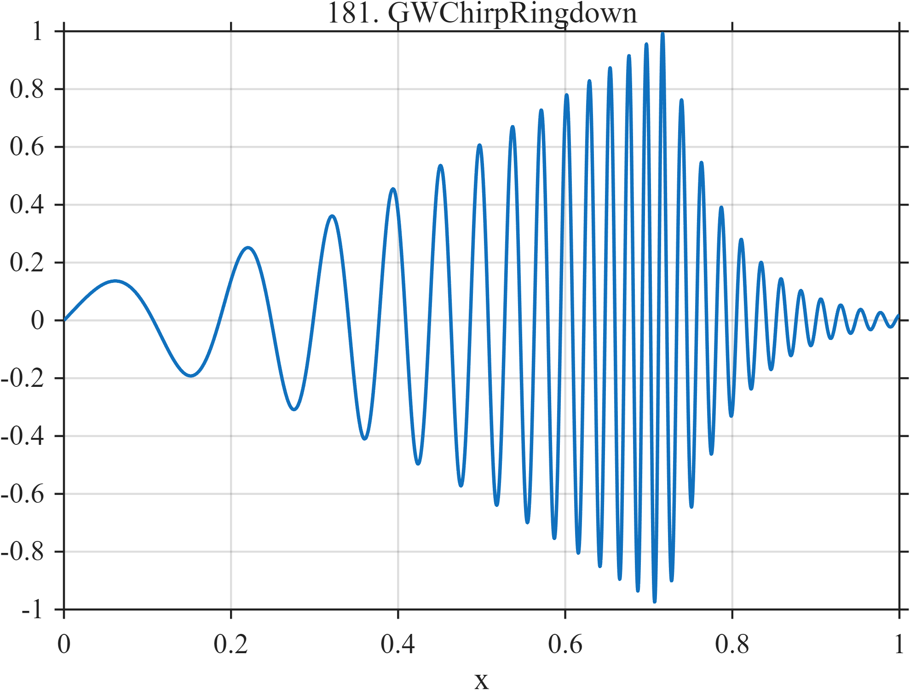

# BEND-1D Category 10

This folder contains GitHub Pages documentation for research-frontier and morphological stress-test signals **TF181–TF230**.

Upload this folder to:

```text
docs/signals/Category10/
```

Upload the corresponding PNG files to:

```text
docs/assets/images/
```

The required image naming pattern is:

```text
TF###_SignalName.png
```

For example:

```markdown

```

Add this entry to `docs/signals/index.md`:

```markdown
[Browse Category 10 Signals](Category10/)
```

The MATLAB and Python examples use `N = 1024` samples on `[0,1]`. Functions requiring smooth logistic transitions or Gaussian features define those helpers locally.

