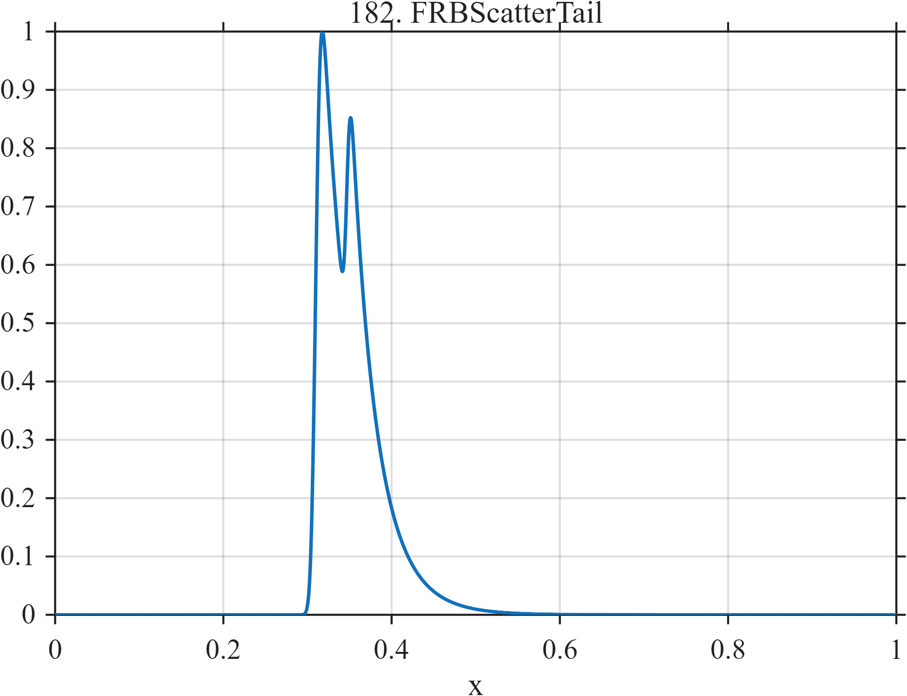

# TF182 — FRBScatterTail

## Overview

A narrow fast-radio-burst-like component has a one-sided scattering tail, and a weaker nearby component creates a partially unresolved doublet.

## Mathematical Definition

Define
$$
E(x;c,s,\tau)=\frac12
\exp\left\{\frac{s^2}{2\tau^2}-\frac{x-c}{\tau}\right\}
\mathrm{erfc}\left\{\frac{s^2/\tau-(x-c)}{\sqrt2\,s}\right\}.
$$
If $e_1=E(x;0.310,0.0045,0.038)$ and
$e_2=E(x;0.347,0.0032,0.024)$, then
$$
f(x)=\frac{e_1(x)}{\max_i e_1(x_i)}
+0.42\frac{e_2(x)}{\max_i e_2(x_i)}.
$$

## Morphological Characteristics

| Property | Description |
|---|---|
| Application family | Radio astronomy |
| Structure | Two normalized exponentially modified Gaussian pulses |
| Regularity | Smooth but strongly asymmetric and highly localized |
| Main challenge | Localize the leading edges while preserving the long tails |

## Parameters

| Parameter | Value |
|---|---|
| Primary $(c,s,\tau)$ | $(0.310,0.0045,0.038)$ |
| Companion $(c,s,\tau)$ | $(0.347,0.0032,0.024)$ |
| Companion weight | $0.42$ |

## MATLAB Implementation

~~~matlab
N=1024; x=linspace(0,1,N);
exg=@(z,c,s,tau) 0.5*exp(s^2/(2*tau^2)-(z-c)/tau).* ...
    erfc((s^2/tau-(z-c))/(sqrt(2)*s));
e1=exg(x,0.310,0.0045,0.038);
e2=exg(x,0.347,0.0032,0.024);
e1=e1/max(e1); e2=e2/max(e2);
f=e1+0.42*e2;
plot(x,f,'LineWidth',1.3); grid on
xlabel('x'); ylabel('f(x)'); title('TF182 — FRBScatterTail')
~~~

## Python Implementation

~~~python
import numpy as np
import matplotlib.pyplot as plt
N=1024
x=np.linspace(0.0,1.0,N)
from scipy.special import erfc
def exg(z,c,s,tau):
    return 0.5*np.exp(s**2/(2*tau**2)-(z-c)/tau)*erfc((s**2/tau-(z-c))/(np.sqrt(2)*s))
e1=exg(x,0.310,0.0045,0.038); e2=exg(x,0.347,0.0032,0.024)
e1/=np.max(e1); e2/=np.max(e2)
f=e1+0.42*e2
plt.plot(x,f); plt.grid(True)
plt.xlabel("x"); plt.ylabel("f(x)"); plt.title("TF182 — FRBScatterTail")
plt.show()
~~~

## Recommended Uses

- Asymmetric transient denoising
- Close-event resolution
- One-sided tail preservation

## Provenance

This is a deterministic benchmark surrogate inspired by radio astronomy measurement morphology. It is not a calibrated physical or clinical simulator.

[← Previous: GWChirpRingdown](TF181_GWChirpRingdown.md) · [Category 10 catalog](index.md) · [Next: PulsarGlitchRecovery →](TF183_PulsarGlitchRecovery.md)

