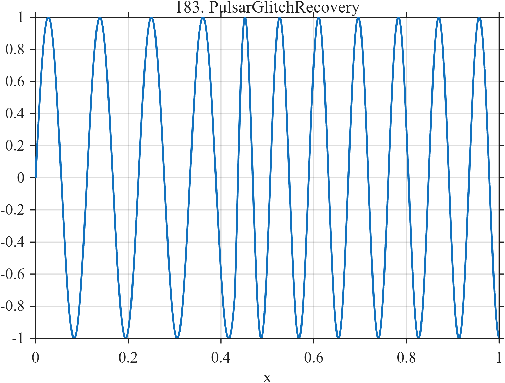

# TF183 — PulsarGlitchRecovery

## Overview

A persistent pulsar-like oscillation undergoes an abrupt frequency change followed by two recovery time scales while remaining continuous in phase.

## Mathematical Definition

Let $c=0.43$, $u=(x-c)_+$, and $H=I(x\ge c)$. Define
$$
\phi(x)=2\pi\left[9x+H\{2.4u+0.22(1-e^{-u/0.03})
+0.16(1-e^{-u/0.18})\}\right].
$$
Then $f(x)=\sin\{\phi(x)\}$.

## Morphological Characteristics

| Property | Description |
|---|---|
| Application family | Astrophysics |
| Structure | Sinusoid with a post-glitch nonlinear phase law |
| Regularity | Continuous amplitude and phase; abrupt local-frequency change |
| Main challenge | Retain a subtle change in oscillatory dynamics |

## Parameters

| Parameter | Value |
|---|---|
| Glitch time | $0.43$ |
| Frequency increment | $2.4$ |
| Recovery scales | $0.03, 0.18$ |

## MATLAB Implementation

~~~matlab
N=1024; x=linspace(0,1,N);
c=0.43; u=max(x-c,0); h=double(x>=c);
phase=2*pi*(9*x+h.*(2.4*u+0.22*(1-exp(-u/0.03))+0.16*(1-exp(-u/0.18))));
f=sin(phase);
plot(x,f,'LineWidth',1.3); grid on
xlabel('x'); ylabel('f(x)'); title('TF183 — PulsarGlitchRecovery')
~~~

## Python Implementation

~~~python
import numpy as np
import matplotlib.pyplot as plt
N=1024
x=np.linspace(0.0,1.0,N)
c=0.43; u=np.maximum(x-c,0); h=(x>=c).astype(float)
phase=2*np.pi*(9*x+h*(2.4*u+0.22*(1-np.exp(-u/0.03))+0.16*(1-np.exp(-u/0.18))))
f=np.sin(phase)
plt.plot(x,f); plt.grid(True)
plt.xlabel("x"); plt.ylabel("f(x)"); plt.title("TF183 — PulsarGlitchRecovery")
plt.show()
~~~

## Recommended Uses

- Phase-preserving denoising
- Glitch detection
- Multirate recovery estimation

## Provenance

This is a deterministic benchmark surrogate inspired by astrophysics measurement morphology. It is not a calibrated physical or clinical simulator.

[← Previous: FRBScatterTail](TF182_FRBScatterTail.md) · [Category 10 catalog](index.md) · [Next: MagnetarBurstStorm →](TF184_MagnetarBurstStorm.md)

