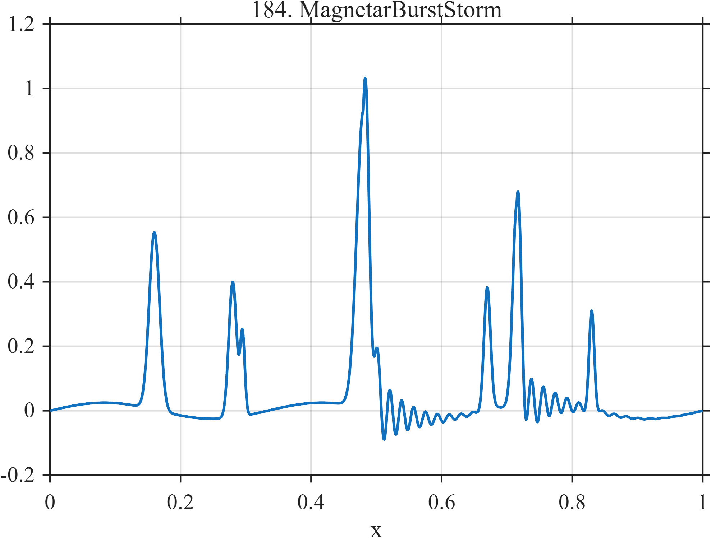

# TF184 — MagnetarBurstStorm

## Overview

Unequal narrow bursts occur in clusters, with damped high-frequency ringing after the two strongest events. Several nearby bursts deliberately challenge temporal resolution.

## Mathematical Definition

Let $G(x;c,w)=e^{-((x-c)/w)^2/2}$. With centers $c_k$, amplitudes $a_k$, and widths $w_k$ listed in the code,
$$
f(x)=0.025\sin(6\pi x)+\sum_{k=1}^{7}a_kG(x;c_k,w_k)
+\sum_{j=1}^{2}I(x\ge r_j)b_je^{-22(x-r_j)}
\sin\{110\pi(x-r_j)\},
$$
where $r=(0.48,0.715)$ and $b=(0.18,0.12)$.

## Morphological Characteristics

| Property | Description |
|---|---|
| Application family | High-energy astrophysics |
| Structure | Sparse Gaussian bursts plus two causal ring-downs |
| Regularity | Smooth, sparse, and strongly nonstationary |
| Main challenge | Keep weak clustered events and their oscillatory tails |

## Parameters

| Parameter | Value |
|---|---|
| Burst centers | $0.16,0.28,0.295,0.48,0.67,0.715,0.83$ |
| Ring centers | $0.48,0.715$ |
| Ring frequency | $55$ cycles/unit |

## MATLAB Implementation

~~~matlab
N=1024; x=linspace(0,1,N);
G=@(z,c,w) exp(-0.5*((z-c)/w).^2);
f=0.025*sin(2*pi*3*x);
c=[0.16 0.28 0.295 0.48 0.67 0.715 0.83];
a=[0.55 0.42 0.25 0.92 0.38 0.62 0.30];
w=[0.008 0.006 0.0035 0.010 0.005 0.006 0.004];
for k=1:numel(c), f=f+a(k)*G(x,c(k),w(k)); end
cc=[0.48 0.715]; aa=[0.18 0.12];
for k=1:2
 u=max(x-cc(k),0);
 f=f+(x>=cc(k)).*aa(k).*exp(-22*u).*sin(2*pi*55*u);
end
plot(x,f,'LineWidth',1.3); grid on
xlabel('x'); ylabel('f(x)'); title('TF184 — MagnetarBurstStorm')
~~~

## Python Implementation

~~~python
import numpy as np
import matplotlib.pyplot as plt
N=1024
x=np.linspace(0.0,1.0,N)
G=lambda z,c,w: np.exp(-0.5*((z-c)/w)**2)
f=0.025*np.sin(2*np.pi*3*x)
c=[0.16,0.28,0.295,0.48,0.67,0.715,0.83]
a=[0.55,0.42,0.25,0.92,0.38,0.62,0.30]
w=[0.008,0.006,0.0035,0.010,0.005,0.006,0.004]
for ck,ak,wk in zip(c,a,w): f+=ak*G(x,ck,wk)
for ck,ak in zip([0.48,0.715],[0.18,0.12]):
    u=np.maximum(x-ck,0)
    f+=(x>=ck)*ak*np.exp(-22*u)*np.sin(2*np.pi*55*u)
plt.plot(x,f); plt.grid(True)
plt.xlabel("x"); plt.ylabel("f(x)"); plt.title("TF184 — MagnetarBurstStorm")
plt.show()
~~~

## Recommended Uses

- Sparse transient recovery
- Cluster resolution
- Ring-down preservation

## Provenance

This is a deterministic benchmark surrogate inspired by high-energy astrophysics measurement morphology. It is not a calibrated physical or clinical simulator.

[← Previous: PulsarGlitchRecovery](TF183_PulsarGlitchRecovery.md) · [Category 10 catalog](index.md) · [Next: XrayQPODrift →](TF185_XrayQPODrift.md)

