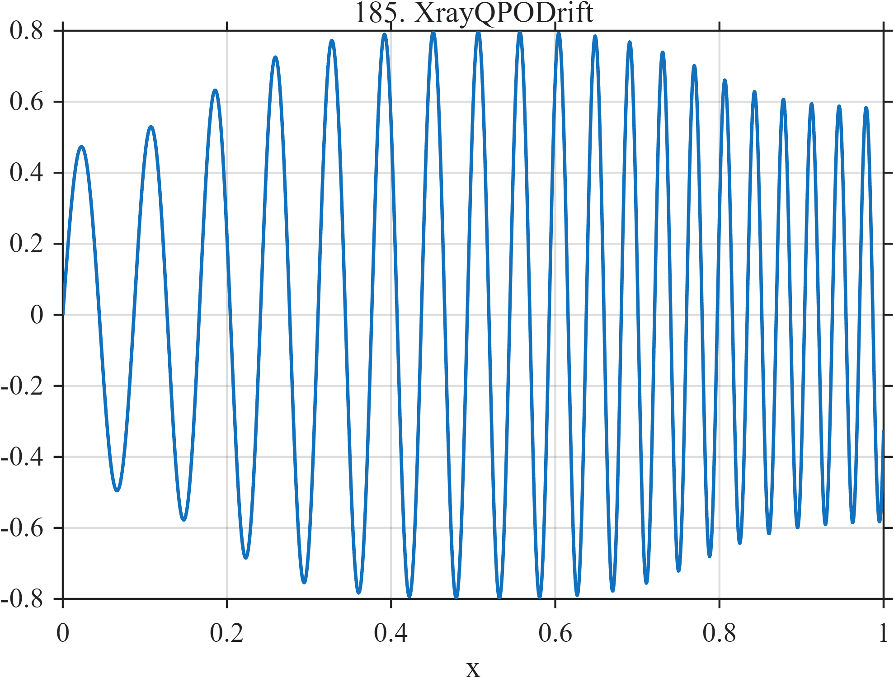

# TF185 — XrayQPODrift

## Overview

A quasi-periodic oscillation changes both amplitude and instantaneous frequency, causing its wavelet representation to migrate across scales while its visibility changes.

## Mathematical Definition

With $L(x;c,w)=[1+e^{-(x-c)/w}]^{-1}$,
$$
A(x)=0.45+0.35L(x;0.18,0.06)-0.22L(x;0.78,0.05),
$$
$$
\phi(x)=2\pi(10x+8x^2+1.8x^3)+0.7\sin(2\pi1.3x),
\qquad f(x)=A(x)\sin\{\phi(x)\}.
$$

## Morphological Characteristics

| Property | Description |
|---|---|
| Application family | High-energy astrophysics |
| Structure | Amplitude-modulated polynomial-phase oscillation |
| Regularity | Smooth and globally oscillatory |
| Main challenge | Follow simultaneous amplitude and frequency drift |

## Parameters

| Parameter | Value |
|---|---|
| Baseline amplitude | $0.45$ |
| Rising transition | $(0.18,0.06)$ |
| Falling transition | $(0.78,0.05)$ |

## MATLAB Implementation

~~~matlab
N=1024; x=linspace(0,1,N);
S=@(z,c,w) 1./(1+exp(-(z-c)/w));
amp=0.45+0.35*S(x,0.18,0.06)-0.22*S(x,0.78,0.05);
phase=2*pi*(10*x+8*x.^2+1.8*x.^3)+0.7*sin(2*pi*1.3*x);
f=amp.*sin(phase);
plot(x,f,'LineWidth',1.3); grid on
xlabel('x'); ylabel('f(x)'); title('TF185 — XrayQPODrift')
~~~

## Python Implementation

~~~python
import numpy as np
import matplotlib.pyplot as plt
N=1024
x=np.linspace(0.0,1.0,N)
S=lambda z,c,w: 1/(1+np.exp(-(z-c)/w))
amp=0.45+0.35*S(x,0.18,0.06)-0.22*S(x,0.78,0.05)
phase=2*np.pi*(10*x+8*x**2+1.8*x**3)+0.7*np.sin(2*np.pi*1.3*x)
f=amp*np.sin(phase)
plt.plot(x,f); plt.grid(True)
plt.xlabel("x"); plt.ylabel("f(x)"); plt.title("TF185 — XrayQPODrift")
plt.show()
~~~

## Recommended Uses

- QPO denoising
- Time-frequency ridge preservation
- Amplitude-modulated chirp recovery

## Provenance

This is a deterministic benchmark surrogate inspired by high-energy astrophysics measurement morphology. It is not a calibrated physical or clinical simulator.

[← Previous: MagnetarBurstStorm](TF184_MagnetarBurstStorm.md) · [Category 10 catalog](index.md) · [Next: QubitRamseyWander →](TF186_QubitRamseyWander.md)

