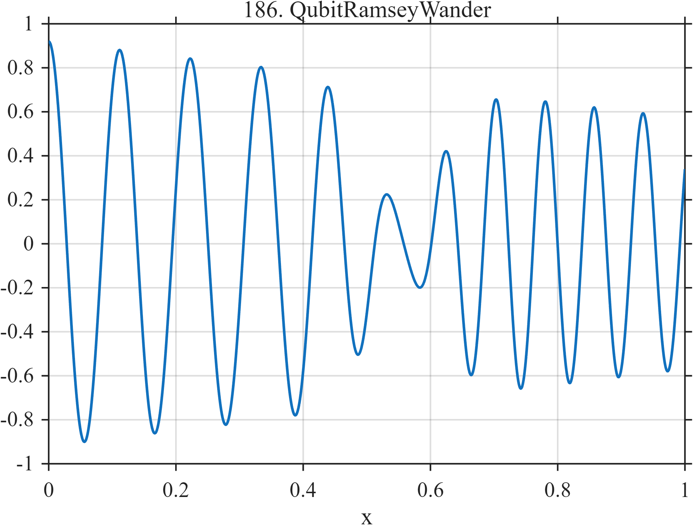

# TF186 — QubitRamseyWander

## Overview

A Ramsey-like fringe has slow phase wander, decreasing visibility, and a localized collapse and recovery of contrast.

## Mathematical Definition

Let $G(x;c,w)=e^{-((x-c)/w)^2/2}$. Then
$$
V(x)=(0.92-0.35x)[1-0.78G(x;0.56,0.055)],
$$
$$
\phi(x)=2\pi(8x+2.8x^2)+0.55\sin(2\pi1.4x),
\qquad f(x)=V(x)\cos\{\phi(x)\}.
$$

## Morphological Characteristics

| Property | Description |
|---|---|
| Application family | Quantum sensing |
| Structure | Phase-modulated fringe with a Gaussian visibility dip |
| Regularity | Smooth oscillation with locally weak amplitude |
| Main challenge | Preserve weak fringes inside the low-visibility region |

## Parameters

| Parameter | Value |
|---|---|
| Visibility-dip center | $0.56$ |
| Visibility-dip width | $0.055$ |
| Visibility-dip depth | $0.78$ |

## MATLAB Implementation

~~~matlab
N=1024; x=linspace(0,1,N);
G=@(z,c,w) exp(-0.5*((z-c)/w).^2);
vis=(0.92-0.35*x).*(1-0.78*G(x,0.56,0.055));
phase=2*pi*(8*x+2.8*x.^2)+0.55*sin(2*pi*1.4*x);
f=vis.*cos(phase);
plot(x,f,'LineWidth',1.3); grid on
xlabel('x'); ylabel('f(x)'); title('TF186 — QubitRamseyWander')
~~~

## Python Implementation

~~~python
import numpy as np
import matplotlib.pyplot as plt
N=1024
x=np.linspace(0.0,1.0,N)
G=lambda z,c,w: np.exp(-0.5*((z-c)/w)**2)
vis=(0.92-0.35*x)*(1-0.78*G(x,0.56,0.055))
phase=2*np.pi*(8*x+2.8*x**2)+0.55*np.sin(2*np.pi*1.4*x)
f=vis*np.cos(phase)
plt.plot(x,f); plt.grid(True)
plt.xlabel("x"); plt.ylabel("f(x)"); plt.title("TF186 — QubitRamseyWander")
plt.show()
~~~

## Recommended Uses

- Weak-fringe preservation
- Phase-drift recovery
- Spatially varying SNR tests

## Provenance

This is a deterministic benchmark surrogate inspired by quantum sensing measurement morphology. It is not a calibrated physical or clinical simulator.

[← Previous: XrayQPODrift](TF185_XrayQPODrift.md) · [Category 10 catalog](index.md) · [Next: JosephsonPhaseSlips →](TF187_JosephsonPhaseSlips.md)

