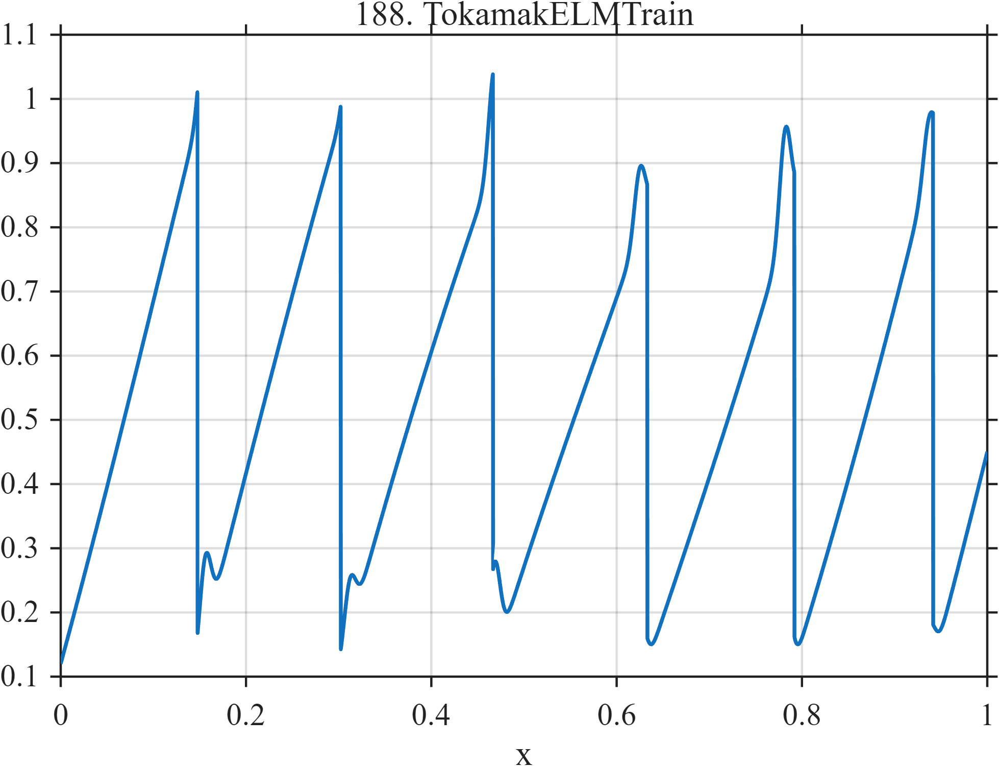

# TF188 — TokamakELMTrain

## Overview

A sequence of slow ramp-and-crash cycles carries unequal narrow precursor or edge-localized events, mixing gradual buildup, resets, and localized peaks.

## Mathematical Definition

Let $q(x)=6.4x+0.07\sin(2\pi x)$ and
$r(x)=q(x)-\lfloor q(x)\rfloor$. With $G(x;c,w)=e^{-((x-c)/w)^2/2}$,
$$
f(x)=0.12+0.78r(x)[1+0.10\sin(2\pi1.1x)]
+\sum_{k=1}^{6}a_kG(x;c_k,0.006),
$$
where the centers and unequal amplitudes are listed in the code.

## Morphological Characteristics

| Property | Description |
|---|---|
| Application family | Fusion plasma |
| Structure | Modulated fractional-part ramp with six Gaussian events |
| Regularity | Piecewise ramps with repeated resets |
| Main challenge | Treat ramps, discontinuities, and narrow peaks simultaneously |

## Parameters

| Parameter | Value |
|---|---|
| Nominal cycles | $6.4$ |
| Event centers | $0.156,0.312,0.468,0.625,0.782,0.937$ |
| Event width | $0.006$ |

## MATLAB Implementation

~~~matlab
N=1024; x=linspace(0,1,N);
G=@(z,c,w) exp(-0.5*((z-c)/w).^2);
q=6.4*x+0.07*sin(2*pi*x); ramp=q-floor(q);
f=0.12+0.78*ramp.*(1+0.10*sin(2*pi*1.1*x));
c=[0.156 0.312 0.468 0.625 0.782 0.937];
a=[0.12 0.08 0.15 0.10 0.16 0.08];
for k=1:numel(c), f=f+a(k)*G(x,c(k),0.006); end
plot(x,f,'LineWidth',1.3); grid on
xlabel('x'); ylabel('f(x)'); title('TF188 — TokamakELMTrain')
~~~

## Python Implementation

~~~python
import numpy as np
import matplotlib.pyplot as plt
N=1024
x=np.linspace(0.0,1.0,N)
G=lambda z,c,w: np.exp(-0.5*((z-c)/w)**2)
q=6.4*x+0.07*np.sin(2*np.pi*x); ramp=q-np.floor(q)
f=0.12+0.78*ramp*(1+0.10*np.sin(2*np.pi*1.1*x))
for ck,ak in zip([0.156,0.312,0.468,0.625,0.782,0.937],[0.12,0.08,0.15,0.10,0.16,0.08]): f+=ak*G(x,ck,0.006)
plt.plot(x,f); plt.grid(True)
plt.xlabel("x"); plt.ylabel("f(x)"); plt.title("TF188 — TokamakELMTrain")
plt.show()
~~~

## Recommended Uses

- Ramp-and-crash denoising
- Narrow-event preservation
- Mixed regularity evaluation

## Provenance

This is a deterministic benchmark surrogate inspired by fusion plasma measurement morphology. It is not a calibrated physical or clinical simulator.

[← Previous: JosephsonPhaseSlips](TF187_JosephsonPhaseSlips.md) · [Category 10 catalog](index.md) · [Next: SolitonCollision →](TF189_SolitonCollision.md)

