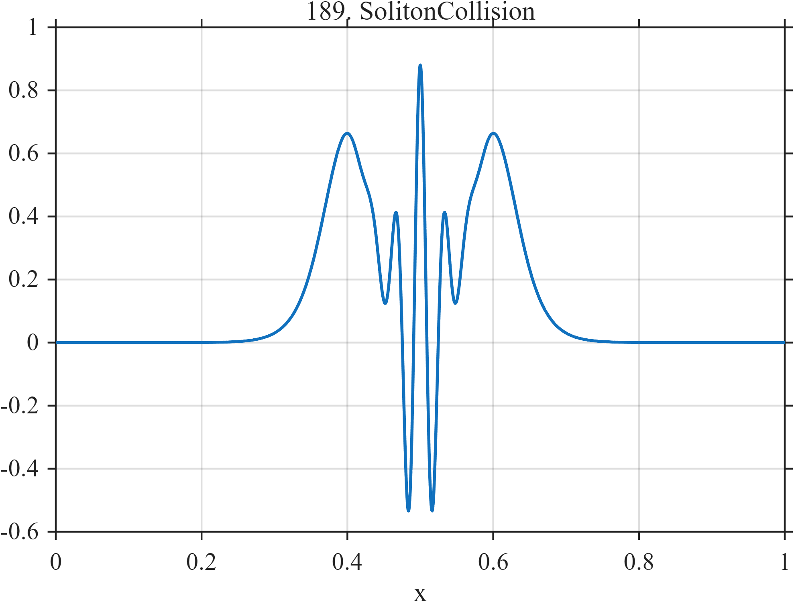

# TF189 — SolitonCollision

## Overview

Two smooth localized pulses flank a strongly oscillatory central interaction region, forcing different treatment of adjacent low- and high-frequency structures.

## Mathematical Definition

Define $Q(z)=1/\cosh^2(z)$. Then
$$
f(x)=0.66Q\left(\frac{x-0.40}{0.045}\right)
+0.66Q\left(\frac{x-0.60}{0.045}\right)
+0.82Q\left(\frac{x-0.50}{0.030}\right)
\cos\{58\pi(x-0.50)\}.
$$

## Morphological Characteristics

| Property | Description |
|---|---|
| Application family | Nonlinear physics |
| Structure | Three localized inverse-cosh-squared components |
| Regularity | Smooth with concentrated central oscillation |
| Main challenge | Preserve the interaction fringes without distorting outer pulses |

## Parameters

| Parameter | Value |
|---|---|
| Outer centers | $0.40,0.60$ |
| Outer width | $0.045$ |
| Collision center/width | $0.50/0.030$ |
| Collision frequency | $29$ cycles/unit |

## MATLAB Implementation

~~~matlab
N=1024; x=linspace(0,1,N);
sech2=@(z) 1./cosh(z).^2;
f=0.66*sech2((x-0.40)/0.045)+0.66*sech2((x-0.60)/0.045) ...
 +0.82*sech2((x-0.50)/0.030).*cos(2*pi*29*(x-0.50));
plot(x,f,'LineWidth',1.3); grid on
xlabel('x'); ylabel('f(x)'); title('TF189 — SolitonCollision')
~~~

## Python Implementation

~~~python
import numpy as np
import matplotlib.pyplot as plt
N=1024
x=np.linspace(0.0,1.0,N)
sech2=lambda z: 1/np.cosh(z)**2
f=0.66*sech2((x-0.40)/0.045)+0.66*sech2((x-0.60)/0.045)
f+=0.82*sech2((x-0.50)/0.030)*np.cos(2*np.pi*29*(x-0.50))
plt.plot(x,f); plt.grid(True)
plt.xlabel("x"); plt.ylabel("f(x)"); plt.title("TF189 — SolitonCollision")
plt.show()
~~~

## Recommended Uses

- Collision-region denoising
- Localized fringe preservation
- Adjacent-scale adaptation

## Provenance

This is a deterministic benchmark surrogate inspired by nonlinear physics measurement morphology. It is not a calibrated physical or clinical simulator.

[← Previous: TokamakELMTrain](TF188_TokamakELMTrain.md) · [Category 10 catalog](index.md) · [Next: CriticalSlowing →](TF190_CriticalSlowing.md)

