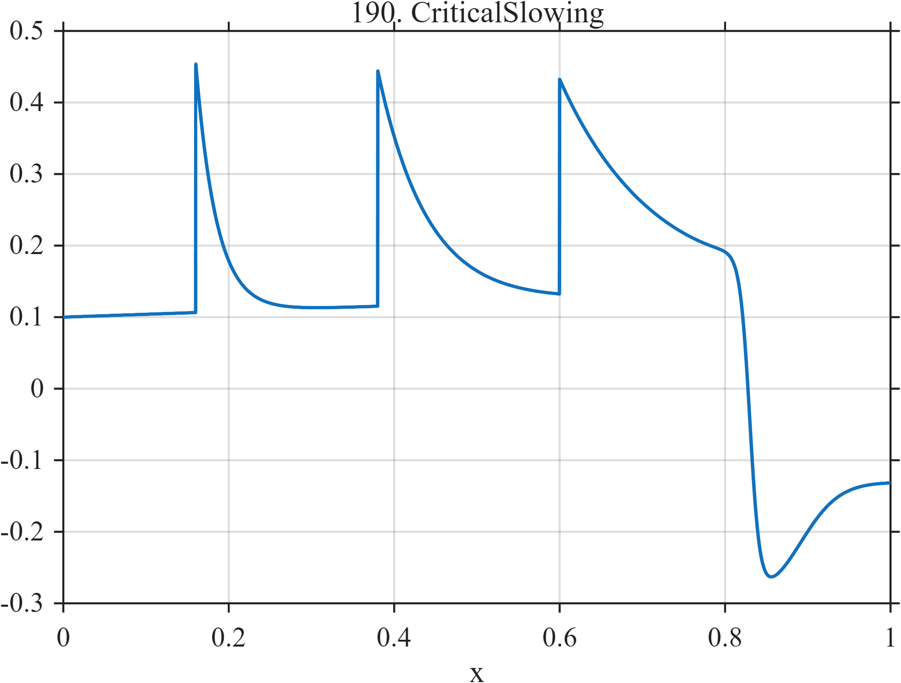

# TF190 — CriticalSlowing

## Overview

Three similar perturbations relax with progressively longer time constants before a final abrupt regime transition and partial recovery.

## Mathematical Definition

Let $u_k=(x-c_k)_+$ with
$c=(0.16,0.38,0.60)$, $a=(0.35,0.33,0.30)$, and
$\tau=(0.025,0.060,0.120)$. With $L(x;c,w)=[1+e^{-(x-c)/w}]^{-1}$,
$$
f(x)=0.10+0.04x+\sum_{k=1}^{3}I(x\ge c_k)a_ke^{-u_k/\tau_k}
-0.48L(x;0.83,0.006)+0.20L(x;0.89,0.025).
$$

## Morphological Characteristics

| Property | Description |
|---|---|
| Application family | Dynamical systems |
| Structure | Causal exponential relaxations plus smooth terminal steps |
| Regularity | One-sided transients and sharp smooth transition |
| Main challenge | Recover systematic growth in the relaxation time |

## Parameters

| Parameter | Value |
|---|---|
| Event centers | $0.16,0.38,0.60$ |
| Decay scales | $0.025,0.060,0.120$ |
| Final transition | $0.83$ |

## MATLAB Implementation

~~~matlab
N=1024; x=linspace(0,1,N);
S=@(z,c,w) 1./(1+exp(-(z-c)/w));
f=0.10+0.04*x; c=[0.16 0.38 0.60]; a=[0.35 0.33 0.30]; tau=[0.025 0.060 0.120];
for k=1:3
 u=max(x-c(k),0); f=f+(x>=c(k)).*a(k).*exp(-u/tau(k));
end
f=f-0.48*S(x,0.83,0.006)+0.20*S(x,0.89,0.025);
plot(x,f,'LineWidth',1.3); grid on
xlabel('x'); ylabel('f(x)'); title('TF190 — CriticalSlowing')
~~~

## Python Implementation

~~~python
import numpy as np
import matplotlib.pyplot as plt
N=1024
x=np.linspace(0.0,1.0,N)
S=lambda z,c,w: 1/(1+np.exp(-(z-c)/w))
f=0.10+0.04*x
for ck,ak,tk in zip([0.16,0.38,0.60],[0.35,0.33,0.30],[0.025,0.060,0.120]):
    u=np.maximum(x-ck,0); f+=(x>=ck)*ak*np.exp(-u/tk)
f=f-0.48*S(x,0.83,0.006)+0.20*S(x,0.89,0.025)
plt.plot(x,f); plt.grid(True)
plt.xlabel("x"); plt.ylabel("f(x)"); plt.title("TF190 — CriticalSlowing")
plt.show()
~~~

## Recommended Uses

- Early-warning morphology
- Relaxation-time estimation
- Transition preservation

## Provenance

This is a deterministic benchmark surrogate inspired by dynamical systems measurement morphology. It is not a calibrated physical or clinical simulator.

[← Previous: SolitonCollision](TF189_SolitonCollision.md) · [Category 10 catalog](index.md) · [Next: BatteryKnee →](TF191_BatteryKnee.md)

