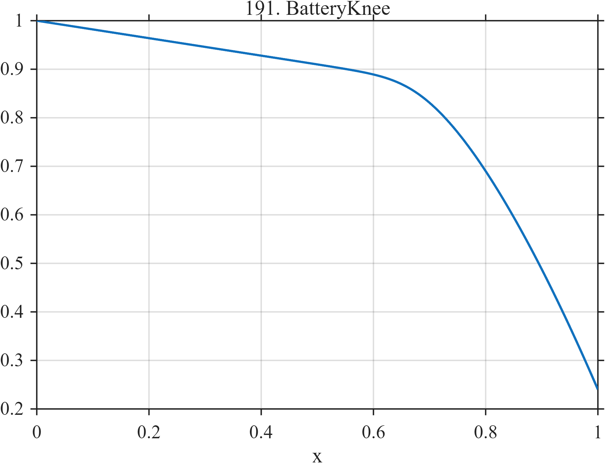

# TF191 — BatteryKnee

## Overview

A long mild degradation trend develops a smooth but pronounced knee followed by accelerated decline. The knee onset is intentionally subtle.

## Mathematical Definition

Let
$$
s(x)=\frac{\log[1+\exp\{\kappa(x-x_0)\}]}{\kappa},
\qquad \kappa=26,\quad x_0=0.64.
$$
The normalized degradation curve is
$$
f(x)=1-0.18x-0.58\left[\frac{s(x)}{s(1)}\right]^{1.55}.
$$

## Morphological Characteristics

| Property | Description |
|---|---|
| Application family | Energy storage |
| Structure | Linear trend plus normalized soft-plus power |
| Regularity | Globally smooth with strongly changing curvature |
| Main challenge | Preserve the onset and severity of the knee |

## Parameters

| Parameter | Value |
|---|---|
| Knee center $x_0$ | $0.64$ |
| Sharpness $\kappa$ | $26$ |
| Power | $1.55$ |
| Nonlinear loss | $0.58$ |

## MATLAB Implementation

~~~matlab
N=1024; x=linspace(0,1,N);
kappa=26; x0=0.64;
sp=log1p(exp(kappa*(x-x0)))/kappa;
sp1=log1p(exp(kappa*(1-x0)))/kappa;
f=1-0.18*x-0.58*(sp/sp1).^1.55;
plot(x,f,'LineWidth',1.3); grid on
xlabel('x'); ylabel('f(x)'); title('TF191 — BatteryKnee')
~~~

## Python Implementation

~~~python
import numpy as np
import matplotlib.pyplot as plt
N=1024
x=np.linspace(0.0,1.0,N)
kappa=26; x0=0.64
sp=np.log1p(np.exp(kappa*(x-x0)))/kappa
sp1=np.log1p(np.exp(kappa*(1-x0)))/kappa
f=1-0.18*x-0.58*(sp/sp1)**1.55
plt.plot(x,f); plt.grid(True)
plt.xlabel("x"); plt.ylabel("f(x)"); plt.title("TF191 — BatteryKnee")
plt.show()
~~~

## Recommended Uses

- Knee-point preservation
- Battery-health curve smoothing
- Curvature-change detection

## Provenance

This is a deterministic benchmark surrogate inspired by energy storage measurement morphology. It is not a calibrated physical simulator.

[← Previous: CriticalSlowing](TF190_CriticalSlowing.md) · [Category 10 catalog](index.md) · [Next: FuelCellFloodDry →](TF192_FuelCellFloodDry.md)

