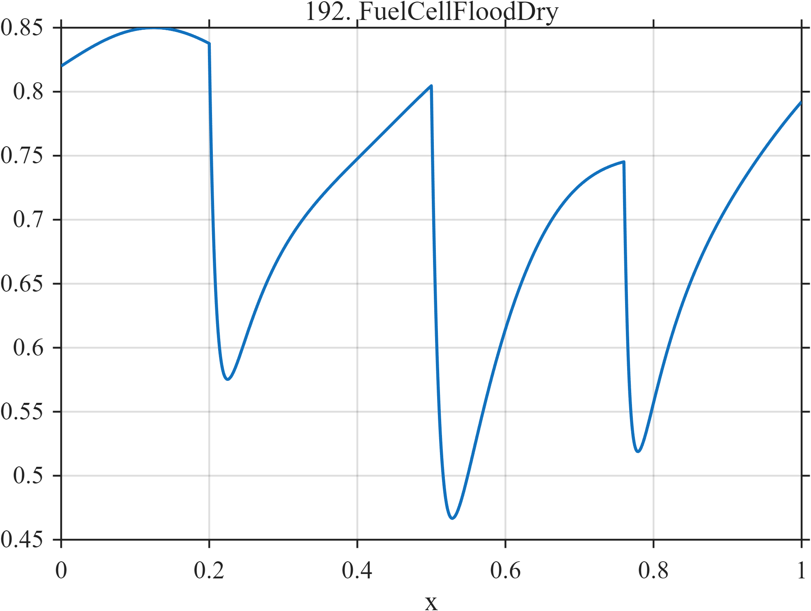

# TF192 — FuelCellFloodDry

## Overview

Three operating cycles contain rapid performance loss followed by slower recovery, with unequal amplitudes and recovery constants.

## Mathematical Definition

For each event let $u_k=(x-c_k)_+$. With the parameter vectors shown below,
$$
f(x)=0.82+0.03\sin(4\pi x)
-\sum_{k=1}^{3}I(x\ge c_k)a_k
(1-e^{-u_k/t_{f,k}})e^{-u_k/t_{s,k}}.
$$

## Morphological Characteristics

| Property | Description |
|---|---|
| Application family | Energy systems |
| Structure | Baseline plus three negative asymmetric causal pulses |
| Regularity | Smooth but sharply activated and multirate |
| Main challenge | Preserve both rapid losses and long recovery tails |

## Parameters

| Parameter | Value |
|---|---|
| Event centers | $0.20,0.50,0.76$ |
| Loss amplitudes | $0.36,0.48,0.32$ |
| Fast scales | $0.010,0.012,0.008$ |
| Slow scales | $0.095,0.135,0.080$ |

## MATLAB Implementation

~~~matlab
N=1024; x=linspace(0,1,N);
f=0.82+0.03*sin(2*pi*2*x);
c=[0.20 0.50 0.76]; a=[0.36 0.48 0.32];
tf=[0.010 0.012 0.008]; ts=[0.095 0.135 0.080];
for k=1:3
 u=max(x-c(k),0);
 f=f-(x>=c(k)).*a(k).*(1-exp(-u/tf(k))).*exp(-u/ts(k));
end
plot(x,f,'LineWidth',1.3); grid on
xlabel('x'); ylabel('f(x)'); title('TF192 — FuelCellFloodDry')
~~~

## Python Implementation

~~~python
import numpy as np
import matplotlib.pyplot as plt
N=1024
x=np.linspace(0.0,1.0,N)
f=0.82+0.03*np.sin(2*np.pi*2*x)
for c,a,tf,ts in zip([0.20,0.50,0.76],[0.36,0.48,0.32],[0.010,0.012,0.008],[0.095,0.135,0.080]):
    u=np.maximum(x-c,0)
    f-=(x>=c)*a*(1-np.exp(-u/tf))*np.exp(-u/ts)
plt.plot(x,f); plt.grid(True)
plt.xlabel("x"); plt.ylabel("f(x)"); plt.title("TF192 — FuelCellFloodDry")
plt.show()
~~~

## Recommended Uses

- Asymmetric event denoising
- Cycle-to-cycle comparison
- Tail-preserving recovery

## Provenance

This is a deterministic benchmark surrogate inspired by energy systems measurement morphology. It is not a calibrated physical simulator.

[← Previous: BatteryKnee](TF191_BatteryKnee.md) · [Category 10 catalog](index.md) · [Next: GNSSMultipathFade →](TF193_GNSSMultipathFade.md)

