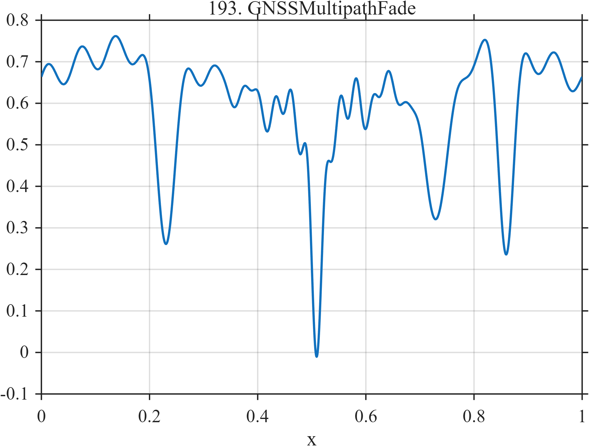

# TF193 — GNSSMultipathFade

## Overview

A slowly varying received-signal baseline contains destructive-interference notches of unequal depth and width, together with localized high-frequency ripple.

## Mathematical Definition

With $G(x;c,w)=e^{-((x-c)/w)^2/2}$,
$$
f(x)=0.65+0.08\sin(3\pi x)+0.035\sin(32\pi x+0.4)
-\sum_{k=1}^{4}a_kG(x;c_k,w_k)
+0.06G(x;0.52,0.08)\sin(66\pi x),
$$
where the fade vectors are listed in the code.

## Morphological Characteristics

| Property | Description |
|---|---|
| Application family | Navigation |
| Structure | Smooth baseline minus four Gaussian fades plus ripple |
| Regularity | Smooth with narrow high-curvature depressions |
| Main challenge | Keep deep fades from being treated as isolated outliers |

## Parameters

| Parameter | Value |
|---|---|
| Fade centers | $0.23,0.51,0.73,0.86$ |
| Fade depths | $0.42,0.56,0.34,0.46$ |
| Ripple carrier | $33$ cycles/unit |

## MATLAB Implementation

~~~matlab
N=1024; x=linspace(0,1,N);
G=@(z,c,w) exp(-0.5*((z-c)/w).^2);
f=0.65+0.08*sin(2*pi*1.5*x)+0.035*sin(2*pi*16*x+0.4);
c=[0.23 0.51 0.73 0.86]; a=[0.42 0.56 0.34 0.46]; w=[0.018 0.011 0.026 0.014];
for k=1:4, f=f-a(k)*G(x,c(k),w(k)); end
f=f+0.06*sin(2*pi*33*x).*G(x,0.52,0.08);
plot(x,f,'LineWidth',1.3); grid on
xlabel('x'); ylabel('f(x)'); title('TF193 — GNSSMultipathFade')
~~~

## Python Implementation

~~~python
import numpy as np
import matplotlib.pyplot as plt
N=1024
x=np.linspace(0.0,1.0,N)
G=lambda z,c,w: np.exp(-0.5*((z-c)/w)**2)
f=0.65+0.08*np.sin(2*np.pi*1.5*x)+0.035*np.sin(2*np.pi*16*x+0.4)
for c,a,w in zip([0.23,0.51,0.73,0.86],[0.42,0.56,0.34,0.46],[0.018,0.011,0.026,0.014]): f-=a*G(x,c,w)
f+=0.06*np.sin(2*np.pi*33*x)*G(x,0.52,0.08)
plt.plot(x,f); plt.grid(True)
plt.xlabel("x"); plt.ylabel("f(x)"); plt.title("TF193 — GNSSMultipathFade")
plt.show()
~~~

## Recommended Uses

- Fade-depth preservation
- Multipath morphology recovery
- Localized-ripple denoising

## Provenance

This is a deterministic benchmark surrogate inspired by navigation measurement morphology. It is not a calibrated physical simulator.

[← Previous: FuelCellFloodDry](TF192_FuelCellFloodDry.md) · [Category 10 catalog](index.md) · [Next: RadarMicroDoppler →](TF194_RadarMicroDoppler.md)

