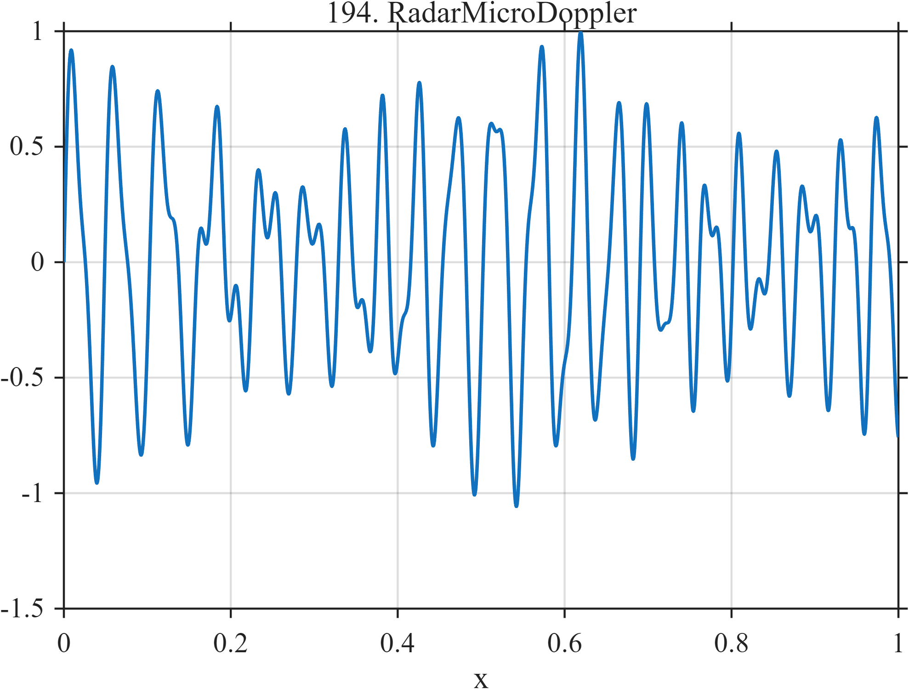

# TF194 — RadarMicroDoppler

## Overview

Two overlapping oscillatory components use nested amplitude and phase modulation to reproduce a nonmonotone micro-Doppler-like time-frequency pattern.

## Mathematical Definition

Define
$$
\phi_1=2\pi(17x+5x^2)+1.25\sin(2\pi2.7x),\qquad
\phi_2=2\pi(39x+2.5x^2)+0.70\sin(2\pi5.2x).
$$
Then
$$
f(x)=[0.58+0.25\cos(2\pi1.8x)]\sin\phi_1+0.24\sin\phi_2.
$$

## Morphological Characteristics

| Property | Description |
|---|---|
| Application family | Radar sensing |
| Structure | Two polynomial-phase carriers with nested modulation |
| Regularity | Smooth, dense, and nonstationary |
| Main challenge | Preserve migrating time-frequency components and sidebands |

## Parameters

| Parameter | Value |
|---|---|
| Carrier 1 base frequency | $17$ |
| Carrier 2 base frequency | $39$ |
| Component-2 amplitude | $0.24$ |

## MATLAB Implementation

~~~matlab
N=1024; x=linspace(0,1,N);
phase1=2*pi*(17*x+5*x.^2)+1.25*sin(2*pi*2.7*x);
phase2=2*pi*(39*x+2.5*x.^2)+0.70*sin(2*pi*5.2*x);
f=(0.58+0.25*cos(2*pi*1.8*x)).*sin(phase1)+0.24*sin(phase2);
plot(x,f,'LineWidth',1.3); grid on
xlabel('x'); ylabel('f(x)'); title('TF194 — RadarMicroDoppler')
~~~

## Python Implementation

~~~python
import numpy as np
import matplotlib.pyplot as plt
N=1024
x=np.linspace(0.0,1.0,N)
phase1=2*np.pi*(17*x+5*x**2)+1.25*np.sin(2*np.pi*2.7*x)
phase2=2*np.pi*(39*x+2.5*x**2)+0.70*np.sin(2*np.pi*5.2*x)
f=(0.58+0.25*np.cos(2*np.pi*1.8*x))*np.sin(phase1)+0.24*np.sin(phase2)
plt.plot(x,f); plt.grid(True)
plt.xlabel("x"); plt.ylabel("f(x)"); plt.title("TF194 — RadarMicroDoppler")
plt.show()
~~~

## Recommended Uses

- Micro-Doppler denoising
- Nested modulation recovery
- Time-frequency ridge preservation

## Provenance

This is a deterministic benchmark surrogate inspired by radar sensing measurement morphology. It is not a calibrated physical simulator.

[← Previous: GNSSMultipathFade](TF193_GNSSMultipathFade.md) · [Category 10 catalog](index.md) · [Next: MeltPoolSpatter →](TF195_MeltPoolSpatter.md)

