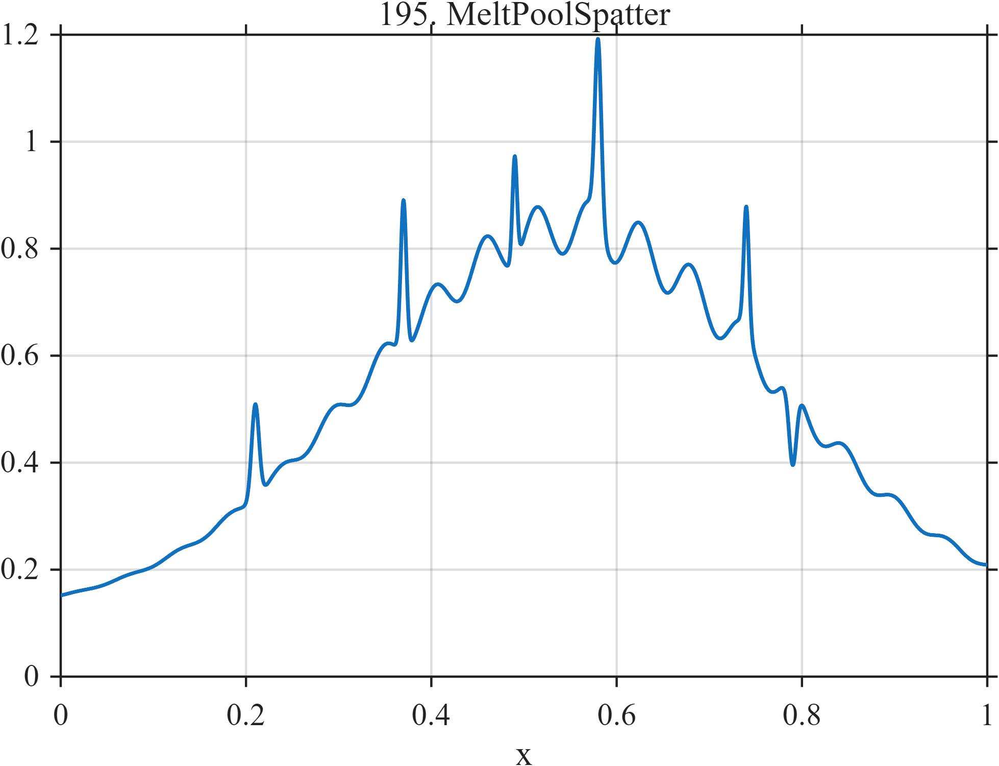

# TF195 — MeltPoolSpatter

## Overview

A broad thermal envelope carries sparse positive and negative spatter events and weak local oscillation. The spikes are legitimate signal features rather than contamination.

## Mathematical Definition

With $G(x;c,w)=e^{-((x-c)/w)^2/2}$,
$$
f(x)=0.12+0.72G(x;0.55,0.22)
+\sum_{k=1}^{6}a_kG(x;c_k,w_k)
+0.05G(x;0.58,0.20)\sin(36\pi x),
$$
where the signed event parameters are given in the code.

## Morphological Characteristics

| Property | Description |
|---|---|
| Application family | Additive manufacturing |
| Structure | Gaussian background with sparse multiscale events |
| Regularity | Smooth but with extremely narrow high-curvature peaks |
| Main challenge | Preserve rare physical events without fitting noise |

## Parameters

| Parameter | Value |
|---|---|
| Envelope center/width | $0.55/0.22$ |
| Event centers | $0.21,0.37,0.49,0.58,0.74,0.79$ |
| Event widths | $0.0025$–$0.004$ |

## MATLAB Implementation

~~~matlab
N=1024; x=linspace(0,1,N);
G=@(z,c,w) exp(-0.5*((z-c)/w).^2);
f=0.12+0.72*G(x,0.55,0.22);
c=[0.21 0.37 0.49 0.58 0.74 0.79]; a=[0.18 0.28 0.20 0.34 0.23 -0.15];
w=[0.004 0.003 0.0025 0.0035 0.0028 0.004];
for k=1:numel(c), f=f+a(k)*G(x,c(k),w(k)); end
f=f+0.05*sin(2*pi*18*x).*G(x,0.58,0.20);
plot(x,f,'LineWidth',1.3); grid on
xlabel('x'); ylabel('f(x)'); title('TF195 — MeltPoolSpatter')
~~~

## Python Implementation

~~~python
import numpy as np
import matplotlib.pyplot as plt
N=1024
x=np.linspace(0.0,1.0,N)
G=lambda z,c,w: np.exp(-0.5*((z-c)/w)**2)
f=0.12+0.72*G(x,0.55,0.22)
for c,a,w in zip([0.21,0.37,0.49,0.58,0.74,0.79],[0.18,0.28,0.20,0.34,0.23,-0.15],[0.004,0.003,0.0025,0.0035,0.0028,0.004]): f+=a*G(x,c,w)
f+=0.05*np.sin(2*np.pi*18*x)*G(x,0.58,0.20)
plt.plot(x,f); plt.grid(True)
plt.xlabel("x"); plt.ylabel("f(x)"); plt.title("TF195 — MeltPoolSpatter")
plt.show()
~~~

## Recommended Uses

- Sparse-event preservation
- Thermal-envelope smoothing
- Outlier-versus-signal discrimination

## Provenance

This is a deterministic benchmark surrogate inspired by additive manufacturing measurement morphology. It is not a calibrated physical simulator.

[← Previous: RadarMicroDoppler](TF194_RadarMicroDoppler.md) · [Category 10 catalog](index.md) · [Next: CavitationCollapse →](TF196_CavitationCollapse.md)

