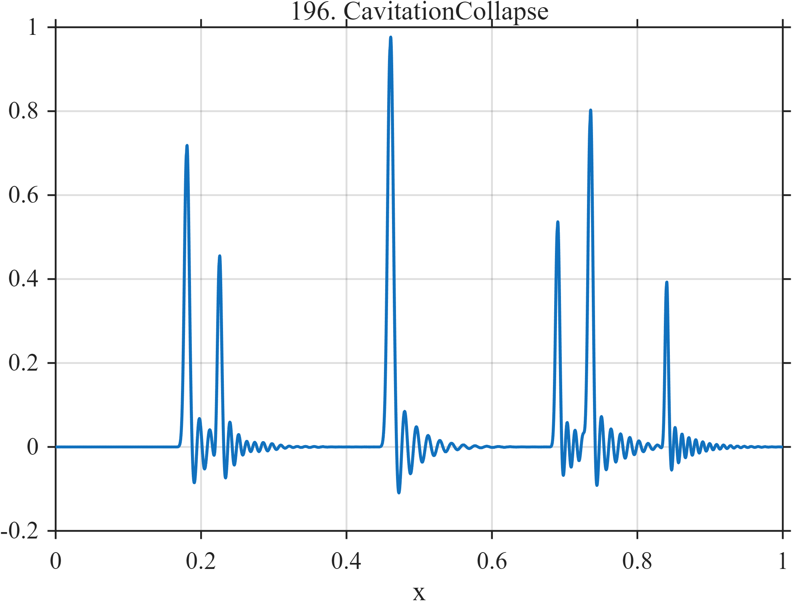

# TF196 — CavitationCollapse

## Overview

Very narrow pressure impulses occur singly and in clusters, and every event excites a damped high-frequency ring-down.

## Mathematical Definition

For the vectors $(c_k,a_k,w_k,\nu_k)$ in the code and
$G(x;c,w)=e^{-((x-c)/w)^2/2}$,
$$
f(x)=\sum_{k=1}^{6}\left[
a_kG(x;c_k,w_k)+I(x\ge c_k)(0.18a_k)e^{-35(x-c_k)}
\sin\{2\pi\nu_k(x-c_k)\}\right].
$$

## Morphological Characteristics

| Property | Description |
|---|---|
| Application family | Fluid machinery |
| Structure | Six Gaussian impulses with causal oscillatory tails |
| Regularity | Strongly localized multiscale transients |
| Main challenge | Resolve close impulses while retaining post-event ringing |

## Parameters

| Parameter | Value |
|---|---|
| Event centers | $0.18,0.225,0.46,0.69,0.735,0.84$ |
| Pulse widths | $0.002$–$0.0035$ |
| Ring frequencies | $62$–$105$ cycles/unit |

## MATLAB Implementation

~~~matlab
N=1024; x=linspace(0,1,N);
G=@(z,c,w) exp(-0.5*((z-c)/w).^2);
f=zeros(size(x));
c=[0.18 0.225 0.46 0.69 0.735 0.84]; a=[0.70 0.42 0.95 0.52 0.76 0.38];
w=[0.003 0.0025 0.0035 0.0025 0.003 0.002]; fr=[70 86 62 92 78 105];
for k=1:numel(c)
 f=f+a(k)*G(x,c(k),w(k)); u=max(x-c(k),0);
 f=f+(x>=c(k)).*(0.18*a(k)).*exp(-35*u).*sin(2*pi*fr(k)*u);
end
plot(x,f,'LineWidth',1.3); grid on
xlabel('x'); ylabel('f(x)'); title('TF196 — CavitationCollapse')
~~~

## Python Implementation

~~~python
import numpy as np
import matplotlib.pyplot as plt
N=1024
x=np.linspace(0.0,1.0,N)
G=lambda z,c,w: np.exp(-0.5*((z-c)/w)**2)
f=np.zeros_like(x)
for c,a,w,fr in zip([0.18,0.225,0.46,0.69,0.735,0.84],[0.70,0.42,0.95,0.52,0.76,0.38],[0.003,0.0025,0.0035,0.0025,0.003,0.002],[70,86,62,92,78,105]):
    f+=a*G(x,c,w); u=np.maximum(x-c,0)
    f+=(x>=c)*(0.18*a)*np.exp(-35*u)*np.sin(2*np.pi*fr*u)
plt.plot(x,f); plt.grid(True)
plt.xlabel("x"); plt.ylabel("f(x)"); plt.title("TF196 — CavitationCollapse")
plt.show()
~~~

## Recommended Uses

- Impulse-cluster resolution
- Ring-down preservation
- High-dynamic-range transient denoising

## Provenance

This is a deterministic benchmark surrogate inspired by fluid machinery measurement morphology. It is not a calibrated physical simulator.

[← Previous: MeltPoolSpatter](TF195_MeltPoolSpatter.md) · [Category 10 catalog](index.md) · [Next: ModeBeatingDecay →](TF197_ModeBeatingDecay.md)

