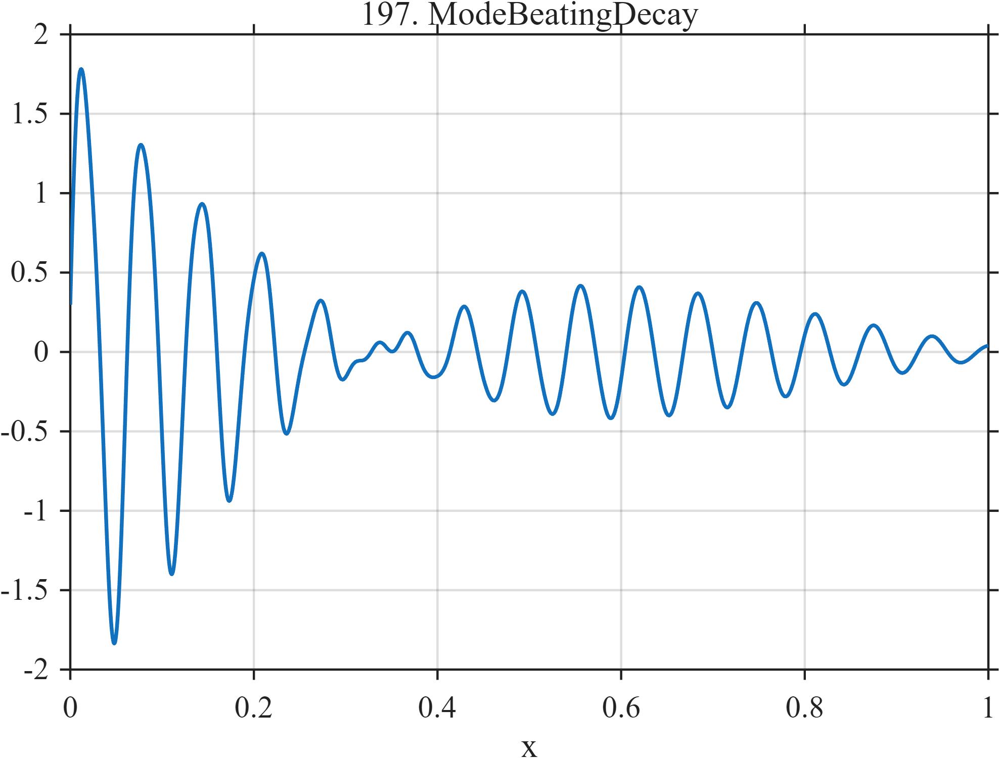

# TF197 — ModeBeatingDecay

## Overview

Two closely spaced damped modes produce a slowly varying beat envelope, while a weaker higher-frequency mode decays more rapidly.

## Mathematical Definition

The signal is
$$
f(x)=e^{-2.4x}\{\sin(30\pi x)+0.93\sin(32.8\pi x+0.15)\}
+0.28e^{-5.8x}\sin(66\pi x+0.6).
$$

## Morphological Characteristics

| Property | Description |
|---|---|
| Application family | Structural dynamics |
| Structure | Three damped sinusoids with two nearby frequencies |
| Regularity | Smooth oscillation with evolving spectral composition |
| Main challenge | Retain the extended beat pattern and weak third mode |

## Parameters

| Parameter | Value |
|---|---|
| Main frequencies | $15,16.4$ |
| Main decay rate | $2.4$ |
| Third frequency/decay | $33/5.8$ |

## MATLAB Implementation

~~~matlab
N=1024; x=linspace(0,1,N);
f=exp(-2.4*x).*(sin(2*pi*15*x)+0.93*sin(2*pi*16.4*x+0.15)) ...
 +0.28*exp(-5.8*x).*sin(2*pi*33*x+0.6);
plot(x,f,'LineWidth',1.3); grid on
xlabel('x'); ylabel('f(x)'); title('TF197 — ModeBeatingDecay')
~~~

## Python Implementation

~~~python
import numpy as np
import matplotlib.pyplot as plt
N=1024
x=np.linspace(0.0,1.0,N)
f=np.exp(-2.4*x)*(np.sin(2*np.pi*15*x)+0.93*np.sin(2*np.pi*16.4*x+0.15))
f+=0.28*np.exp(-5.8*x)*np.sin(2*np.pi*33*x+0.6)
plt.plot(x,f); plt.grid(True)
plt.xlabel("x"); plt.ylabel("f(x)"); plt.title("TF197 — ModeBeatingDecay")
plt.show()
~~~

## Recommended Uses

- Beat-envelope preservation
- Modal decay estimation
- Close-frequency denoising

## Provenance

This is a deterministic benchmark surrogate inspired by structural dynamics measurement morphology. It is not a calibrated physical simulator.

[← Previous: CavitationCollapse](TF196_CavitationCollapse.md) · [Category 10 catalog](index.md) · [Next: ValveChatter →](TF198_ValveChatter.md)

