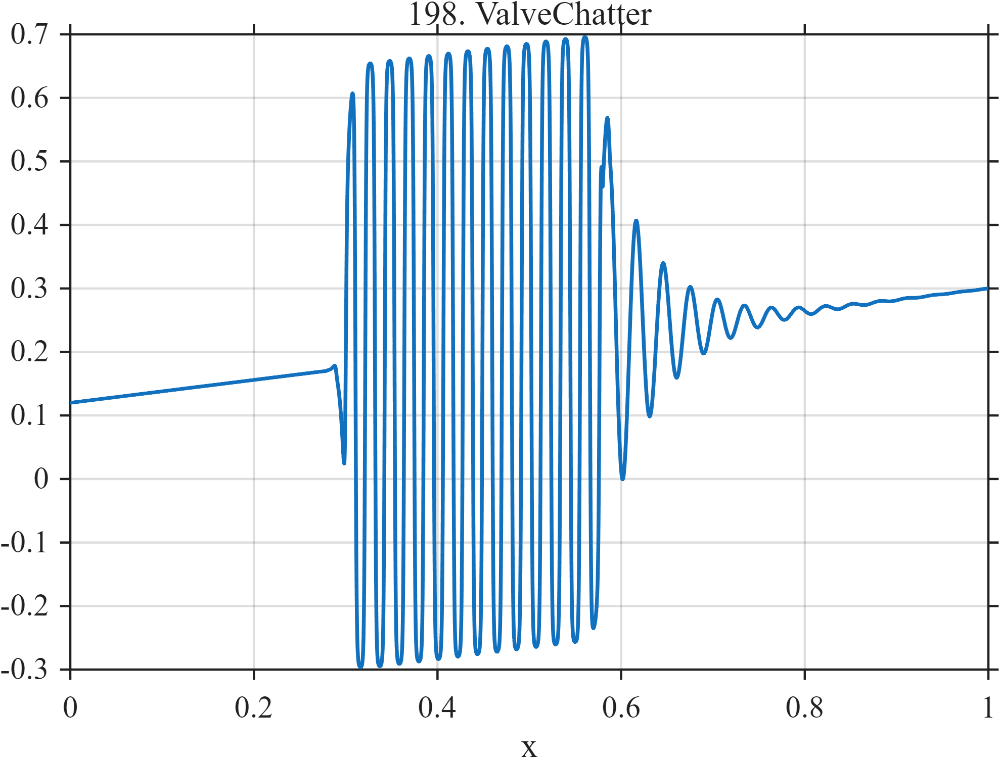

# TF198 — ValveChatter

## Overview

A finite interval of rapid near-square switching is embedded in a slow trend and followed by a damped mechanical ring-down.

## Mathematical Definition

Let $L(x;c,w)=[1+e^{-(x-c)/w}]^{-1}$ and
$g=L(x;0.30,0.003)-L(x;0.58,0.003)$. Then
$$
f(x)=0.12+0.18x+0.48g(x)\tanh[2.7\sin\{2\pi47(x-0.30)\}]
+I(x\ge0.58)0.34e^{-18u}\sin(68\pi u),
$$
where $u=x-0.58$.

## Morphological Characteristics

| Property | Description |
|---|---|
| Application family | Control systems |
| Structure | Smooth gate, saturated sinusoidal chatter, and causal ring |
| Regularity | Localized rapid switching with smooth recovery |
| Main challenge | Retain persistent high-frequency switching without staircasing the trend |

## Parameters

| Parameter | Value |
|---|---|
| Chatter interval | approximately $0.30$–$0.58$ |
| Chatter frequency | $47$ cycles/unit |
| Ring frequency/decay | $34/18$ |

## MATLAB Implementation

~~~matlab
N=1024; x=linspace(0,1,N);
S=@(z,c,w) 1./(1+exp(-(z-c)/w));
gate=S(x,0.30,0.003)-S(x,0.58,0.003);
chatter=gate.*tanh(2.7*sin(2*pi*47*(x-0.30)));
u=max(x-0.58,0); ring=(x>=0.58).*0.34.*exp(-18*u).*sin(2*pi*34*u);
f=0.12+0.18*x+0.48*chatter+ring;
plot(x,f,'LineWidth',1.3); grid on
xlabel('x'); ylabel('f(x)'); title('TF198 — ValveChatter')
~~~

## Python Implementation

~~~python
import numpy as np
import matplotlib.pyplot as plt
N=1024
x=np.linspace(0.0,1.0,N)
S=lambda z,c,w: 1/(1+np.exp(-(z-c)/w))
gate=S(x,0.30,0.003)-S(x,0.58,0.003)
chatter=gate*np.tanh(2.7*np.sin(2*np.pi*47*(x-0.30)))
u=np.maximum(x-0.58,0); ring=(x>=0.58)*0.34*np.exp(-18*u)*np.sin(2*np.pi*34*u)
f=0.12+0.18*x+0.48*chatter+ring
plt.plot(x,f); plt.grid(True)
plt.xlabel("x"); plt.ylabel("f(x)"); plt.title("TF198 — ValveChatter")
plt.show()
~~~

## Recommended Uses

- Switching-signal denoising
- Chatter localization
- Post-switch ring-down recovery

## Provenance

This is a deterministic benchmark surrogate inspired by control systems measurement morphology. It is not a calibrated physical simulator.

[← Previous: ModeBeatingDecay](TF197_ModeBeatingDecay.md) · [Category 10 catalog](index.md) · [Next: NetworkCongestionBurst →](TF199_NetworkCongestionBurst.md)

