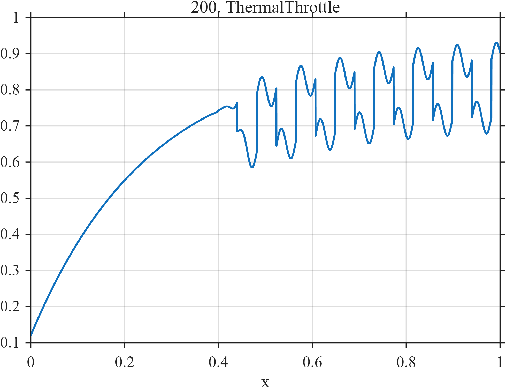

# TF200 — ThermalThrottle

## Overview

A smooth thermal rise is interrupted after threshold by rapid, nearly discrete throttling cycles and a smaller harmonic controller response.

## Mathematical Definition

Let $L(x;c,w)=[1+e^{-(x-c)/w}]^{-1}$,
$$
T(x)=0.12+0.78(1-e^{-4x}),\qquad g(x)=L(x;0.44,0.01),
$$
and
$$
q(x)=\frac12[1+\mathrm{sign}\{\sin(24\pi(x-0.44))\}].
$$
Then
$$
f(x)=T(x)-0.16g(x)q(x)+0.045g(x)\sin\{48\pi(x-0.44)\}.
$$

## Morphological Characteristics

| Property | Description |
|---|---|
| Application family | Computing systems |
| Structure | Saturating trend plus gated square-wave-like control |
| Regularity | Smooth state with repeated controller discontinuities |
| Main challenge | Preserve switching without turning the thermal state into steps |

## Parameters

| Parameter | Value |
|---|---|
| Throttle onset | $0.44$ |
| Throttle frequency | $12$ cycles/unit |
| Throttle depth | $0.16$ |

## MATLAB Implementation

~~~matlab
N=1024; x=linspace(0,1,N);
S=@(z,c,w) 1./(1+exp(-(z-c)/w));
thermal=0.12+0.78*(1-exp(-4*x)); gate=S(x,0.44,0.01);
sq=0.5*(1+sign(sin(2*pi*12*(x-0.44))));
f=thermal-0.16*gate.*sq+0.045*gate.*sin(2*pi*24*(x-0.44));
plot(x,f,'LineWidth',1.3); grid on
xlabel('x'); ylabel('f(x)'); title('TF200 — ThermalThrottle')
~~~

## Python Implementation

~~~python
import numpy as np
import matplotlib.pyplot as plt
N=1024
x=np.linspace(0.0,1.0,N)
S=lambda z,c,w: 1/(1+np.exp(-(z-c)/w))
thermal=0.12+0.78*(1-np.exp(-4*x)); gate=S(x,0.44,0.01)
sq=0.5*(1+np.sign(np.sin(2*np.pi*12*(x-0.44))))
f=thermal-0.16*gate*sq+0.045*gate*np.sin(2*np.pi*24*(x-0.44))
plt.plot(x,f); plt.grid(True)
plt.xlabel("x"); plt.ylabel("f(x)"); plt.title("TF200 — ThermalThrottle")
plt.show()
~~~

## Recommended Uses

- Controller-switch preservation
- Thermal-trend smoothing
- Mixed smooth/discrete recovery

## Provenance

This is a deterministic benchmark surrogate inspired by computing systems measurement morphology. It is not a calibrated physical simulator.

[← Previous: NetworkCongestionBurst](TF199_NetworkCongestionBurst.md) · [Category 10 catalog](index.md) · [Next: CGMMealStack →](TF201_CGMMealStack.md)

