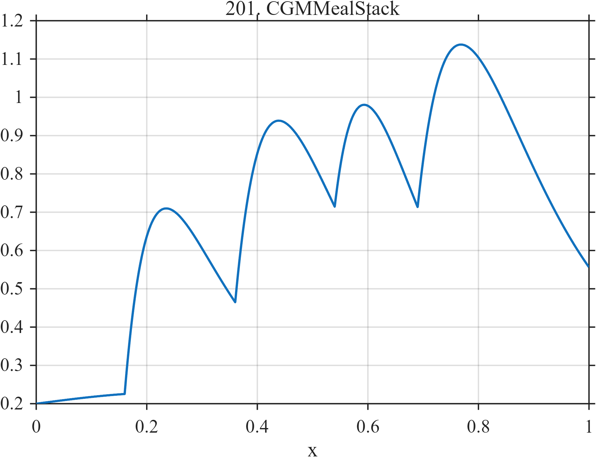

# TF201 — CGMMealStack

## Overview

Four asymmetric meal responses begin before previous responses return to baseline, producing shoulders and partially hidden peaks rather than isolated events.

## Mathematical Definition

For $u_k=(x-c_k)_+$, define
$$
r_k(x)=I(x\ge c_k)\frac{u_k}{\tau_k}
\exp\left(1-\frac{u_k}{\tau_k}\right).
$$
With the vectors in the parameter table,
$$
f(x)=0.20+0.03\sin(2\pi x)+\sum_{k=1}^{4}a_kr_k(x).
$$

## Morphological Characteristics

| Property | Description |
|---|---|
| Application family | Biomedical monitoring |
| Structure | Baseline plus overlapping gamma-like causal responses |
| Regularity | Continuous with sharp causal onsets and long tails |
| Main challenge | Resolve stacked events and preserve shoulders |

## Parameters

| Parameter | Value |
|---|---|
| Meal times | $0.16,0.36,0.54,0.69$ |
| Amplitudes | $0.48,0.62,0.45,0.70$ |
| Time scales | $0.075,0.095,0.080,0.110$ |

## MATLAB Implementation

~~~matlab
N=1024; x=linspace(0,1,N);
f=0.20+0.03*sin(2*pi*x);
c=[0.16 0.36 0.54 0.69]; a=[0.48 0.62 0.45 0.70]; tau=[0.075 0.095 0.080 0.110];
for k=1:4
 u=max(x-c(k),0); resp=(x>=c(k)).*(u/tau(k)).*exp(1-u/tau(k));
 f=f+a(k)*resp;
end
plot(x,f,'LineWidth',1.3); grid on
xlabel('x'); ylabel('f(x)'); title('TF201 — CGMMealStack')
~~~

## Python Implementation

~~~python
import numpy as np
import matplotlib.pyplot as plt
N=1024
x=np.linspace(0.0,1.0,N)
f=0.20+0.03*np.sin(2*np.pi*x)
for c,a,tau in zip([0.16,0.36,0.54,0.69],[0.48,0.62,0.45,0.70],[0.075,0.095,0.080,0.110]):
    u=np.maximum(x-c,0); resp=(x>=c)*(u/tau)*np.exp(1-u/tau)
    f+=a*resp
plt.plot(x,f); plt.grid(True)
plt.xlabel("x"); plt.ylabel("f(x)"); plt.title("TF201 — CGMMealStack")
plt.show()
~~~

## Recommended Uses

- Overlapping-event recovery
- Shoulder preservation
- Continuous-monitoring denoising

## Provenance

This is a deterministic benchmark surrogate inspired by biomedical monitoring measurement morphology. It is not a calibrated physical or clinical simulator.

[← Previous: ThermalThrottle](TF200_ThermalThrottle.md) · [Category 10 catalog](index.md) · [Next: SleepSpindleKComplex →](TF202_SleepSpindleKComplex.md)

