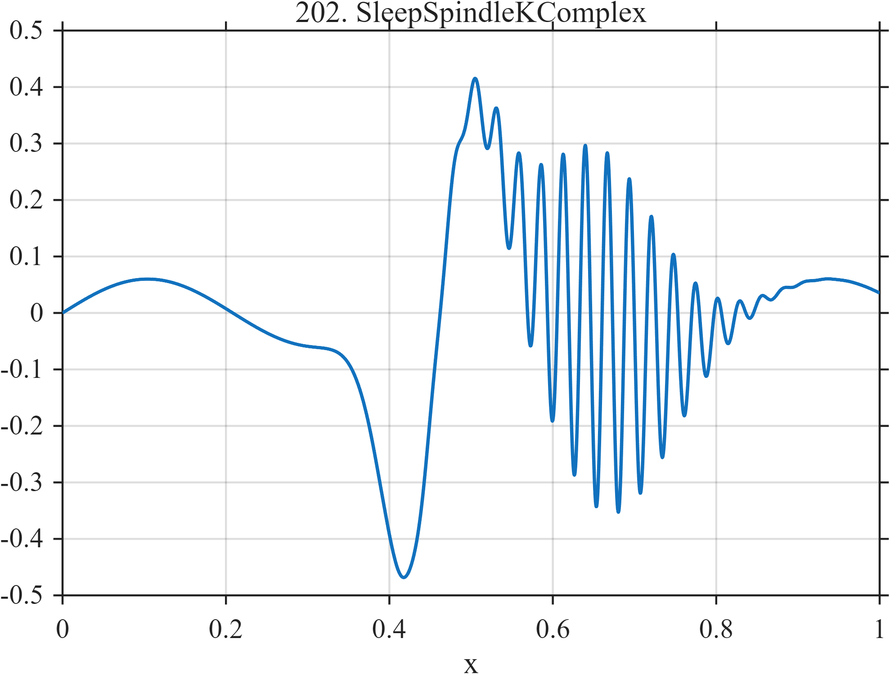

# TF202 — SleepSpindleKComplex

## Overview

A low-frequency background contains a large biphasic K-complex followed closely by a localized high-frequency spindle.

## Mathematical Definition

With $G(x;c,w)=e^{-((x-c)/w)^2/2}$,
$$
f(x)=0.06\sin(2\pi2.4x)-0.75G(x;0.43,0.035)
+0.48G(x;0.475,0.048)
+0.32G(x;0.66,0.075)\sin\{2\pi37(x-0.66)\}.
$$

## Morphological Characteristics

| Property | Description |
|---|---|
| Application family | Neurophysiology |
| Structure | Slow oscillation, signed Gaussian complex, and wave packet |
| Regularity | Smooth and strongly multiscale |
| Main challenge | Preserve two nearby structures occupying very different scales |

## Parameters

| Parameter | Value |
|---|---|
| K-complex centers | $0.43,0.475$ |
| Spindle center/width | $0.66/0.075$ |
| Spindle frequency | $37$ cycles/unit |

## MATLAB Implementation

~~~matlab
N=1024; x=linspace(0,1,N);
G=@(z,c,w) exp(-0.5*((z-c)/w).^2);
kcomp=-0.75*G(x,0.43,0.035)+0.48*G(x,0.475,0.048);
spindle=0.32*G(x,0.66,0.075).*sin(2*pi*37*(x-0.66));
slow=0.06*sin(2*pi*2.4*x); f=slow+kcomp+spindle;
plot(x,f,'LineWidth',1.3); grid on
xlabel('x'); ylabel('f(x)'); title('TF202 — SleepSpindleKComplex')
~~~

## Python Implementation

~~~python
import numpy as np
import matplotlib.pyplot as plt
N=1024
x=np.linspace(0.0,1.0,N)
G=lambda z,c,w: np.exp(-0.5*((z-c)/w)**2)
kcomp=-0.75*G(x,0.43,0.035)+0.48*G(x,0.475,0.048)
spindle=0.32*G(x,0.66,0.075)*np.sin(2*np.pi*37*(x-0.66))
slow=0.06*np.sin(2*np.pi*2.4*x); f=slow+kcomp+spindle
plt.plot(x,f); plt.grid(True)
plt.xlabel("x"); plt.ylabel("f(x)"); plt.title("TF202 — SleepSpindleKComplex")
plt.show()
~~~

## Recommended Uses

- EEG event denoising
- Wave-packet preservation
- Adjacent multiscale feature recovery

## Provenance

This is a deterministic benchmark surrogate inspired by neurophysiology measurement morphology. It is not a calibrated physical or clinical simulator.

[← Previous: CGMMealStack](TF201_CGMMealStack.md) · [Category 10 catalog](index.md) · [Next: PupilLightReflex →](TF203_PupilLightReflex.md)

