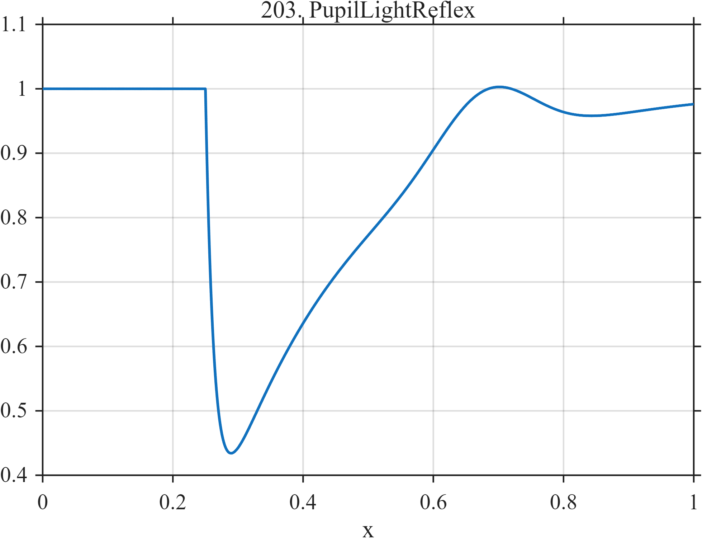

# TF203 — PupilLightReflex

## Overview

After a stimulus, the pupil surrogate constricts rapidly and redilates much more slowly, with a small late overshoot.

## Mathematical Definition

Let $u=(x-0.25)_+$. Then
$$
r(x)=I(x\ge0.25)(1-e^{-u/0.014})e^{-u/0.22},
$$
and, with $G(x;c,w)=e^{-((x-c)/w)^2/2}$,
$$
f(x)=1-0.72r(x)+0.10G(x;0.68,0.07).
$$

## Morphological Characteristics

| Property | Description |
|---|---|
| Application family | Biomedical optics |
| Structure | Asymmetric causal response plus Gaussian overshoot |
| Regularity | Smooth with a sharp change in time scale at onset |
| Main challenge | Preserve rapid constriction and slow recovery simultaneously |

## Parameters

| Parameter | Value |
|---|---|
| Stimulus time | $0.25$ |
| Rise/decay scales | $0.014/0.22$ |
| Overshoot center/width | $0.68/0.07$ |

## MATLAB Implementation

~~~matlab
N=1024; x=linspace(0,1,N);
G=@(z,c,w) exp(-0.5*((z-c)/w).^2);
u=max(x-0.25,0);
resp=(x>=0.25).*(1-exp(-u/0.014)).*exp(-u/0.22);
f=1-0.72*resp+0.10*G(x,0.68,0.07);
plot(x,f,'LineWidth',1.3); grid on
xlabel('x'); ylabel('f(x)'); title('TF203 — PupilLightReflex')
~~~

## Python Implementation

~~~python
import numpy as np
import matplotlib.pyplot as plt
N=1024
x=np.linspace(0.0,1.0,N)
G=lambda z,c,w: np.exp(-0.5*((z-c)/w)**2)
u=np.maximum(x-0.25,0)
resp=(x>=0.25)*(1-np.exp(-u/0.014))*np.exp(-u/0.22)
f=1-0.72*resp+0.10*G(x,0.68,0.07)
plt.plot(x,f); plt.grid(True)
plt.xlabel("x"); plt.ylabel("f(x)"); plt.title("TF203 — PupilLightReflex")
plt.show()
~~~

## Recommended Uses

- Asymmetric transient smoothing
- Onset localization
- Weak overshoot preservation

## Provenance

This is a deterministic benchmark surrogate inspired by biomedical optics measurement morphology. It is not a calibrated physical or clinical simulator.

[← Previous: SleepSpindleKComplex](TF202_SleepSpindleKComplex.md) · [Category 10 catalog](index.md) · [Next: CoughFlowBurst →](TF204_CoughFlowBurst.md)

