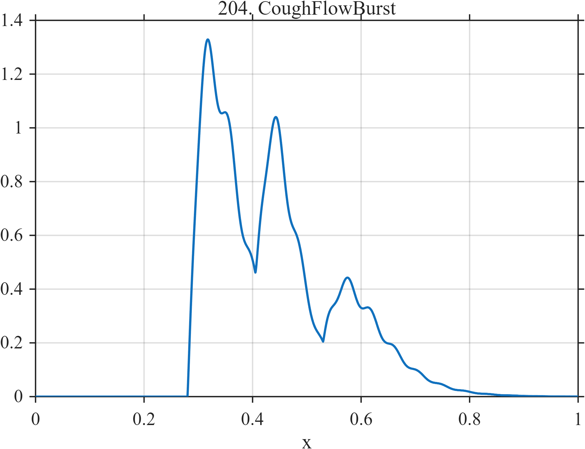

# TF204 — CoughFlowBurst

## Overview

An explosive primary cough-flow onset is followed by two smaller bursts and an irregularly modulated decay.

## Mathematical Definition

For $u_k=(x-c_k)_+$,
$$
r_k(x)=I(x\ge c_k)\left(\frac{u_k}{\tau_k}\right)^{p_k}
\exp\left(p_k-\frac{u_k}{\tau_k}\right).
$$
The signal is
$$
f(x)=\left[\sum_{k=1}^{3}a_kr_k(x)\right]
[1+0.08\sin(46\pi x)].
$$

## Morphological Characteristics

| Property | Description |
|---|---|
| Application family | Respiratory physiology |
| Structure | Three causal generalized gamma-like bursts with modulation |
| Regularity | Sharp asymmetric onsets and extended tails |
| Main challenge | Preserve high-dynamic-range onset and weak secondary events |

## Parameters

| Parameter | Value |
|---|---|
| Burst centers | $0.28,0.405,0.53$ |
| Amplitudes | $1.00,0.48,0.32$ |
| Shape powers | $1.2,1.4,1.1$ |

## MATLAB Implementation

~~~matlab
N=1024; x=linspace(0,1,N);
f=zeros(size(x)); c=[0.28 0.405 0.53]; a=[1.0 0.48 0.32];
tau=[0.035 0.027 0.045]; p=[1.2 1.4 1.1];
for k=1:3
 u=max(x-c(k),0); resp=(x>=c(k)).*(u/tau(k)).^p(k).*exp(p(k)-u/tau(k));
 f=f+a(k)*resp;
end
f=f.*(1+0.08*sin(2*pi*23*x));
plot(x,f,'LineWidth',1.3); grid on
xlabel('x'); ylabel('f(x)'); title('TF204 — CoughFlowBurst')
~~~

## Python Implementation

~~~python
import numpy as np
import matplotlib.pyplot as plt
N=1024
x=np.linspace(0.0,1.0,N)
f=np.zeros_like(x)
for c,a,tau,p in zip([0.28,0.405,0.53],[1.0,0.48,0.32],[0.035,0.027,0.045],[1.2,1.4,1.1]):
    u=np.maximum(x-c,0); resp=(x>=c)*(u/tau)**p*np.exp(p-u/tau)
    f+=a*resp
f*=1+0.08*np.sin(2*np.pi*23*x)
plt.plot(x,f); plt.grid(True)
plt.xlabel("x"); plt.ylabel("f(x)"); plt.title("TF204 — CoughFlowBurst")
plt.show()
~~~

## Recommended Uses

- Respiratory-burst denoising
- Secondary-event preservation
- Asymmetric tail recovery

## Provenance

This is a deterministic benchmark surrogate inspired by respiratory physiology measurement morphology. It is not a calibrated physical or clinical simulator.

[← Previous: PupilLightReflex](TF203_PupilLightReflex.md) · [Category 10 catalog](index.md) · [Next: DesaturationRecovery →](TF205_DesaturationRecovery.md)

