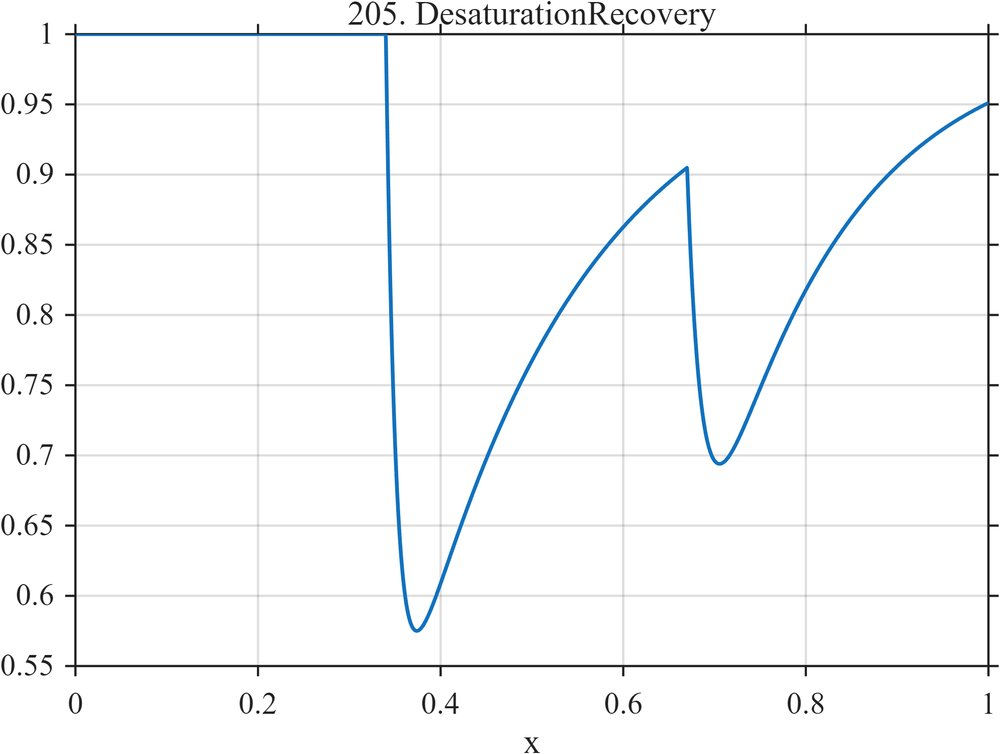

# TF205 — DesaturationRecovery

## Overview

Two oxygen-desaturation-like episodes fall rapidly and recover much more slowly. The second begins from a different local baseline because the events overlap.

## Mathematical Definition

For $u_k=(x-c_k)_+$,
$$
f(x)=1-\sum_{k=1}^{2}I(x\ge c_k)a_k
(1-e^{-u_k/t_{f,k}})e^{-u_k/t_{s,k}},
$$
with the parameter vectors given below.

## Morphological Characteristics

| Property | Description |
|---|---|
| Application family | Pulse oximetry |
| Structure | Unit baseline minus two asymmetric causal depressions |
| Regularity | Continuous with fast fall and slow nonlinear return |
| Main challenge | Recover minima and long recovery tails without bias |

## Parameters

| Parameter | Value |
|---|---|
| Event centers | $0.34,0.67$ |
| Depths | $0.54,0.34$ |
| Fast scales | $0.012,0.018$ |
| Slow scales | $0.19,0.14$ |

## MATLAB Implementation

~~~matlab
N=1024; x=linspace(0,1,N);
f=ones(size(x)); c=[0.34 0.67]; a=[0.54 0.34]; tf=[0.012 0.018]; ts=[0.19 0.14];
for k=1:2
 u=max(x-c(k),0);
 f=f-(x>=c(k)).*a(k).*(1-exp(-u/tf(k))).*exp(-u/ts(k));
end
plot(x,f,'LineWidth',1.3); grid on
xlabel('x'); ylabel('f(x)'); title('TF205 — DesaturationRecovery')
~~~

## Python Implementation

~~~python
import numpy as np
import matplotlib.pyplot as plt
N=1024
x=np.linspace(0.0,1.0,N)
f=np.ones_like(x)
for c,a,tf,ts in zip([0.34,0.67],[0.54,0.34],[0.012,0.018],[0.19,0.14]):
    u=np.maximum(x-c,0)
    f-=(x>=c)*a*(1-np.exp(-u/tf))*np.exp(-u/ts)
plt.plot(x,f); plt.grid(True)
plt.xlabel("x"); plt.ylabel("f(x)"); plt.title("TF205 — DesaturationRecovery")
plt.show()
~~~

## Recommended Uses

- Desaturation-minimum preservation
- Overlapping recovery estimation
- Asymmetric dip denoising

## Provenance

This is a deterministic benchmark surrogate inspired by pulse oximetry measurement morphology. It is not a calibrated physical or clinical simulator.

[← Previous: CoughFlowBurst](TF204_CoughFlowBurst.md) · [Category 10 catalog](index.md) · [Next: OJIPFluorescence →](TF206_OJIPFluorescence.md)

