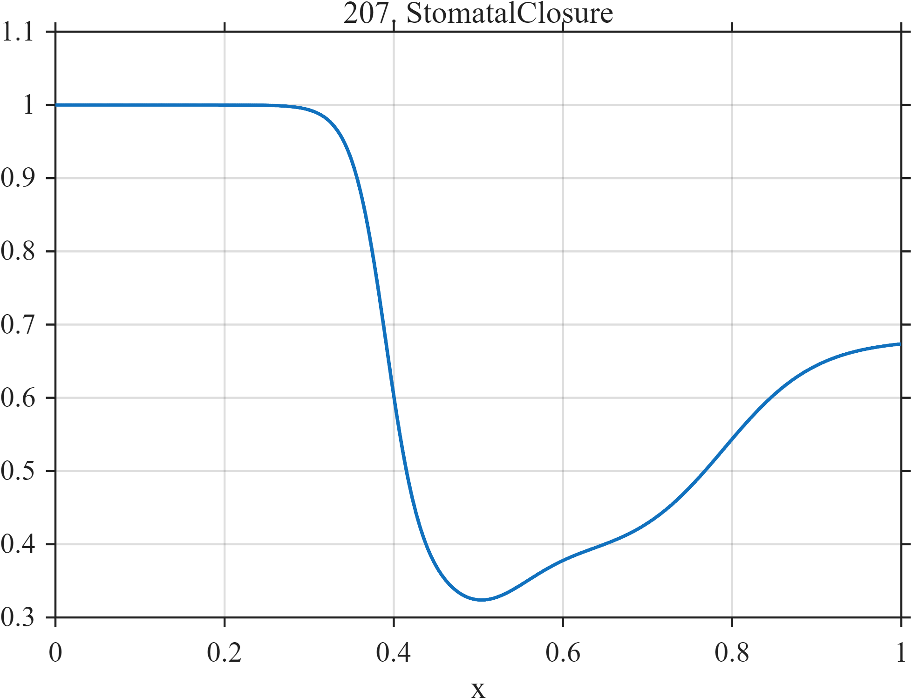

# TF207 — StomatalClosure

## Overview

A delayed sharp closure response is followed by slower incomplete reopening and a weak overshoot-like depression.

## Mathematical Definition

With
$L(x;c,w)=[1+e^{-(x-c)/w}]^{-1}$ and
$G(x;c,w)=e^{-((x-c)/w)^2/2}$,
$$
f(x)=1-0.62L(x;0.39,0.020)
+0.30L(x;0.79,0.055)-0.06G(x;0.50,0.055).
$$

## Morphological Characteristics

| Property | Description |
|---|---|
| Application family | Plant physiology |
| Structure | Opposing logistic transitions plus Gaussian depression |
| Regularity | Smooth but strongly asymmetric |
| Main challenge | Preserve threshold timing, overshoot, and incomplete recovery |

## Parameters

| Parameter | Value |
|---|---|
| Closure center/width | $0.39/0.020$ |
| Reopening center/width | $0.79/0.055$ |
| Depression center/width | $0.50/0.055$ |

## MATLAB Implementation

~~~matlab
N=1024; x=linspace(0,1,N);
S=@(z,c,w) 1./(1+exp(-(z-c)/w)); G=@(z,c,w) exp(-0.5*((z-c)/w).^2);
f=1-0.62*S(x,0.39,0.020)+0.30*S(x,0.79,0.055)-0.06*G(x,0.50,0.055);
plot(x,f,'LineWidth',1.3); grid on
xlabel('x'); ylabel('f(x)'); title('TF207 — StomatalClosure')
~~~

## Python Implementation

~~~python
import numpy as np
import matplotlib.pyplot as plt
N=1024
x=np.linspace(0.0,1.0,N)
S=lambda z,c,w: 1/(1+np.exp(-(z-c)/w)); G=lambda z,c,w: np.exp(-0.5*((z-c)/w)**2)
f=1-0.62*S(x,0.39,0.020)+0.30*S(x,0.79,0.055)-0.06*G(x,0.50,0.055)
plt.plot(x,f); plt.grid(True)
plt.xlabel("x"); plt.ylabel("f(x)"); plt.title("TF207 — StomatalClosure")
plt.show()
~~~

## Recommended Uses

- Threshold-response recovery
- Asymmetric transition smoothing
- Weak overshoot preservation

## Provenance

This is a deterministic benchmark surrogate inspired by plant physiology measurement morphology. It is not a calibrated physical or clinical simulator.

[← Previous: OJIPFluorescence](TF206_OJIPFluorescence.md) · [Category 10 catalog](index.md) · [Next: SapFlowLag →](TF208_SapFlowLag.md)

