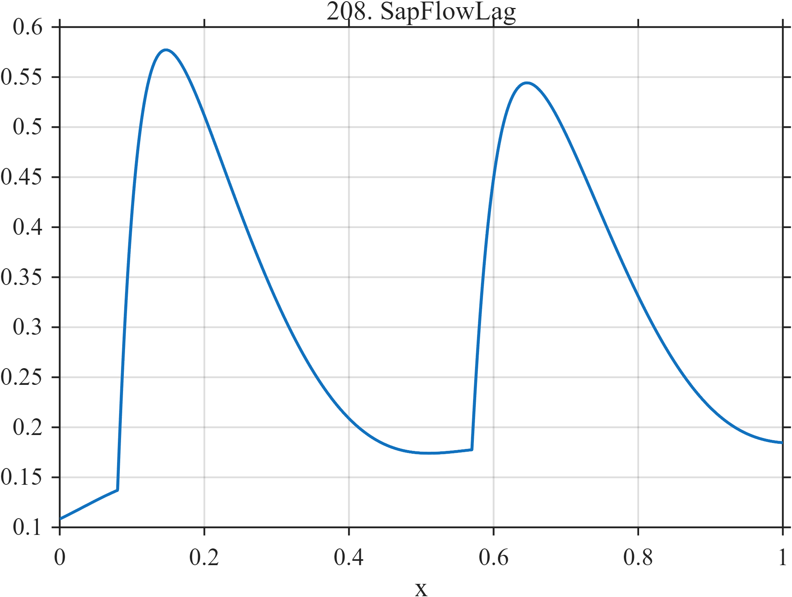

# TF208 — SapFlowLag

## Overview

Two unequal diurnal hydraulic pulses activate quickly and decay slowly against a weak background oscillation representing lagged forcing.

## Mathematical Definition

For $u_k=(x-c_k)_+$,
$$
f(x)=0.12+0.03\sin(4\pi x-0.4)
+\sum_{k=1}^{2}I(x\ge c_k)a_k
(1-e^{-u_k/t_{r,k}})e^{-u_k/t_{d,k}}.
$$

## Morphological Characteristics

| Property | Description |
|---|---|
| Application family | Plant hydraulics |
| Structure | Two asymmetric causal pulses plus low-frequency forcing |
| Regularity | Smooth and recurrent but nonidentical |
| Main challenge | Preserve cycle-to-cycle differences and long lags |

## Parameters

| Parameter | Value |
|---|---|
| Pulse starts | $0.08,0.57$ |
| Amplitudes | $0.78,0.70$ |
| Rise scales | $0.040,0.050$ |
| Decay scales | $0.17,0.19$ |

## MATLAB Implementation

~~~matlab
N=1024; x=linspace(0,1,N);
f=0.12*ones(size(x)); c=[0.08 0.57]; a=[0.78 0.70]; tr=[0.040 0.050]; td=[0.17 0.19];
for k=1:2
 u=max(x-c(k),0); f=f+(x>=c(k)).*a(k).*(1-exp(-u/tr(k))).*exp(-u/td(k));
end
f=f+0.03*sin(2*pi*2*x-0.4);
plot(x,f,'LineWidth',1.3); grid on
xlabel('x'); ylabel('f(x)'); title('TF208 — SapFlowLag')
~~~

## Python Implementation

~~~python
import numpy as np
import matplotlib.pyplot as plt
N=1024
x=np.linspace(0.0,1.0,N)
f=0.12*np.ones_like(x)
for c,a,tr,td in zip([0.08,0.57],[0.78,0.70],[0.040,0.050],[0.17,0.19]):
    u=np.maximum(x-c,0); f+=(x>=c)*a*(1-np.exp(-u/tr))*np.exp(-u/td)
f+=0.03*np.sin(2*np.pi*2*x-0.4)
plt.plot(x,f); plt.grid(True)
plt.xlabel("x"); plt.ylabel("f(x)"); plt.title("TF208 — SapFlowLag")
plt.show()
~~~

## Recommended Uses

- Diurnal-cycle denoising
- Hydraulic-lag preservation
- Unequal repeated-event recovery

## Provenance

This is a deterministic benchmark surrogate inspired by plant hydraulics measurement morphology. It is not a calibrated physical or clinical simulator.

[← Previous: StomatalClosure](TF207_StomatalClosure.md) · [Category 10 catalog](index.md) · [Next: LeafNyctinasty →](TF209_LeafNyctinasty.md)

