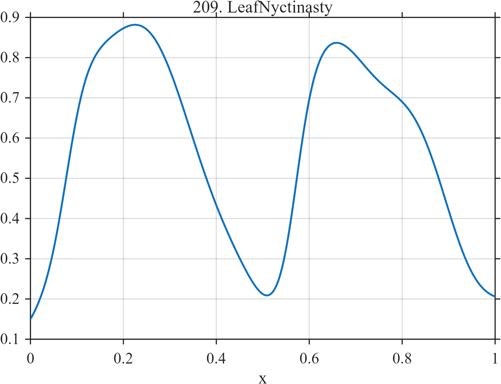

# TF209 — LeafNyctinasty

## Overview

Two daily opening–closing cycles have deliberately unequal transition speeds, making the waveform nearly periodic but distinctly nonsinusoidal.

## Mathematical Definition

With $L(x;c,w)=[1+e^{-(x-c)/w}]^{-1}$,
$$
\begin{aligned}
f(x)={}&0.12+0.78[L(x;0.08,0.025)-L(x;0.38,0.050)]\\
&+0.72[L(x;0.57,0.022)-L(x;0.88,0.060)]
+0.025\sin(10\pi x).
\end{aligned}
$$

## Morphological Characteristics

| Property | Description |
|---|---|
| Application family | Botany |
| Structure | Two pairs of asymmetric logistic gates plus weak oscillation |
| Regularity | Smooth repeated transitions without true jumps |
| Main challenge | Preserve unequal opening and closing rates |

## Parameters

| Parameter | Value |
|---|---|
| First cycle | $0.08$–$0.38$ |
| Second cycle | $0.57$–$0.88$ |
| Opening widths | $0.025,0.022$ |
| Closing widths | $0.050,0.060$ |

## MATLAB Implementation

~~~matlab
N=1024; x=linspace(0,1,N);
S=@(z,c,w) 1./(1+exp(-(z-c)/w));
f=0.12+0.78*(S(x,0.08,0.025)-S(x,0.38,0.050)) ...
 +0.72*(S(x,0.57,0.022)-S(x,0.88,0.060))+0.025*sin(2*pi*5*x);
plot(x,f,'LineWidth',1.3); grid on
xlabel('x'); ylabel('f(x)'); title('TF209 — LeafNyctinasty')
~~~

## Python Implementation

~~~python
import numpy as np
import matplotlib.pyplot as plt
N=1024
x=np.linspace(0.0,1.0,N)
S=lambda z,c,w: 1/(1+np.exp(-(z-c)/w))
f=0.12+0.78*(S(x,0.08,0.025)-S(x,0.38,0.050))
f+=0.72*(S(x,0.57,0.022)-S(x,0.88,0.060))+0.025*np.sin(2*np.pi*5*x)
plt.plot(x,f); plt.grid(True)
plt.xlabel("x"); plt.ylabel("f(x)"); plt.title("TF209 — LeafNyctinasty")
plt.show()
~~~

## Recommended Uses

- Quasi-periodic transition denoising
- Asymmetry preservation
- Cycle-shape recovery

## Provenance

This is a deterministic benchmark surrogate inspired by botany measurement morphology. It is not a calibrated physical or clinical simulator.

[← Previous: SapFlowLag](TF208_SapFlowLag.md) · [Category 10 catalog](index.md) · [Next: FungalGrowthPulse →](TF210_FungalGrowthPulse.md)

