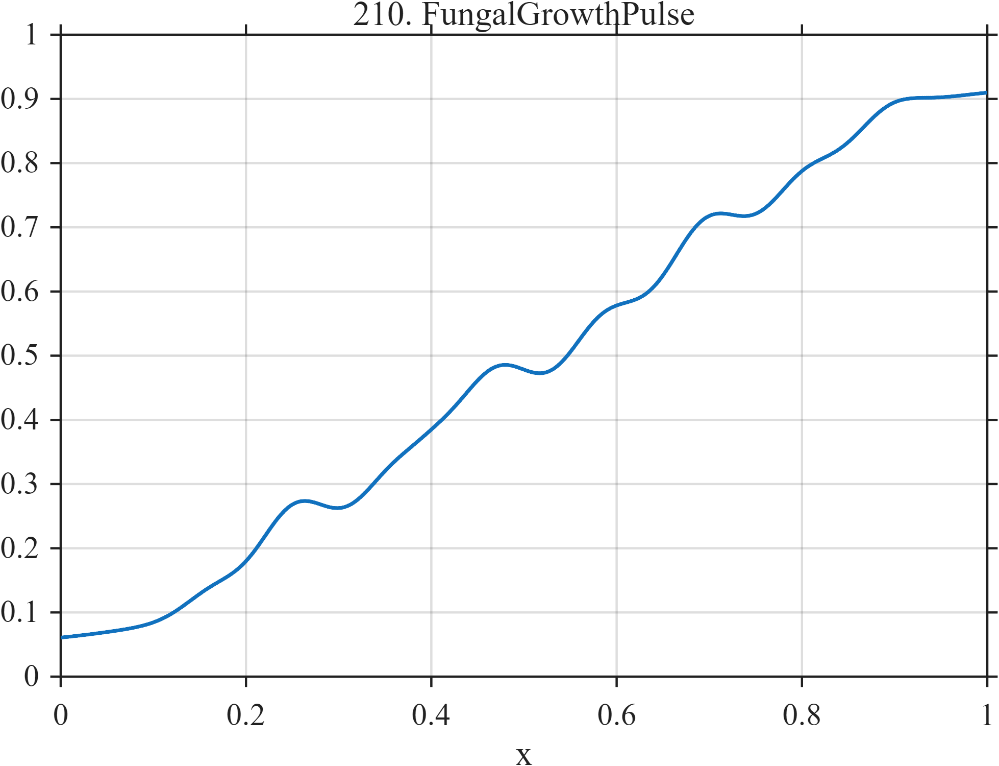

# TF210 — FungalGrowthPulse

## Overview

A slowly increasing baseline is punctuated by four sigmoidal growth spurts of different widths and magnitudes, with weak oscillation between them.

## Mathematical Definition

With $L(x;c,w)=[1+e^{-(x-c)/w}]^{-1}$,
$$
\begin{aligned}
f(x)={}&0.06+0.12x+0.19L(x;0.19,0.035)
+0.15L(x;0.39,0.018)\\
&+0.27L(x;0.63,0.050)+0.12L(x;0.84,0.020)\\
&+0.018\sin(18\pi x)[L(x;0.17,0.03)-L(x;0.88,0.03)].
\end{aligned}
$$

## Morphological Characteristics

| Property | Description |
|---|---|
| Application family | Mycology |
| Structure | Trend plus unequal logistic increments and gated ripple |
| Regularity | Smooth cumulative staircase |
| Main challenge | Preserve weak and broad growth phases simultaneously |

## Parameters

| Parameter | Value |
|---|---|
| Growth centers | $0.19,0.39,0.63,0.84$ |
| Growth magnitudes | $0.19,0.15,0.27,0.12$ |
| Growth widths | $0.035,0.018,0.050,0.020$ |

## MATLAB Implementation

~~~matlab
N=1024; x=linspace(0,1,N);
S=@(z,c,w) 1./(1+exp(-(z-c)/w));
f=0.06+0.12*x+0.19*S(x,0.19,0.035)+0.15*S(x,0.39,0.018) ...
 +0.27*S(x,0.63,0.050)+0.12*S(x,0.84,0.020);
f=f+0.018*sin(2*pi*9*x).*(S(x,0.17,0.03)-S(x,0.88,0.03));
plot(x,f,'LineWidth',1.3); grid on
xlabel('x'); ylabel('f(x)'); title('TF210 — FungalGrowthPulse')
~~~

## Python Implementation

~~~python
import numpy as np
import matplotlib.pyplot as plt
N=1024
x=np.linspace(0.0,1.0,N)
S=lambda z,c,w: 1/(1+np.exp(-(z-c)/w))
f=0.06+0.12*x+0.19*S(x,0.19,0.035)+0.15*S(x,0.39,0.018)
f+=0.27*S(x,0.63,0.050)+0.12*S(x,0.84,0.020)
f+=0.018*np.sin(2*np.pi*9*x)*(S(x,0.17,0.03)-S(x,0.88,0.03))
plt.plot(x,f); plt.grid(True)
plt.xlabel("x"); plt.ylabel("f(x)"); plt.title("TF210 — FungalGrowthPulse")
plt.show()
~~~

## Recommended Uses

- Growth-curve denoising
- Multiple-knee preservation
- Weak interphase oscillation recovery

## Provenance

This is a deterministic benchmark surrogate inspired by mycology measurement morphology. It is not a calibrated physical or clinical simulator.

[← Previous: LeafNyctinasty](TF209_LeafNyctinasty.md) · [Category 10 catalog](index.md) · [Next: PianoInharmonicDecay →](TF211_PianoInharmonicDecay.md)

