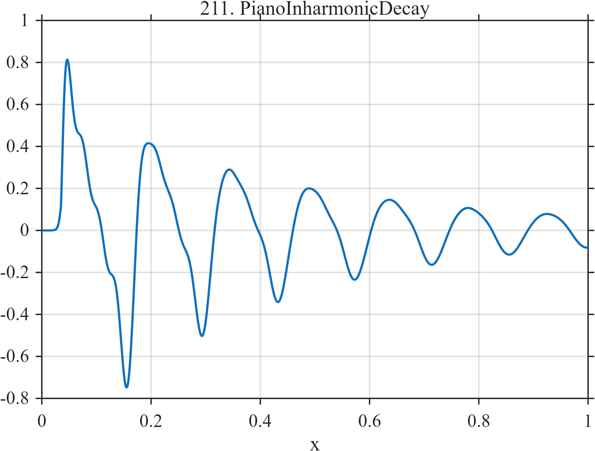

# TF211 — PianoInharmonicDecay

## Overview

After a short attack, four slightly inharmonic partials decay at frequency-dependent rates so the spectrum simplifies continuously over time.

## Mathematical Definition

Let $u=(x-0.035)_+$ and
$g(x)=[1+e^{-(x-0.035)/0.0025}]^{-1}$. Then
$$
f(x)=g(x)\sum_{k=1}^{4}a_ke^{-\lambda_ku}
\sin(2\pi\nu_ku+\phi_k),
$$
with $(a_k,\lambda_k,\nu_k,\phi_k)$ given exactly in the code.

## Morphological Characteristics

| Property | Description |
|---|---|
| Application family | Music/acoustics |
| Structure | Smoothly gated sum of four damped inharmonic sinusoids |
| Regularity | Sharp attack with long oscillatory tail |
| Main challenge | Preserve weak upper partials and their changing balance |

## Parameters

| Parameter | Value |
|---|---|
| Attack time/width | $0.035/0.0025$ |
| Frequencies | $7,14.25,21.7,29.5$ |
| Decay rates | $2.2,4.0,6.0,8.0$ |

## MATLAB Implementation

~~~matlab
N=1024; x=linspace(0,1,N);
S=@(z,c,w) 1./(1+exp(-(z-c)/w));
u=max(x-0.035,0); gate=S(x,0.035,0.0025);
f=gate.*(0.62*exp(-2.2*u).*sin(2*pi*7*u) ...
 +0.34*exp(-4.0*u).*sin(2*pi*14.25*u+0.15) ...
 +0.22*exp(-6.0*u).*sin(2*pi*21.7*u+0.4) ...
 +0.14*exp(-8.0*u).*sin(2*pi*29.5*u+0.7));
plot(x,f,'LineWidth',1.3); grid on
xlabel('x'); ylabel('f(x)'); title('TF211 — PianoInharmonicDecay')
~~~

## Python Implementation

~~~python
import numpy as np
import matplotlib.pyplot as plt
N=1024
x=np.linspace(0.0,1.0,N)
S=lambda z,c,w: 1/(1+np.exp(-(z-c)/w))
u=np.maximum(x-0.035,0); gate=S(x,0.035,0.0025)
f=gate*(0.62*np.exp(-2.2*u)*np.sin(2*np.pi*7*u)+0.34*np.exp(-4.0*u)*np.sin(2*np.pi*14.25*u+0.15)+0.22*np.exp(-6.0*u)*np.sin(2*np.pi*21.7*u+0.4)+0.14*np.exp(-8.0*u)*np.sin(2*np.pi*29.5*u+0.7))
plt.plot(x,f); plt.grid(True)
plt.xlabel("x"); plt.ylabel("f(x)"); plt.title("TF211 — PianoInharmonicDecay")
plt.show()
~~~

## Recommended Uses

- Inharmonic transient denoising
- Attack preservation
- Time-varying spectral recovery

## Provenance

This is a deterministic benchmark surrogate inspired by music/acoustics measurement morphology. It is not a calibrated physical or environmental simulator.

[← Previous: FungalGrowthPulse](TF210_FungalGrowthPulse.md) · [Category 10 catalog](index.md) · [Next: GuitarPluckDualDecay →](TF212_GuitarPluckDualDecay.md)

