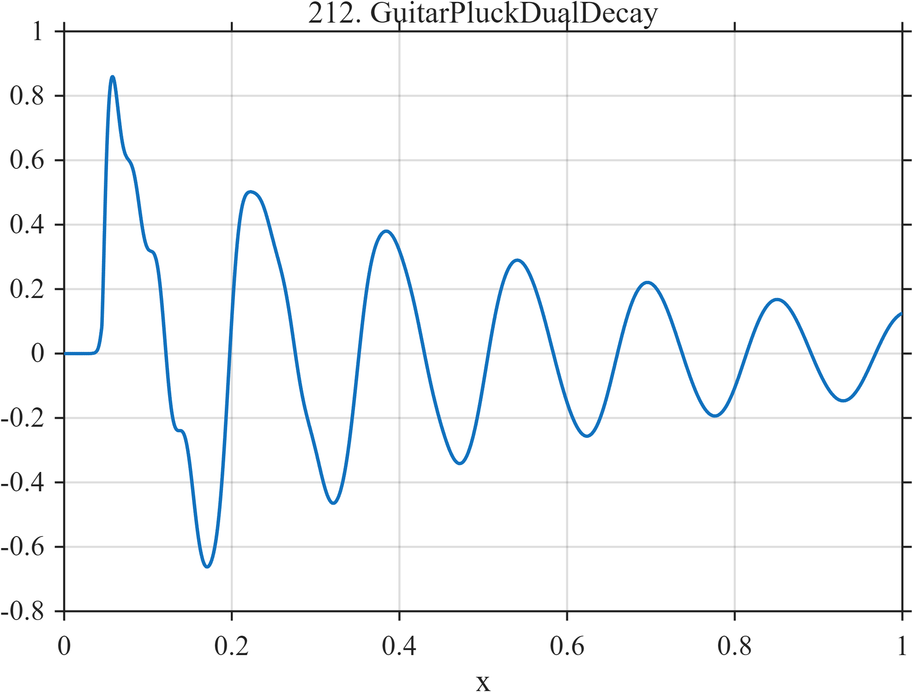

# TF212 — GuitarPluckDualDecay

## Overview

A sharp pluck attack excites a slowly decaying fundamental and three faster-decaying harmonics, leaving a long low-amplitude tail.

## Mathematical Definition

Let $u=(x-0.045)_+$ and
$g(x)=[1+e^{-(x-0.045)/0.002}]^{-1}$. Then
$$
f(x)=g(x)\sum_{k=1}^{4}a_ke^{-\lambda_ku}
\sin(2\pi\nu_ku+\phi_k),
$$
with the mode parameters given in the implementations.

## Morphological Characteristics

| Property | Description |
|---|---|
| Application family | Music/acoustics |
| Structure | Gated harmonic sum with mode-specific damping |
| Regularity | Sharp smooth onset and multirate oscillatory decay |
| Main challenge | Keep the attack and weak late harmonics together |

## Parameters

| Parameter | Value |
|---|---|
| Attack time/width | $0.045/0.002$ |
| Frequencies | $6.5,13,19.5,32.5$ |
| Decay rates | $1.8,5.5,8.0,11$ |

## MATLAB Implementation

~~~matlab
N=1024; x=linspace(0,1,N);
S=@(z,c,w) 1./(1+exp(-(z-c)/w));
u=max(x-0.045,0); gate=S(x,0.045,0.002);
f=gate.*(0.72*exp(-1.8*u).*sin(2*pi*6.5*u) ...
 +0.32*exp(-5.5*u).*sin(2*pi*13*u+0.2) ...
 +0.22*exp(-8.0*u).*sin(2*pi*19.5*u+0.5) ...
 +0.12*exp(-11*u).*sin(2*pi*32.5*u));
plot(x,f,'LineWidth',1.3); grid on
xlabel('x'); ylabel('f(x)'); title('TF212 — GuitarPluckDualDecay')
~~~

## Python Implementation

~~~python
import numpy as np
import matplotlib.pyplot as plt
N=1024
x=np.linspace(0.0,1.0,N)
S=lambda z,c,w: 1/(1+np.exp(-(z-c)/w))
u=np.maximum(x-0.045,0); gate=S(x,0.045,0.002)
f=gate*(0.72*np.exp(-1.8*u)*np.sin(2*np.pi*6.5*u)+0.32*np.exp(-5.5*u)*np.sin(2*np.pi*13*u+0.2)+0.22*np.exp(-8.0*u)*np.sin(2*np.pi*19.5*u+0.5)+0.12*np.exp(-11*u)*np.sin(2*np.pi*32.5*u))
plt.plot(x,f); plt.grid(True)
plt.xlabel("x"); plt.ylabel("f(x)"); plt.title("TF212 — GuitarPluckDualDecay")
plt.show()
~~~

## Recommended Uses

- Plucked-string denoising
- Sharp-attack recovery
- Weak harmonic-tail preservation

## Provenance

This is a deterministic benchmark surrogate inspired by music/acoustics measurement morphology. It is not a calibrated physical or environmental simulator.

[← Previous: PianoInharmonicDecay](TF211_PianoInharmonicDecay.md) · [Category 10 catalog](index.md) · [Next: BellBeating →](TF213_BellBeating.md)

