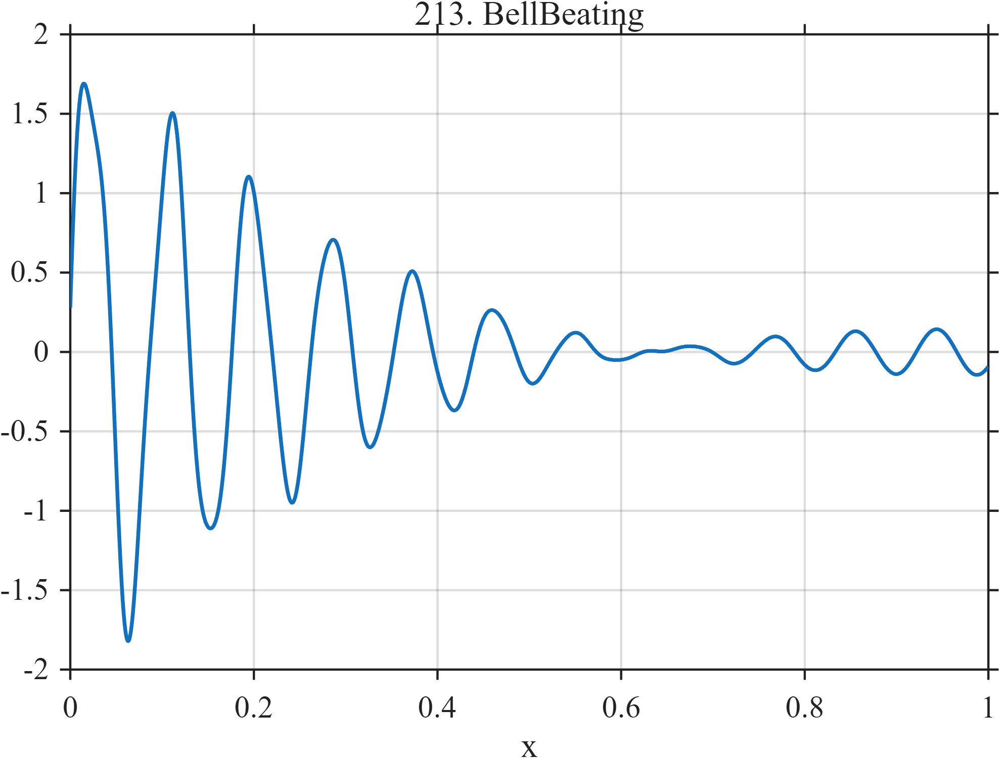

# TF213 — BellBeating

## Overview

Two closely spaced modes produce a long-lived beat envelope, while a third higher mode decays much more rapidly.

## Mathematical Definition

The signal is
$$
f(x)=e^{-2.3x}\{\sin(22\pi x)+0.92\sin(23.5\pi x+0.12)\}
+0.35e^{-6.9x}\sin(2\pi27.3x+0.5).
$$

## Morphological Characteristics

| Property | Description |
|---|---|
| Application family | Music/acoustics |
| Structure | Three damped sinusoids with a close-frequency pair |
| Regularity | Smooth, oscillatory, and nonstationary |
| Main challenge | Preserve the perceptually important beat envelope |

## Parameters

| Parameter | Value |
|---|---|
| Close frequencies | $11,11.75$ |
| Shared decay rate | $2.3$ |
| Third frequency/decay | $27.3/6.9$ |

## MATLAB Implementation

~~~matlab
N=1024; x=linspace(0,1,N);
f=exp(-2.3*x).*(sin(2*pi*11*x)+0.92*sin(2*pi*11.75*x+0.12)) ...
 +0.35*exp(-6.9*x).*sin(2*pi*27.3*x+0.5);
plot(x,f,'LineWidth',1.3); grid on
xlabel('x'); ylabel('f(x)'); title('TF213 — BellBeating')
~~~

## Python Implementation

~~~python
import numpy as np
import matplotlib.pyplot as plt
N=1024
x=np.linspace(0.0,1.0,N)
f=np.exp(-2.3*x)*(np.sin(2*np.pi*11*x)+0.92*np.sin(2*np.pi*11.75*x+0.12))
f+=0.35*np.exp(-6.9*x)*np.sin(2*np.pi*27.3*x+0.5)
plt.plot(x,f); plt.grid(True)
plt.xlabel("x"); plt.ylabel("f(x)"); plt.title("TF213 — BellBeating")
plt.show()
~~~

## Recommended Uses

- Beat-envelope recovery
- Close-mode preservation
- Decaying acoustic-signal denoising

## Provenance

This is a deterministic benchmark surrogate inspired by music/acoustics measurement morphology. It is not a calibrated physical or environmental simulator.

[← Previous: GuitarPluckDualDecay](TF212_GuitarPluckDualDecay.md) · [Category 10 catalog](index.md) · [Next: DrumModePacket →](TF214_DrumModePacket.md)

