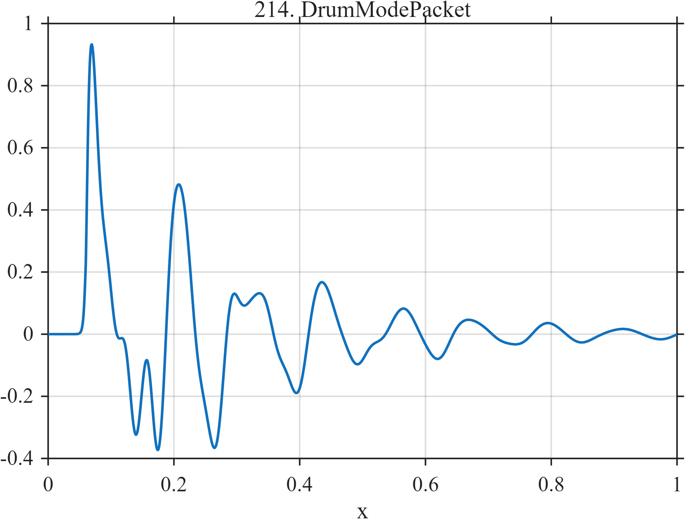

# TF214 — DrumModePacket

## Overview

A rapid attack excites four nonharmonic drum-like modes with different damping rates, causing the initially dense spectrum to simplify over time.

## Mathematical Definition

Let $u=(x-0.06)_+$ and
$g(x)=[1+e^{-(x-0.06)/0.002}]^{-1}$. Then
$$
f(x)=g(x)\sum_{k=1}^{4}a_ke^{-\lambda_ku}
\sin(2\pi\nu_ku+\phi_k),
$$
using the nonharmonic mode parameters in the code.

## Morphological Characteristics

| Property | Description |
|---|---|
| Application family | Music/acoustics |
| Structure | Smoothly gated nonharmonic damped-mode packet |
| Regularity | Sharp attack and evolving oscillatory tail |
| Main challenge | Preserve mode-specific decay across a dense onset |

## Parameters

| Parameter | Value |
|---|---|
| Attack time/width | $0.06/0.002$ |
| Frequencies | $8.5,13.7,22.4,31.2$ |
| Decay rates | $4,5.8,7.5,10$ |

## MATLAB Implementation

~~~matlab
N=1024; x=linspace(0,1,N);
S=@(z,c,w) 1./(1+exp(-(z-c)/w));
u=max(x-0.06,0); gate=S(x,0.06,0.002);
f=gate.*(0.58*exp(-4*u).*sin(2*pi*8.5*u) ...
 +0.40*exp(-5.8*u).*sin(2*pi*13.7*u+0.7) ...
 +0.27*exp(-7.5*u).*sin(2*pi*22.4*u+0.3) ...
 +0.16*exp(-10*u).*sin(2*pi*31.2*u+1.0));
plot(x,f,'LineWidth',1.3); grid on
xlabel('x'); ylabel('f(x)'); title('TF214 — DrumModePacket')
~~~

## Python Implementation

~~~python
import numpy as np
import matplotlib.pyplot as plt
N=1024
x=np.linspace(0.0,1.0,N)
S=lambda z,c,w: 1/(1+np.exp(-(z-c)/w))
u=np.maximum(x-0.06,0); gate=S(x,0.06,0.002)
f=gate*(0.58*np.exp(-4*u)*np.sin(2*np.pi*8.5*u)+0.40*np.exp(-5.8*u)*np.sin(2*np.pi*13.7*u+0.7)+0.27*np.exp(-7.5*u)*np.sin(2*np.pi*22.4*u+0.3)+0.16*np.exp(-10*u)*np.sin(2*np.pi*31.2*u+1.0))
plt.plot(x,f); plt.grid(True)
plt.xlabel("x"); plt.ylabel("f(x)"); plt.title("TF214 — DrumModePacket")
plt.show()
~~~

## Recommended Uses

- Percussive-transient denoising
- Nonharmonic-mode preservation
- Time-varying spectrum recovery

## Provenance

This is a deterministic benchmark surrogate inspired by music/acoustics measurement morphology. It is not a calibrated physical or environmental simulator.

[← Previous: BellBeating](TF213_BellBeating.md) · [Category 10 catalog](index.md) · [Next: TrafficStopGo →](TF215_TrafficStopGo.md)

