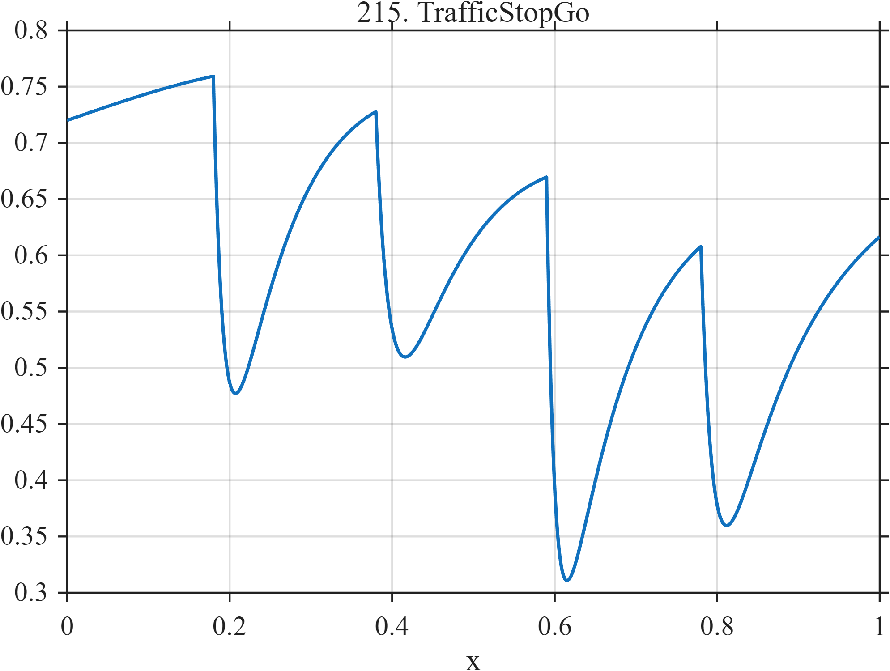

# TF215 — TrafficStopGo

## Overview

A slowly varying cruising level is repeatedly interrupted by rapid speed loss and slower recovery, with unequal event depths and time scales.

## Mathematical Definition

For $u_k=(x-c_k)_+$,
$$
f(x)=0.72+0.05\sin(2\pi0.8x)
-\sum_{k=1}^{4}I(x\ge c_k)a_k
(1-e^{-u_k/t_{f,k}})e^{-u_k/t_{s,k}},
$$
with the vectors listed below.

## Morphological Characteristics

| Property | Description |
|---|---|
| Application family | Transportation |
| Structure | Low-frequency baseline minus four asymmetric causal pulses |
| Regularity | Smooth, recurrent, and irregular |
| Main challenge | Preserve cycle asymmetry and event-to-event variation |

## Parameters

| Parameter | Value |
|---|---|
| Event centers | $0.18,0.38,0.59,0.78$ |
| Depths | $0.48,0.38,0.55,0.44$ |
| Fast scales | $0.012$–$0.020$ |
| Slow scales | $0.08$–$0.11$ |

## MATLAB Implementation

~~~matlab
N=1024; x=linspace(0,1,N);
f=0.72+0.05*sin(2*pi*0.8*x);
c=[0.18 0.38 0.59 0.78]; a=[0.48 0.38 0.55 0.44]; tf=[0.015 0.020 0.012 0.018]; ts=[0.08 0.11 0.09 0.10];
for k=1:4
 u=max(x-c(k),0); f=f-(x>=c(k)).*a(k).*(1-exp(-u/tf(k))).*exp(-u/ts(k));
end
plot(x,f,'LineWidth',1.3); grid on
xlabel('x'); ylabel('f(x)'); title('TF215 — TrafficStopGo')
~~~

## Python Implementation

~~~python
import numpy as np
import matplotlib.pyplot as plt
N=1024
x=np.linspace(0.0,1.0,N)
f=0.72+0.05*np.sin(2*np.pi*0.8*x)
for c,a,tf,ts in zip([0.18,0.38,0.59,0.78],[0.48,0.38,0.55,0.44],[0.015,0.020,0.012,0.018],[0.08,0.11,0.09,0.10]):
    u=np.maximum(x-c,0); f-=(x>=c)*a*(1-np.exp(-u/tf))*np.exp(-u/ts)
plt.plot(x,f); plt.grid(True)
plt.xlabel("x"); plt.ylabel("f(x)"); plt.title("TF215 — TrafficStopGo")
plt.show()
~~~

## Recommended Uses

- Stop-and-go waveform denoising
- Repeated-event preservation
- Asymmetric recovery estimation

## Provenance

This is a deterministic benchmark surrogate inspired by transportation measurement morphology. It is not a calibrated physical or environmental simulator.

[← Previous: DrumModePacket](TF214_DrumModePacket.md) · [Category 10 catalog](index.md) · [Next: ElevatorRide →](TF216_ElevatorRide.md)

