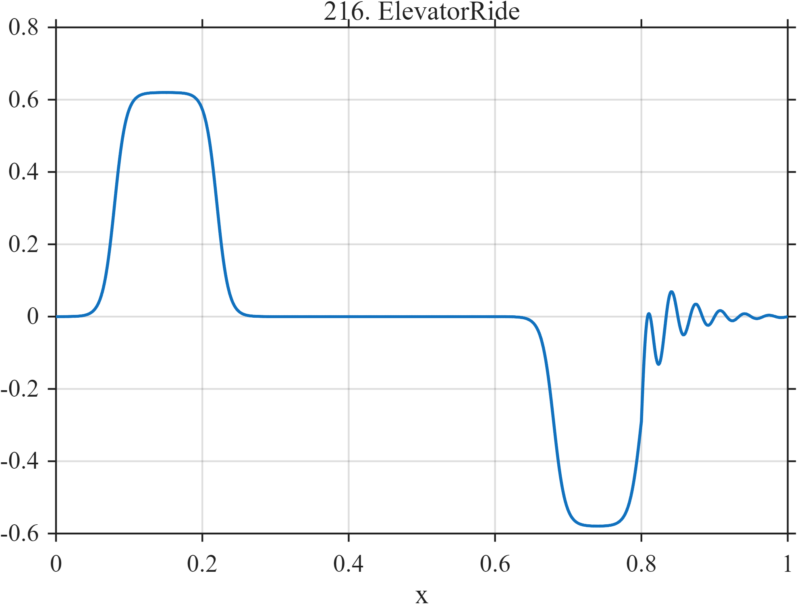

# TF216 — ElevatorRide

## Overview

The acceleration trace contains a positive plateau, near-zero cruise, a negative braking plateau, and a short damped settling oscillation.

## Mathematical Definition

With $L(x;c,w)=[1+e^{-(x-c)/w}]^{-1}$ and $u=(x-0.80)_+$,
$$
\begin{aligned}
f(x)={}&0.62[L(x;0.08,0.008)-L(x;0.22,0.008)]\\
&-0.58[L(x;0.68,0.008)-L(x;0.80,0.008)]\\
&+I(x\ge0.80)0.18e^{-22u}\sin(60\pi u).
\end{aligned}
$$

## Morphological Characteristics

| Property | Description |
|---|---|
| Application family | Everyday mechanics |
| Structure | Opposing finite logistic plateaus plus causal ring-down |
| Regularity | Flat regions joined by sharp smooth transitions |
| Main challenge | Preserve plateau edges and weak final settling |

## Parameters

| Parameter | Value |
|---|---|
| Acceleration interval | $0.08$–$0.22$ |
| Braking interval | $0.68$–$0.80$ |
| Settling frequency/decay | $30/22$ |

## MATLAB Implementation

~~~matlab
N=1024; x=linspace(0,1,N);
S=@(z,c,w) 1./(1+exp(-(z-c)/w));
f=0.62*(S(x,0.08,0.008)-S(x,0.22,0.008)) ...
 -0.58*(S(x,0.68,0.008)-S(x,0.80,0.008));
u=max(x-0.80,0); f=f+(x>=0.80).*0.18.*exp(-22*u).*sin(2*pi*30*u);
plot(x,f,'LineWidth',1.3); grid on
xlabel('x'); ylabel('f(x)'); title('TF216 — ElevatorRide')
~~~

## Python Implementation

~~~python
import numpy as np
import matplotlib.pyplot as plt
N=1024
x=np.linspace(0.0,1.0,N)
S=lambda z,c,w: 1/(1+np.exp(-(z-c)/w))
f=0.62*(S(x,0.08,0.008)-S(x,0.22,0.008))-0.58*(S(x,0.68,0.008)-S(x,0.80,0.008))
u=np.maximum(x-0.80,0); f+=(x>=0.80)*0.18*np.exp(-22*u)*np.sin(2*np.pi*30*u)
plt.plot(x,f); plt.grid(True)
plt.xlabel("x"); plt.ylabel("f(x)"); plt.title("TF216 — ElevatorRide")
plt.show()
~~~

## Recommended Uses

- Plateau-edge preservation
- Inertial-sensor denoising
- Weak settling-oscillation recovery

## Provenance

This is a deterministic benchmark surrogate inspired by everyday mechanics measurement morphology. It is not a calibrated physical or environmental simulator.

[← Previous: TrafficStopGo](TF215_TrafficStopGo.md) · [Category 10 catalog](index.md) · [Next: ThermostatCycle →](TF217_ThermostatCycle.md)

