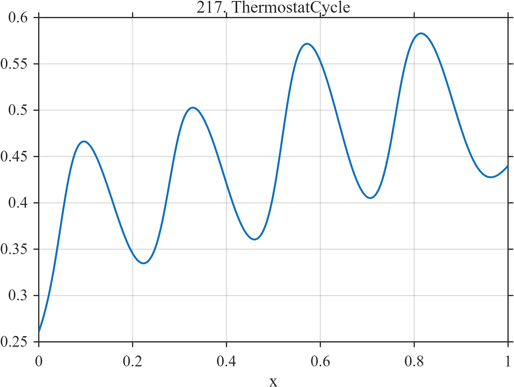

# TF217 — ThermostatCycle

## Overview

Four asymmetric heating intervals are superimposed on slow thermal drift and a weak periodic component.

## Mathematical Definition

With $L(x;c,w)=[1+e^{-(x-c)/w}]^{-1}$,
$$
f(x)=0.25+0.18x+0.025\sin(8\pi x)
+\sum_{k=1}^{4}a_k[L(x;o_k,0.018)-L(x;d_k,0.038)],
$$
where $o_k$ and $d_k$ are the on and off times.

## Morphological Characteristics

| Property | Description |
|---|---|
| Application family | Building systems |
| Structure | Trend plus four unequal smooth finite-duration gates |
| Regularity | Smooth controller cycles with different heating/cooling rates |
| Main challenge | Preserve asymmetric transitions without flattening drift |

## Parameters

| Parameter | Value |
|---|---|
| On times | $0.05,0.28,0.52,0.76$ |
| Off times | $0.18,0.41,0.65,0.89$ |
| On width | $0.018$ |
| Off width | $0.038$ |

## MATLAB Implementation

~~~matlab
N=1024; x=linspace(0,1,N);
S=@(z,c,w) 1./(1+exp(-(z-c)/w)); f=0.25+0.18*x;
on=[0.05 0.28 0.52 0.76]; off=[0.18 0.41 0.65 0.89]; amp=[0.22 0.20 0.23 0.19];
for k=1:4, f=f+amp(k)*(S(x,on(k),0.018)-S(x,off(k),0.038)); end
f=f+0.025*sin(2*pi*4*x);
plot(x,f,'LineWidth',1.3); grid on
xlabel('x'); ylabel('f(x)'); title('TF217 — ThermostatCycle')
~~~

## Python Implementation

~~~python
import numpy as np
import matplotlib.pyplot as plt
N=1024
x=np.linspace(0.0,1.0,N)
S=lambda z,c,w: 1/(1+np.exp(-(z-c)/w)); f=0.25+0.18*x
for on,off,a in zip([0.05,0.28,0.52,0.76],[0.18,0.41,0.65,0.89],[0.22,0.20,0.23,0.19]): f+=a*(S(x,on,0.018)-S(x,off,0.038))
f+=0.025*np.sin(2*np.pi*4*x)
plt.plot(x,f); plt.grid(True)
plt.xlabel("x"); plt.ylabel("f(x)"); plt.title("TF217 — ThermostatCycle")
plt.show()
~~~

## Recommended Uses

- Controller-cycle denoising
- Asymmetric edge preservation
- Trend-plus-cycle separation

## Provenance

This is a deterministic benchmark surrogate inspired by building systems measurement morphology. It is not a calibrated physical or environmental simulator.

[← Previous: ElevatorRide](TF216_ElevatorRide.md) · [Category 10 catalog](index.md) · [Next: AtmosphericRiver →](TF218_AtmosphericRiver.md)

