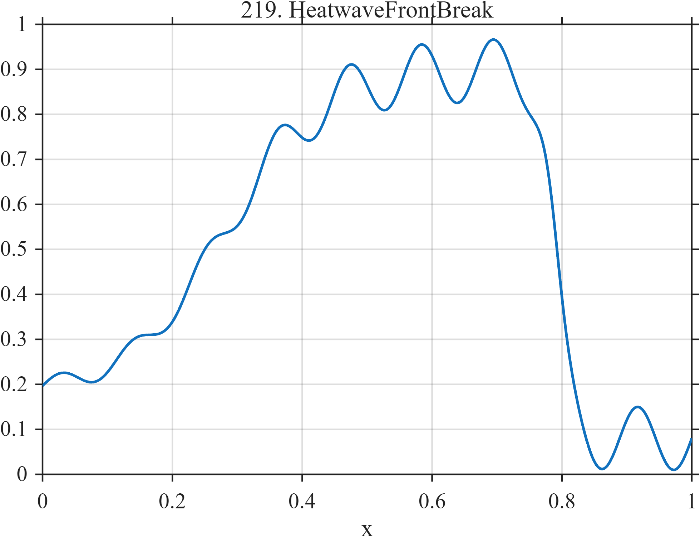

# TF219 — HeatwaveFrontBreak

## Overview

Temperature rises gradually toward a high plateau with increasingly visible diurnal oscillation, then collapses rapidly at a frontal passage.

## Mathematical Definition

With $L(x;c,w)=[1+e^{-(x-c)/w}]^{-1}$,
$$
f(x)=0.18+0.72L(x;0.28,0.075)-0.82L(x;0.79,0.012)
+[0.02+0.05L(x;0.35,0.08)]\sin(18\pi x).
$$

## Morphological Characteristics

| Property | Description |
|---|---|
| Application family | Climate |
| Structure | Two unequal logistic transitions plus amplitude-varying oscillation |
| Regularity | Smooth long trend with one sharp macroscopic break |
| Main challenge | Keep the abrupt break and low-amplitude diurnal structure |

## Parameters

| Parameter | Value |
|---|---|
| Rise center/width | $0.28/0.075$ |
| Break center/width | $0.79/0.012$ |
| Oscillation frequency | $9$ cycles/unit |

## MATLAB Implementation

~~~matlab
N=1024; x=linspace(0,1,N);
S=@(z,c,w) 1./(1+exp(-(z-c)/w));
f=0.18+0.72*S(x,0.28,0.075)-0.82*S(x,0.79,0.012);
f=f+(0.02+0.05*S(x,0.35,0.08)).*sin(2*pi*9*x);
plot(x,f,'LineWidth',1.3); grid on
xlabel('x'); ylabel('f(x)'); title('TF219 — HeatwaveFrontBreak')
~~~

## Python Implementation

~~~python
import numpy as np
import matplotlib.pyplot as plt
N=1024
x=np.linspace(0.0,1.0,N)
S=lambda z,c,w: 1/(1+np.exp(-(z-c)/w))
f=0.18+0.72*S(x,0.28,0.075)-0.82*S(x,0.79,0.012)
f+=(0.02+0.05*S(x,0.35,0.08))*np.sin(2*np.pi*9*x)
plt.plot(x,f); plt.grid(True)
plt.xlabel("x"); plt.ylabel("f(x)"); plt.title("TF219 — HeatwaveFrontBreak")
plt.show()
~~~

## Recommended Uses

- Regime-break localization
- Trend-plus-cycle denoising
- Climate-extreme morphology recovery

## Provenance

This is a deterministic benchmark surrogate inspired by climate measurement morphology. It is not a calibrated physical or environmental simulator.

[← Previous: AtmosphericRiver](TF218_AtmosphericRiver.md) · [Category 10 catalog](index.md) · [Next: DroughtRecovery →](TF220_DroughtRecovery.md)

