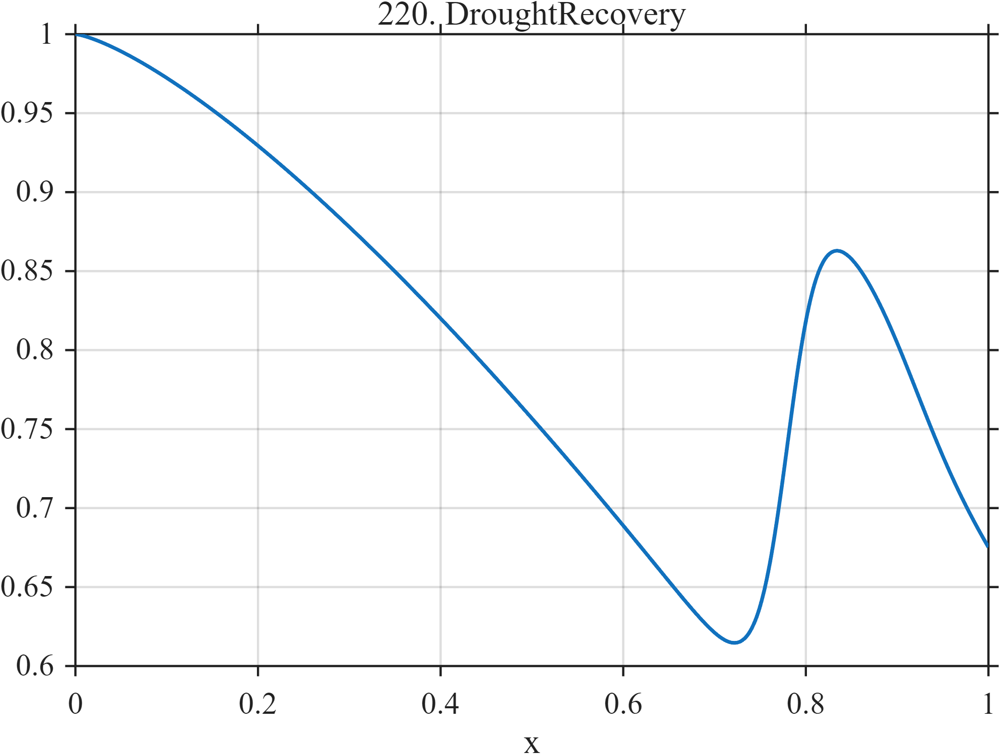

# TF220 — DroughtRecovery

## Overview

The signal declines slowly and nonlinearly over most of the record, then undergoes a comparatively rapid but incomplete recovery and a small late correction.

## Mathematical Definition

With $L(x;c,w)=[1+e^{-(x-c)/w}]^{-1}$,
$$
f(x)=1-0.62x^{1.35}+0.37L(x;0.78,0.018)
-0.08L(x;0.92,0.03).
$$

## Morphological Characteristics

| Property | Description |
|---|---|
| Application family | Hydroclimate |
| Structure | Power-law decline with two opposing logistic changes |
| Regularity | Smooth with a concentrated recovery threshold |
| Main challenge | Preserve the recovery onset without biasing the long decline |

## Parameters

| Parameter | Value |
|---|---|
| Decline coefficient/power | $0.62/1.35$ |
| Recovery center/width | $0.78/0.018$ |
| Late correction | $-0.08$ at $0.92$ |

## MATLAB Implementation

~~~matlab
N=1024; x=linspace(0,1,N);
S=@(z,c,w) 1./(1+exp(-(z-c)/w));
f=1-0.62*x.^1.35+0.37*S(x,0.78,0.018)-0.08*S(x,0.92,0.03);
plot(x,f,'LineWidth',1.3); grid on
xlabel('x'); ylabel('f(x)'); title('TF220 — DroughtRecovery')
~~~

## Python Implementation

~~~python
import numpy as np
import matplotlib.pyplot as plt
N=1024
x=np.linspace(0.0,1.0,N)
S=lambda z,c,w: 1/(1+np.exp(-(z-c)/w))
f=1-0.62*x**1.35+0.37*S(x,0.78,0.018)-0.08*S(x,0.92,0.03)
plt.plot(x,f); plt.grid(True)
plt.xlabel("x"); plt.ylabel("f(x)"); plt.title("TF220 — DroughtRecovery")
plt.show()
~~~

## Recommended Uses

- Nonlinear-trend smoothing
- Recovery-threshold detection
- Long-range bias assessment

## Provenance

This is a deterministic benchmark surrogate inspired by hydroclimate measurement morphology. It is not a calibrated physical or environmental simulator.

[← Previous: HeatwaveFrontBreak](TF219_HeatwaveFrontBreak.md) · [Category 10 catalog](index.md) · [Next: ENSOEnvelope →](TF221_ENSOEnvelope.md)

