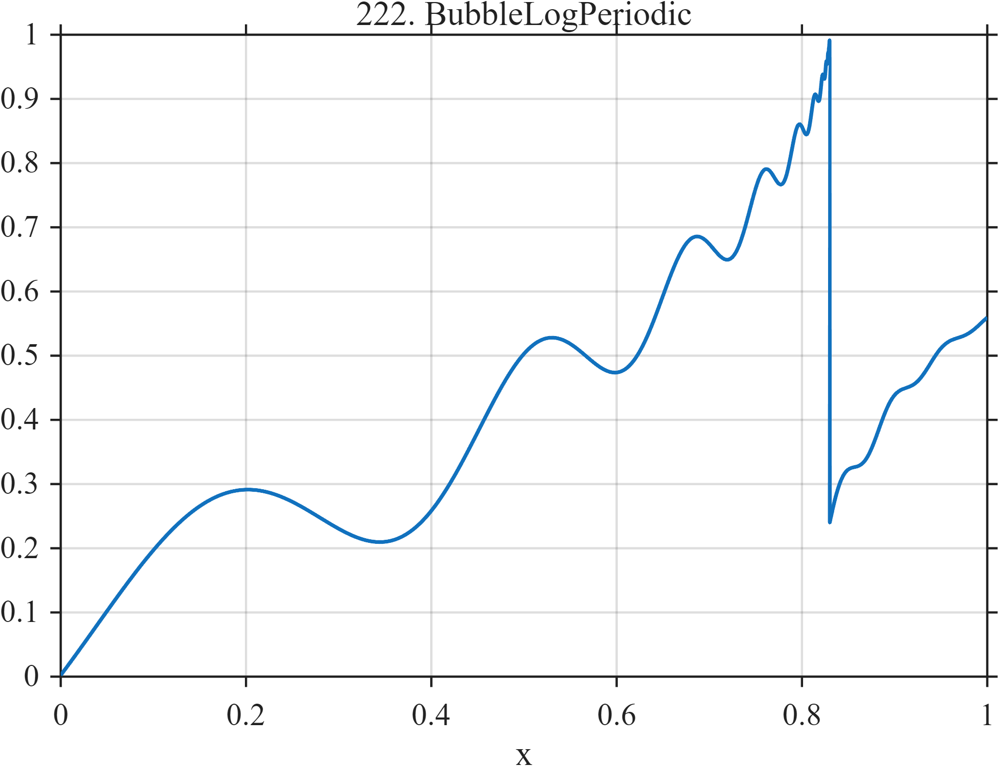

# TF222 — BubbleLogPeriodic

## Overview

A speculative-bubble surrogate develops accelerating log-periodic oscillations toward a critical time, then crashes abruptly and partially recovers with weak ringing.

## Mathematical Definition

Let $x_c=0.83$ and $t=\max(x_c-x,10^{-5})$. Then
$$
f(x)=1-1.05t^{0.55}[1+0.14\cos\{8.5\log t+0.4\}],
\qquad x<x_c.
$$
For $u=x-x_c\ge0$,
$$
f(x)=0.24+0.42(1-e^{-u/0.12})
+0.03e^{-12u}\sin(36\pi u).
$$

## Morphological Characteristics

| Property | Description |
|---|---|
| Application family | Finance |
| Structure | Critical power law with log-periodicity and post-crash recovery |
| Regularity | Frequency compression followed by a discontinuous regime change |
| Main challenge | Preserve accelerating oscillations immediately before the crash |

## Parameters

| Parameter | Value |
|---|---|
| Critical time $x_c$ | $0.83$ |
| Power $m$ | $0.55$ |
| Log frequency | $8.5$ |
| Modulation depth | $0.14$ |

## MATLAB Implementation

~~~matlab
N=1024; x=linspace(0,1,N);
xc=0.83; f=zeros(size(x)); pre=x<xc; t=max(xc-x,1e-5);
f(pre)=1-1.05*t(pre).^0.55.*(1+0.14*cos(8.5*log(t(pre))+0.4));
u=max(x-xc,0);
f(~pre)=0.24+0.42*(1-exp(-u(~pre)/0.12))+0.03*sin(2*pi*18*u(~pre)).*exp(-12*u(~pre));
plot(x,f,'LineWidth',1.3); grid on
xlabel('x'); ylabel('f(x)'); title('TF222 — BubbleLogPeriodic')
~~~

## Python Implementation

~~~python
import numpy as np
import matplotlib.pyplot as plt
N=1024
x=np.linspace(0.0,1.0,N)
xc=0.83; f=np.zeros_like(x); pre=x<xc; t=np.maximum(xc-x,1e-5)
f[pre]=1-1.05*t[pre]**0.55*(1+0.14*np.cos(8.5*np.log(t[pre])+0.4))
u=np.maximum(x-xc,0)
f[~pre]=0.24+0.42*(1-np.exp(-u[~pre]/0.12))+0.03*np.sin(2*np.pi*18*u[~pre])*np.exp(-12*u[~pre])
plt.plot(x,f); plt.grid(True)
plt.xlabel("x"); plt.ylabel("f(x)"); plt.title("TF222 — BubbleLogPeriodic")
plt.show()
~~~

## Recommended Uses

- Critical-time signal denoising
- Crash localization
- Log-periodic precursor preservation

## Provenance

This is a deterministic benchmark surrogate inspired by finance measurement morphology. It is not a calibrated physical or financial simulator.

[← Previous: ENSOEnvelope](TF221_ENSOEnvelope.md) · [Category 10 catalog](index.md) · [Next: IntradayVolatilityU →](TF223_IntradayVolatilityU.md)

