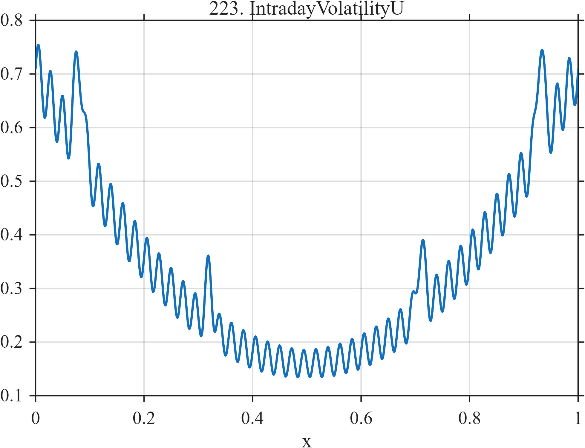

# TF223 — IntradayVolatilityU

## Overview

A deterministic U-shaped volatility profile has elevated endpoint microstructure oscillation and four isolated event spikes.

## Mathematical Definition

With $G(x;c,w)=e^{-((x-c)/w)^2/2}$,
$$
f(x)=0.16+2.2(x-0.5)^2
+0.025[1+2.5|x-0.5|]\sin(90\pi x)
+\sum_{k=1}^{4}a_kG(x;c_k,w_k),
$$
where the event parameters are given below.

## Morphological Characteristics

| Property | Description |
|---|---|
| Application family | Finance |
| Structure | Quadratic envelope plus endpoint-weighted ripple and Gaussians |
| Regularity | Smooth with narrow localized events |
| Main challenge | Recover both the broad U shape and fine endpoint structure |

## Parameters

| Parameter | Value |
|---|---|
| U-shape coefficient | $2.2$ |
| Ripple frequency | $45$ cycles/unit |
| Event centers | $0.08,0.32,0.71,0.93$ |

## MATLAB Implementation

~~~matlab
N=1024; x=linspace(0,1,N);
G=@(z,c,w) exp(-0.5*((z-c)/w).^2);
f=0.16+2.2*(x-0.5).^2+0.025*sin(2*pi*45*x).*(1+2.5*abs(x-0.5));
c=[0.08 0.32 0.71 0.93]; a=[0.18 0.10 0.12 0.20]; w=[0.008 0.006 0.007 0.006];
for k=1:4, f=f+a(k)*G(x,c(k),w(k)); end
plot(x,f,'LineWidth',1.3); grid on
xlabel('x'); ylabel('f(x)'); title('TF223 — IntradayVolatilityU')
~~~

## Python Implementation

~~~python
import numpy as np
import matplotlib.pyplot as plt
N=1024
x=np.linspace(0.0,1.0,N)
G=lambda z,c,w: np.exp(-0.5*((z-c)/w)**2)
f=0.16+2.2*(x-0.5)**2+0.025*np.sin(2*np.pi*45*x)*(1+2.5*np.abs(x-0.5))
for c,a,w in zip([0.08,0.32,0.71,0.93],[0.18,0.10,0.12,0.20],[0.008,0.006,0.007,0.006]): f+=a*G(x,c,w)
plt.plot(x,f); plt.grid(True)
plt.xlabel("x"); plt.ylabel("f(x)"); plt.title("TF223 — IntradayVolatilityU")
plt.show()
~~~

## Recommended Uses

- Envelope-plus-event denoising
- Endpoint microstructure preservation
- Volatility-profile smoothing

## Provenance

This is a deterministic benchmark surrogate inspired by finance measurement morphology. It is not a calibrated physical or financial simulator.

[← Previous: BubbleLogPeriodic](TF222_BubbleLogPeriodic.md) · [Category 10 catalog](index.md) · [Next: LiquidityDrought →](TF224_LiquidityDrought.md)

