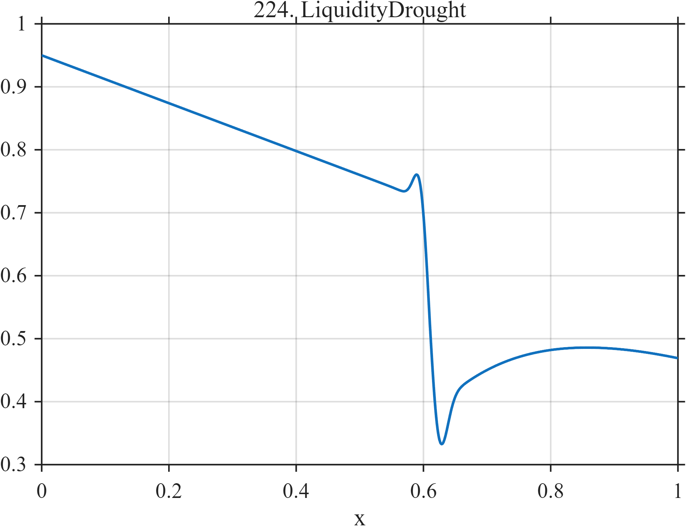

# TF224 — LiquidityDrought

## Overview

Liquidity deteriorates gradually, suffers an abrupt additional loss, and then recovers only partially and nonlinearly, with small features surrounding the gap.

## Mathematical Definition

With $L(x;c,w)=[1+e^{-(x-c)/w}]^{-1}$,
$G(x;c,w)=e^{-((x-c)/w)^2/2}$, and $u=(x-0.61)_+$,
$$
\begin{aligned}
f(x)={}&0.95-0.38x-0.34L(x;0.61,0.008)\\
&+I(x\ge0.61)0.27(1-e^{-u/0.18})
+0.07G(x;0.595,0.010)-0.10G(x;0.625,0.012).
\end{aligned}
$$

## Morphological Characteristics

| Property | Description |
|---|---|
| Application family | Market microstructure |
| Structure | Trend, sharp logistic loss, slow recovery, and local peaks |
| Regularity | Mixed smooth trend and concentrated change point |
| Main challenge | Preserve precursor and post-gap features near the main loss |

## Parameters

| Parameter | Value |
|---|---|
| Gap center/width | $0.61/0.008$ |
| Gap magnitude | $0.34$ |
| Recovery scale | $0.18$ |

## MATLAB Implementation

~~~matlab
N=1024; x=linspace(0,1,N);
S=@(z,c,w) 1./(1+exp(-(z-c)/w)); G=@(z,c,w) exp(-0.5*((z-c)/w).^2);
f=0.95-0.38*x-0.34*S(x,0.61,0.008); u=max(x-0.61,0);
f=f+(x>=0.61).*0.27.*(1-exp(-u/0.18))+0.07*G(x,0.595,0.010)-0.10*G(x,0.625,0.012);
plot(x,f,'LineWidth',1.3); grid on
xlabel('x'); ylabel('f(x)'); title('TF224 — LiquidityDrought')
~~~

## Python Implementation

~~~python
import numpy as np
import matplotlib.pyplot as plt
N=1024
x=np.linspace(0.0,1.0,N)
S=lambda z,c,w: 1/(1+np.exp(-(z-c)/w)); G=lambda z,c,w: np.exp(-0.5*((z-c)/w)**2)
f=0.95-0.38*x-0.34*S(x,0.61,0.008); u=np.maximum(x-0.61,0)
f+=(x>=0.61)*0.27*(1-np.exp(-u/0.18))+0.07*G(x,0.595,0.010)-0.10*G(x,0.625,0.012)
plt.plot(x,f); plt.grid(True)
plt.xlabel("x"); plt.ylabel("f(x)"); plt.title("TF224 — LiquidityDrought")
plt.show()
~~~

## Recommended Uses

- Liquidity-gap localization
- Precursor preservation
- Partial-recovery estimation

## Provenance

This is a deterministic benchmark surrogate inspired by market microstructure measurement morphology. It is not a calibrated physical or financial simulator.

[← Previous: IntradayVolatilityU](TF223_IntradayVolatilityU.md) · [Category 10 catalog](index.md) · [Next: YieldShockRecovery →](TF225_YieldShockRecovery.md)

