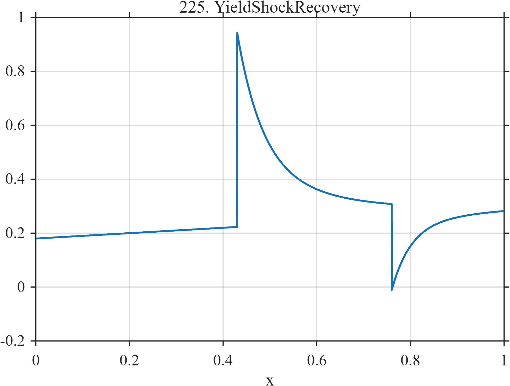

# TF225 — YieldShockRecovery

## Overview

A drifting baseline experiences shocks of opposite sign, each followed by a mixture of fast and slow exponential mean reversion.

## Mathematical Definition

For $u_k=(x-c_k)_+$,
$$
f(x)=0.18+0.10x+\sum_{k=1}^{2}I(x\ge c_k)a_k
[0.72e^{-u_k/t_{1,k}}+0.28e^{-u_k/t_{2,k}}],
$$
with the parameter vectors listed below.

## Morphological Characteristics

| Property | Description |
|---|---|
| Application family | Fixed income |
| Structure | Linear trend plus two signed causal biexponential shocks |
| Regularity | Abrupt value changes with long smooth tails |
| Main challenge | Preserve jumps while estimating two recovery scales |

## Parameters

| Parameter | Value |
|---|---|
| Shock times | $0.43,0.76$ |
| Shock amplitudes | $0.72,-0.32$ |
| Fast scales | $0.055,0.040$ |
| Slow scales | $0.24,0.14$ |

## MATLAB Implementation

~~~matlab
N=1024; x=linspace(0,1,N);
f=0.18+0.10*x; c=[0.43 0.76]; a=[0.72 -0.32]; t1=[0.055 0.040]; t2=[0.24 0.14];
for k=1:2
 u=max(x-c(k),0); f=f+(x>=c(k)).*a(k).*(0.72*exp(-u/t1(k))+0.28*exp(-u/t2(k)));
end
plot(x,f,'LineWidth',1.3); grid on
xlabel('x'); ylabel('f(x)'); title('TF225 — YieldShockRecovery')
~~~

## Python Implementation

~~~python
import numpy as np
import matplotlib.pyplot as plt
N=1024
x=np.linspace(0.0,1.0,N)
f=0.18+0.10*x
for c,a,t1,t2 in zip([0.43,0.76],[0.72,-0.32],[0.055,0.040],[0.24,0.14]):
    u=np.maximum(x-c,0); f+=(x>=c)*a*(0.72*np.exp(-u/t1)+0.28*np.exp(-u/t2))
plt.plot(x,f); plt.grid(True)
plt.xlabel("x"); plt.ylabel("f(x)"); plt.title("TF225 — YieldShockRecovery")
plt.show()
~~~

## Recommended Uses

- Jump-and-recovery denoising
- Signed shock preservation
- Multirate mean-reversion estimation

## Provenance

This is a deterministic benchmark surrogate inspired by fixed income measurement morphology. It is not a calibrated physical or financial simulator.

[← Previous: LiquidityDrought](TF224_LiquidityDrought.md) · [Category 10 catalog](index.md) · [Next: AnalyticNearPole →](TF226_AnalyticNearPole.md)

