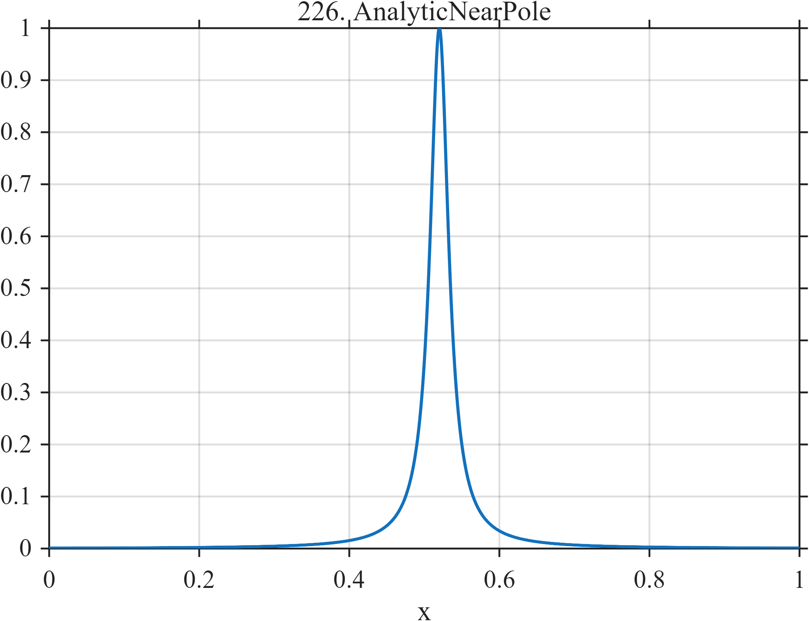

# TF226 — AnalyticNearPole

## Overview

This normalized rational peak is infinitely differentiable on the real interval, but nearby complex poles create extreme local curvature.

## Mathematical Definition

Let
$$
r(x)=\frac{1}{(x-0.52)^2+0.015^2}.
$$
For sampled points $x_i$, define
$$
f_i=\frac{r(x_i)}{\max_j r(x_j)}.
$$
The complex poles occur at $0.52\pm0.015i$.

## Morphological Characteristics

| Property | Description |
|---|---|
| Application family | Mathematical stress test |
| Structure | Unit-normalized narrow rational peak |
| Regularity | Real analytic on $[0,1]$ despite extreme curvature |
| Main challenge | Avoid equating mathematical smoothness with slow variation |

## Parameters

| Parameter | Value |
|---|---|
| Center $x_0$ | $0.52$ |
| Pole distance $\delta$ | $0.015$ |
| Normalization | Sample maximum equals $1$ |

## MATLAB Implementation

~~~matlab
N=1024; x=linspace(0,1,N);
raw=1./((x-0.52).^2+0.015^2); f=raw/max(raw);
plot(x,f,'LineWidth',1.3); grid on
xlabel('x'); ylabel('f(x)'); title('TF226 — AnalyticNearPole')
~~~

## Python Implementation

~~~python
import numpy as np
import matplotlib.pyplot as plt
N=1024
x=np.linspace(0.0,1.0,N)
raw=1/((x-0.52)**2+0.015**2); f=raw/np.max(raw)
plt.plot(x,f); plt.grid(True)
plt.xlabel("x"); plt.ylabel("f(x)"); plt.title("TF226 — AnalyticNearPole")
plt.show()
~~~

## Recommended Uses

- Extreme-curvature recovery
- Bandwidth stress testing
- Smoothness-versus-scale diagnostics

## Provenance

This is a deliberately artificial controlled stress test. Its normalization and sampling conventions are part of the definition.

[← Previous: YieldShockRecovery](TF225_YieldShockRecovery.md) · [Category 10 catalog](index.md) · [Next: ChirpCuspCollision →](TF227_ChirpCuspCollision.md)

