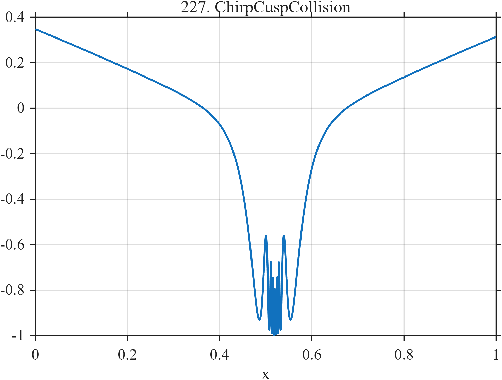

# TF227 — ChirpCuspCollision

## Overview

A square-root cusp and a rapidly compressed oscillation occupy the same location, so their difficulties cannot be separated spatially.

## Mathematical Definition

Let $u=x-0.52$ and $a=|u|$. The native construction is
$$
r(x)=a^{1/2}+0.48a^{1/3}\sin\left(\frac{0.18}{a+0.004}\right).
$$
For sampled values, center and normalize:
$$
f_i=\frac{r(x_i)-\bar r}{\max_j|r(x_j)-\bar r|}.
$$

## Morphological Characteristics

| Property | Description |
|---|---|
| Application family | Mathematical stress test |
| Structure | Cusp plus singularly compressed amplitude-weighted chirp |
| Regularity | Nonsmooth at the shared center |
| Main challenge | Protect both the cusp and the local oscillation |

## Parameters

| Parameter | Value |
|---|---|
| Center | $0.52$ |
| Chirp amplitude | $0.48$ |
| Chirp regularizer | $0.004$ |
| Output | Centered and max-normalized |

## MATLAB Implementation

~~~matlab
N=1024; x=linspace(0,1,N);
u=x-0.52; au=abs(u);
f=au.^0.5+0.48*au.^(1/3).*sin(0.18./(au+0.004));
f=f-mean(f); f=f/max(abs(f));
plot(x,f,'LineWidth',1.3); grid on
xlabel('x'); ylabel('f(x)'); title('TF227 — ChirpCuspCollision')
~~~

## Python Implementation

~~~python
import numpy as np
import matplotlib.pyplot as plt
N=1024
x=np.linspace(0.0,1.0,N)
u=x-0.52; au=np.abs(u)
f=au**0.5+0.48*au**(1/3)*np.sin(0.18/(au+0.004))
f-=np.mean(f); f/=np.max(np.abs(f))
plt.plot(x,f); plt.grid(True)
plt.xlabel("x"); plt.ylabel("f(x)"); plt.title("TF227 — ChirpCuspCollision")
plt.show()
~~~

## Recommended Uses

- Cusp preservation
- Compressed-chirp recovery
- Competing-scale stress testing

## Provenance

This is a deliberately artificial controlled stress test. Its normalization and sampling conventions are part of the definition.

[← Previous: AnalyticNearPole](TF226_AnalyticNearPole.md) · [Category 10 catalog](index.md) · [Next: LogPeriodicCusp →](TF228_LogPeriodicCusp.md)

