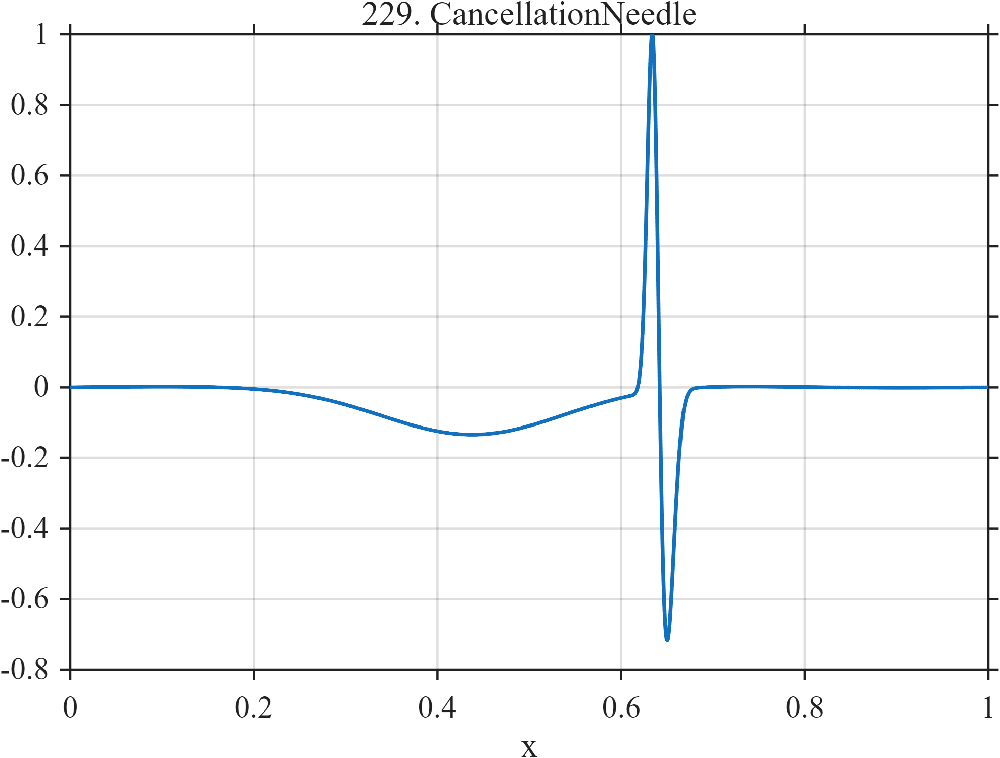

# TF229 — CancellationNeedle

## Overview

Two order-one broad components nearly cancel, leaving a fragile background on which a narrow biphasic feature is placed.

## Mathematical Definition

With $G(x;c,w)=e^{-((x-c)/w)^2/2}$,
$$
g_1=1.10G(x;0.50,0.18)+0.22\sin(4\pi x),\qquad
g_2=1.004g_1+0.018G(x;0.44,0.10),
$$
$$
\eta=G(x;0.635,0.006)-0.62G(x;0.648,0.009).
$$
If $r=g_1-0.995g_2+0.16\eta$, then
$f_i=r(x_i)/\max_j|r(x_j)|$.

## Morphological Characteristics

| Property | Description |
|---|---|
| Application family | Interference |
| Structure | Near-cancellation residual plus weak biphasic needle |
| Regularity | Smooth but numerically delicate and highly localized |
| Main challenge | Preserve a weak feature when total signal is a small residual |

## Parameters

| Parameter | Value |
|---|---|
| Broad center/width | $0.50/0.18$ |
| Needle centers | $0.635,0.648$ |
| Needle weight | $0.16$ |
| Output | Max-normalized |

## MATLAB Implementation

~~~matlab
N=1024; x=linspace(0,1,N);
G=@(z,c,w) exp(-0.5*((z-c)/w).^2);
g1=1.10*G(x,0.50,0.18)+0.22*sin(2*pi*2*x);
g2=1.004*g1+0.018*G(x,0.44,0.10);
needle=G(x,0.635,0.006)-0.62*G(x,0.648,0.009);
f=g1-0.995*g2+0.16*needle; f=f/max(abs(f));
plot(x,f,'LineWidth',1.3); grid on
xlabel('x'); ylabel('f(x)'); title('TF229 — CancellationNeedle')
~~~

## Python Implementation

~~~python
import numpy as np
import matplotlib.pyplot as plt
N=1024
x=np.linspace(0.0,1.0,N)
G=lambda z,c,w: np.exp(-0.5*((z-c)/w)**2)
g1=1.10*G(x,0.50,0.18)+0.22*np.sin(2*np.pi*2*x)
g2=1.004*g1+0.018*G(x,0.44,0.10)
needle=G(x,0.635,0.006)-0.62*G(x,0.648,0.009)
f=g1-0.995*g2+0.16*needle; f/=np.max(np.abs(f))
plt.plot(x,f); plt.grid(True)
plt.xlabel("x"); plt.ylabel("f(x)"); plt.title("TF229 — CancellationNeedle")
plt.show()
~~~

## Recommended Uses

- Weak-needle preservation
- Cancellation-residual denoising
- Global-error failure diagnostics

## Provenance

This is a deliberately artificial controlled stress test. Its normalization and sampling conventions are part of the definition.

[← Previous: LogPeriodicCusp](TF228_LogPeriodicCusp.md) · [Category 10 catalog](index.md) · [Next: RegularityQuilt →](TF230_RegularityQuilt.md)

