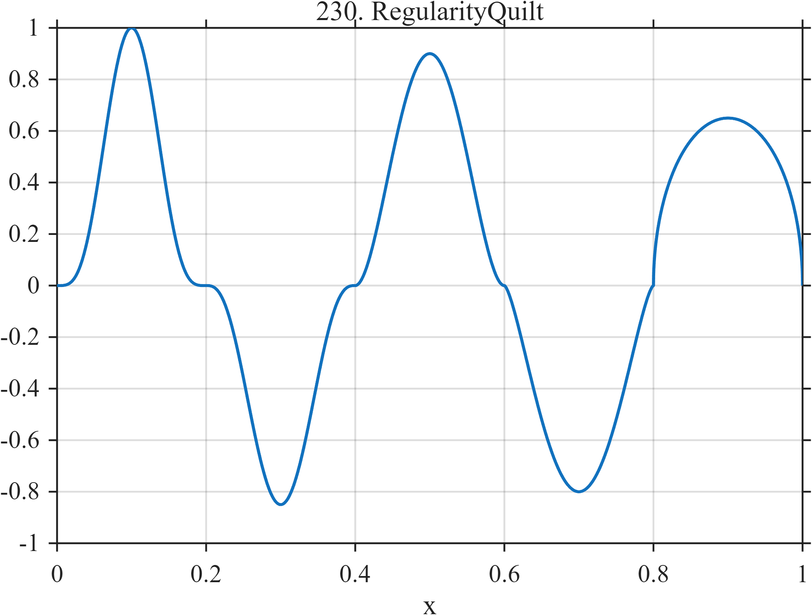

# TF230 — RegularityQuilt

## Overview

Five adjacent compact bumps meet continuously at zero but use different powers and signs, placing several local smoothness classes in one record.

## Mathematical Definition

For interval $[a_k,b_k]$, set
$s=(x-a_k)/(b_k-a_k)$ and
$$
f(x)=A_k[4s(1-s)]^{p_k},\qquad a_k\le x\le b_k.
$$
The rows $(a_k,b_k,p_k,A_k)$ are
$$
(0,.2,4,1),\ (.2,.4,3,-.85),\ (.4,.6,2,.90),\
(.6,.8,1.5,-.80),\ (.8,1,.5,.65).
$$

## Morphological Characteristics

| Property | Description |
|---|---|
| Application family | Regularity stress test |
| Structure | Piecewise compact beta-shaped bumps |
| Regularity | Region-dependent boundary regularity |
| Main challenge | Apply one shrinkage policy across heterogeneous smoothness |

## Parameters

| Parameter | Value |
|---|---|
| Intervals | Five equal subintervals |
| Powers | $4,3,2,1.5,0.5$ |
| Amplitudes | $1,-0.85,0.90,-0.80,0.65$ |

## MATLAB Implementation

~~~matlab
N=1024; x=linspace(0,1,N);
f=zeros(size(x));
intervals=[0 .2 4 1.00; .2 .4 3 -.85; .4 .6 2 .90; .6 .8 1.5 -.80; .8 1.0 .5 .65];
for k=1:size(intervals,1)
 aa=intervals(k,1); bb=intervals(k,2); pp=intervals(k,3); A0=intervals(k,4);
 m=x>=aa & x<=bb; s=(x(m)-aa)/(bb-aa);
 f(m)=A0*(4*s.*(1-s)).^pp;
end
plot(x,f,'LineWidth',1.3); grid on
xlabel('x'); ylabel('f(x)'); title('TF230 — RegularityQuilt')
~~~

## Python Implementation

~~~python
import numpy as np
import matplotlib.pyplot as plt
N=1024
x=np.linspace(0.0,1.0,N)
f=np.zeros_like(x)
intervals=[[0,.2,4,1.00],[.2,.4,3,-.85],[.4,.6,2,.90],[.6,.8,1.5,-.80],[.8,1.0,.5,.65]]
for aa,bb,p,A in intervals:
    m=(x>=aa)&(x<=bb); s=(x[m]-aa)/(bb-aa)
    f[m]=A*(4*s*(1-s))**p
plt.plot(x,f); plt.grid(True)
plt.xlabel("x"); plt.ylabel("f(x)"); plt.title("TF230 — RegularityQuilt")
plt.show()
~~~

## Recommended Uses

- Spatially adaptive denoising
- Mixed-regularity recovery
- Boundary-smoothness diagnostics

## Provenance

This is a deliberately artificial controlled stress test. Its normalization and sampling conventions are part of the definition.

[← Previous: CancellationNeedle](TF229_CancellationNeedle.md) · [Category 10 catalog](index.md) · [Benchmarking role →](benchmarking-role.md)

