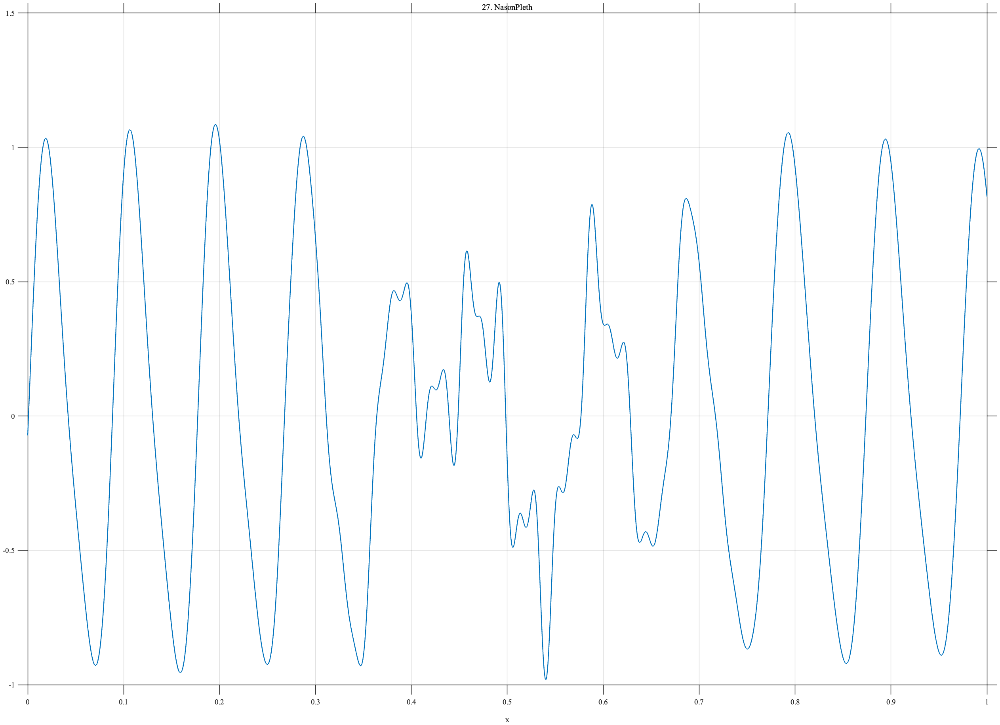

# TF027 — NasonPleth

## Overview

The **NasonPleth** signal represents inductance plethysmography during recovery after general anesthesia. It contains relatively regular breathing on both sides of a strongly disturbed central interval. If `ipd.csv` is supplied, the empirical trace is interpolated to the requested grid; otherwise, the deterministic fallback below is used.

## Mathematical Definition

For the deterministic fallback, define

$$
\phi(x)=2\pi\left[10.5x+0.20\sin(1.5\pi x)\right]
$$

and the mildly modulated breathing component

$$
r(x)=\left[0.92+0.10\sin(1.1\pi x)\right]
\left[\sin\phi(x)+0.18\sin\{2\phi(x)-0.45\}\right].
$$

The disturbed-interval window is

$$
w(x)=\exp\!\left[-\frac12\left(\frac{x-0.51}{0.105}\right)^2\right],
$$

and its irregular component is

$$
\begin{aligned}
d(x)={}&0.48w(x)\sin\{2\pi(4.1x+1.6x^2)+0.6\}\\
&+0.25w(x)\sin(62\pi x)
+0.14w(x)\sin(106\pi x+0.8).
\end{aligned}
$$

The fallback signal is

$$
f(x)=\left[1-0.88w(x)\right]r(x)+d(x).
$$

When `ipd.csv` is available, the last finite data column is mapped to $[0,1]$ using a shape-preserving cubic interpolant.

## Morphological Characteristics

| Property | Description |
|---|---|
| Primary family | Quasi-periodic activity with a disturbed interval |
| Signal type | Empirical when available; otherwise deterministic |
| Central disturbance | Gaussian-localized near $x=0.51$ |
| Background | Mildly modulated respiratory oscillation |
| Main challenge | Preserving regular breathing and localized irregular activity |

## Parameters

| Parameter | Meaning | Default |
|---|---|---:|
| $N$ | Number of output samples | 1024 |
| $0.51$ | Disturbed-interval center | 0.51 |
| $0.105$ | Disturbed-window width | 0.105 |
| `ipd.csv` | Optional empirical data source | Not required |

## MATLAB Implementation

~~~matlab
N = 1024;
x = linspace(0,1,N);
scriptFolder = pwd;
ipdFile = fullfile(scriptFolder,'ipd.csv');
usedExactNasonIPD = false;

if exist(ipdFile,'file') == 2
    z = readmatrix(ipdFile);
    z = z(:,end);
    z = z(isfinite(z));
    if numel(z) >= 16
        xx = linspace(0,1,numel(z));
        f = interp1(xx,z(:).',x,'pchip');
        usedExactNasonIPD = true;
    end
end

if ~usedExactNasonIPD
    phaseResp = 2*pi*(10.5*x + 0.20*sin(2*pi*0.75*x));
    normalResp = (0.92 + 0.10*sin(2*pi*0.55*x)).* ...
        (sin(phaseResp) + 0.18*sin(2*phaseResp-0.45));
    wDist = exp(-0.5*((x-0.51)/0.105).^2);
    disturb = 0.48*wDist.*sin(2*pi*(4.1*x+1.6*x.^2)+0.6) ...
        + 0.25*wDist.*sin(2*pi*31*x) ...
        + 0.14*wDist.*sin(2*pi*53*x+0.8);
    f = (1-0.88*wDist).*normalResp + disturb;
end

plot(x,f,'LineWidth',1.4); grid on
xlabel('x'); ylabel('f(x)'); title('TF027 — NasonPleth')
exportgraphics(gcf,'TF027_NasonPleth.png','Resolution',300);
~~~

## Python Implementation

~~~python
from pathlib import Path
import numpy as np
import matplotlib.pyplot as plt
from scipy.interpolate import PchipInterpolator

N = 1024
x = np.linspace(0, 1, N)
ipd_file = Path("ipd.csv")

if ipd_file.exists():
    z = np.genfromtxt(ipd_file, delimiter=",")
    z = z if z.ndim == 1 else z[:, -1]
    z = z[np.isfinite(z)]
else:
    z = np.array([])

if z.size >= 16:
    f = PchipInterpolator(np.linspace(0, 1, z.size), z)(x)
else:
    phase = 2*np.pi*(10.5*x + 0.20*np.sin(2*np.pi*0.75*x))
    normal = (0.92 + 0.10*np.sin(2*np.pi*0.55*x)) * (
        np.sin(phase) + 0.18*np.sin(2*phase-0.45))
    w = np.exp(-0.5*((x-0.51)/0.105)**2)
    disturb = (0.48*w*np.sin(2*np.pi*(4.1*x+1.6*x**2)+0.6)
               + 0.25*w*np.sin(2*np.pi*31*x)
               + 0.14*w*np.sin(2*np.pi*53*x+0.8))
    f = (1-0.88*w)*normal + disturb

plt.plot(x, f, linewidth=1.4)
plt.xlabel("x"); plt.ylabel("f(x)"); plt.title("TF027 — NasonPleth")
plt.grid(alpha=0.3); plt.tight_layout()
plt.savefig("TF027_NasonPleth.png", dpi=300)
~~~

## Recommended Uses

- Disturbed-interval detection
- Quasi-periodic physiological denoising
- Transition between regular and irregular oscillations
- Empirical-versus-surrogate robustness checks

## Provenance

**Status:** Optional empirical plethysmography trace with a deterministic documented fallback.

---

[Category 3 Catalog](index.md) | [Next: VasospasmTCD →](TF028_VasospasmTCD.md)
