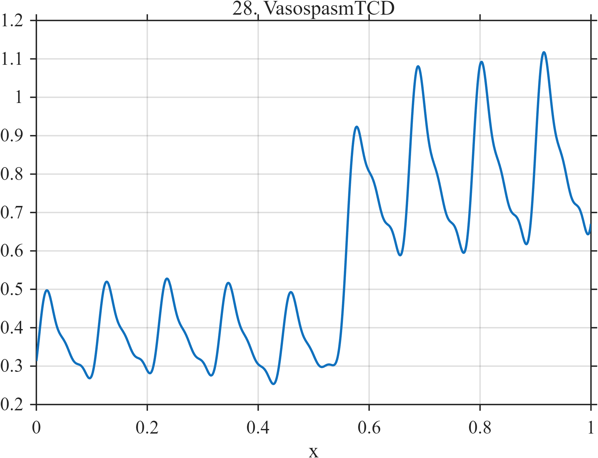

# TF028 — VasospasmTCD

## Overview

The **VasospasmTCD** signal is a toy transcranial-Doppler velocity trace. Cardiac pulsatility persists throughout the record, while a smooth pathological onset increases both mean velocity and pulsatile amplitude.

## Mathematical Definition

Define

$$
\phi(x)=2\pi\left[9x+0.06\sin(1.6\pi x)\right]
$$

and

$$
p(x)=0.55\sin\phi(x)+0.23\sin\{2\phi(x)-0.55\}
+0.10\sin\{3\phi(x)-1\}.
$$

The smooth onset is

$$
o(x)=\frac{1}{1+e^{-65(x-0.56)}}.
$$

The complete signal is

$$
f(x)=0.35+0.18p(x)+o(x)\left[0.48+0.18p(x)\right]
+0.035\sin(2.2\pi x).
$$

## Morphological Characteristics

| Property | Description |
|---|---|
| Primary family | Periodic waveform with gradual pathological onset |
| Persistent structure | Cardiac pulsatility |
| Onset center | $x=0.56$ |
| Post-onset change | Increased mean level and pulse amplitude |
| Main challenge | Preserving repeated pulses while localizing the smooth change |

## Parameters

| Parameter | Meaning | Default |
|---|---|---:|
| $N$ | Number of samples | 1024 |
| $0.56$ | Onset center | 0.56 |
| $65$ | Onset sharpness | 65 |
| $9$ | Nominal cardiac frequency | 9 |

## MATLAB Implementation

~~~matlab
N = 1024; x = linspace(0,1,N);
phase = 2*pi*(9.0*x + 0.06*sin(2*pi*0.8*x));
pulse = 0.55*sin(phase) + 0.23*sin(2*phase-0.55) ...
    + 0.10*sin(3*phase-1.00);
onset = 1./(1+exp(-65*(x-0.56)));
f = 0.35 + 0.18*pulse + onset.*(0.48+0.18*pulse) ...
    + 0.035*sin(2*pi*1.1*x);
plot(x,f,'LineWidth',1.4); grid on
xlabel('x'); ylabel('f(x)'); title('TF028 — VasospasmTCD')
exportgraphics(gcf,'TF028_VasospasmTCD.png','Resolution',300);
~~~

## Python Implementation

~~~python
import numpy as np
import matplotlib.pyplot as plt
N = 1024; x = np.linspace(0, 1, N)
phase = 2*np.pi*(9*x + 0.06*np.sin(2*np.pi*0.8*x))
pulse = (0.55*np.sin(phase) + 0.23*np.sin(2*phase-0.55)
         + 0.10*np.sin(3*phase-1.00))
onset = 1/(1+np.exp(-65*(x-0.56)))
f = 0.35 + 0.18*pulse + onset*(0.48+0.18*pulse) + 0.035*np.sin(2*np.pi*1.1*x)
plt.plot(x,f,linewidth=1.4); plt.grid(alpha=0.3)
plt.xlabel("x"); plt.ylabel("f(x)"); plt.title("TF028 — VasospasmTCD")
plt.tight_layout(); plt.savefig("TF028_VasospasmTCD.png",dpi=300)
~~~

## Recommended Uses

- Smooth pathological-onset detection
- Pulsatile-flow denoising
- Joint level and amplitude-change recovery
- Repeated-waveform preservation

## Provenance

**Status:** Transcranial-Doppler-inspired deterministic physiological surrogate.

---

[← Previous: NasonPleth](TF027_NasonPleth.md) | [Category 3 Catalog](index.md) | [Next: PVCTrain →](TF029_PVCTrain.md)
