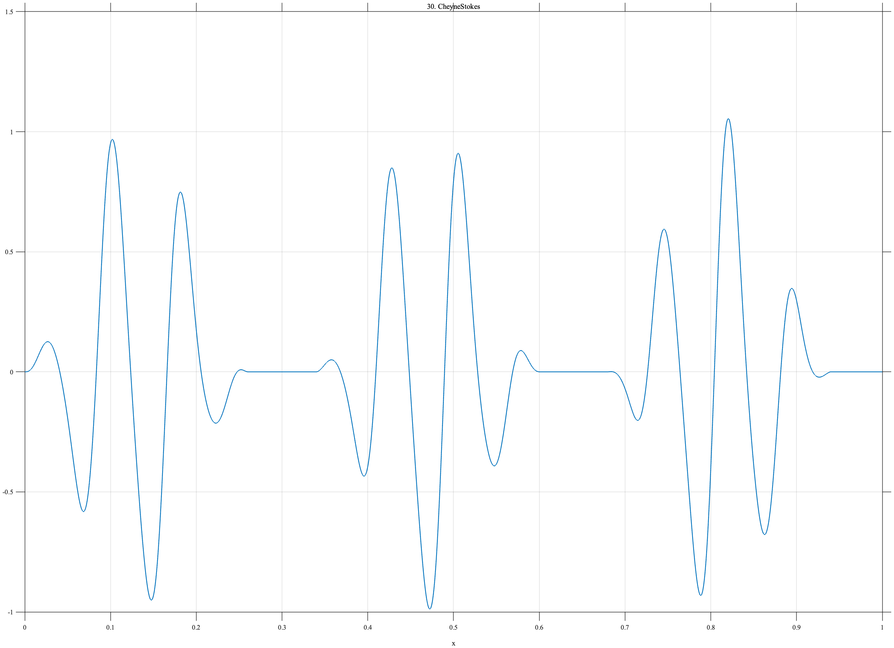

# TF030 — CheyneStokes

## Overview

The **CheyneStokes** signal consists of three respiratory episodes whose amplitudes gradually increase and decrease, separated by nearly quiescent apneic intervals. The weak breaths at the boundaries of each episode are especially vulnerable to aggressive thresholding.

## Mathematical Definition

For the episode intervals

$$
(a_k,b_k)\in\{(0,0.26),(0.34,0.60),(0.68,0.94)\},
$$

define the envelope

$$
E(x)=\sum_{k=1}^{3}
\mathbf{1}_{\{a_k\leq x\leq b_k\}}
\sin^{1.65}\!\left(\pi\frac{x-a_k}{b_k-a_k}\right).
$$

With

$$
\phi(x)=2\pi(12x+0.55x^2),
$$

the signal is

$$
f(x)=E(x)\left[\sin\phi(x)+0.13\sin\{2\phi(x)-0.35\}\right].
$$

## Morphological Characteristics

| Property | Description |
|---|---|
| Primary family | Repeated crescendo–decrescendo episodes |
| Number of episodes | 3 |
| Between episodes | Nearly zero-amplitude apnea |
| Carrier | Mildly chirped oscillation with weak harmonic |
| Main challenge | Retaining weak boundary breaths and true quiescent intervals |

## Parameters

| Parameter | Meaning | Default |
|---|---|---:|
| $N$ | Number of samples | 1024 |
| $(a_k,b_k)$ | Episode intervals | $(0,0.26),(0.34,0.60),(0.68,0.94)$ |
| $1.65$ | Envelope exponent | 1.65 |
| $0.13$ | Harmonic amplitude | 0.13 |

## MATLAB Implementation

~~~matlab
N = 1024; x = linspace(0,1,N); env = zeros(size(x));
episode = [0.00 0.26; 0.34 0.60; 0.68 0.94];
for k = 1:size(episode,1)
    a = episode(k,1); b = episode(k,2);
    ind = x>=a & x<=b; u = (x(ind)-a)/(b-a);
    env(ind) = sin(pi*u).^1.65;
end
phase = 2*pi*(12*x+0.55*x.^2);
f = env.*(sin(phase)+0.13*sin(2*phase-0.35));
plot(x,f,'LineWidth',1.4); grid on
xlabel('x'); ylabel('f(x)'); title('TF030 — CheyneStokes')
exportgraphics(gcf,'TF030_CheyneStokes.png','Resolution',300);
~~~

## Python Implementation

~~~python
import numpy as np
import matplotlib.pyplot as plt
N = 1024; x = np.linspace(0,1,N); env = np.zeros_like(x)
for a,b in [(0.00,0.26),(0.34,0.60),(0.68,0.94)]:
    ind = (x>=a)&(x<=b); u = (x[ind]-a)/(b-a)
    env[ind] = np.sin(np.pi*u)**1.65
phase = 2*np.pi*(12*x+0.55*x**2)
f = env*(np.sin(phase)+0.13*np.sin(2*phase-0.35))
plt.plot(x,f,linewidth=1.4); plt.grid(alpha=0.3)
plt.xlabel("x"); plt.ylabel("f(x)"); plt.title("TF030 — CheyneStokes")
plt.tight_layout(); plt.savefig("TF030_CheyneStokes.png",dpi=300)
~~~

## Recommended Uses

- Envelope-preserving denoising
- Apnea-interval recovery
- Weak-oscillation preservation
- Recurrent nonstationary respiration analysis

## Provenance

**Status:** Cheyne–Stokes-respiration-inspired deterministic surrogate.

---

[← Previous: PVCTrain](TF029_PVCTrain.md) | [Category 3 Catalog](index.md) | [Next: EEGBurstSuppress →](TF031_EEGBurstSuppress.md)
